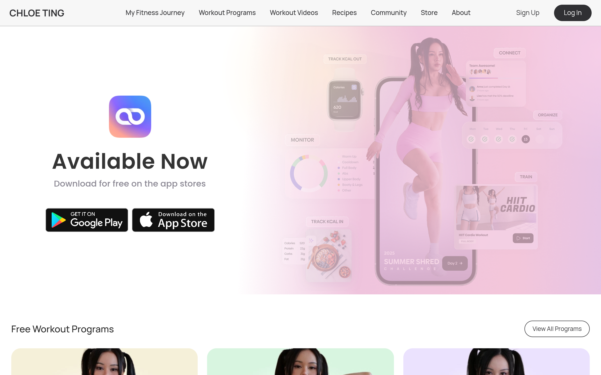

# chloeting Design System

You are building UI for **chloeting**. Light-themed, cool palette, sans-serif typography (Poppins), compact density on a 4px grid, expressive motion.

## Visual Reference

**IMPORTANT**: Study ALL screenshots below before writing any UI. Match colors, typography, spacing, layout, and motion exactly as shown.

### Homepage



### Scroll Journey (Cinematic Visual States)

> These screenshots capture the website at different scroll depths. The design changes dramatically as you scroll — each frame shows a different cinematic state. Replicate these exact visual transitions.

#### 0% — Hero / Above the fold


#### 17% — Mid-page at 17% scroll


#### 33% — Mid-page at 33% scroll


#### 50% — Mid-page at 50% scroll


#### 67% — Mid-page at 67% scroll


#### 83% — Mid-page at 83% scroll


#### 100% — Footer / End of page


> Read `references/DESIGN.md` for full token details. Read `references/ANIMATIONS.md` for motion specs. Read `references/LAYOUT.md` for layout structure. Read `references/COMPONENTS.md` for component patterns.

## Ultra Reference Files

This package includes extended documentation. **Read these files before implementing:**

| File | Contents |
|------|----------|
| `references/DESIGN.md` | Full design system tokens, colors, typography, spacing |
| `references/VISUAL_GUIDE.md` | **START HERE** — Master visual guide with all screenshots embedded |
| `references/ANIMATIONS.md` | CSS keyframes, scroll triggers, motion library stack, video specs |
| `references/LAYOUT.md` | Flex/grid containers, page structure, spacing relationships |
| `references/COMPONENTS.md` | DOM component patterns, HTML structure, class fingerprints |
| `references/INTERACTIONS.md` | Hover/focus states with before/after style diffs |
| `screens/scroll/` | 7 scroll journey screenshots showing cinematic states |

## Design Philosophy

- **Layered depth** — use shadow tokens to create a sense of physical layering. Each elevation level has a specific shadow.
- **Gradient accents** — gradients are used thoughtfully for emphasis, not decoration.
- **Type pairing** — Poppins for body/UI text, Manrope for headings/display. Never introduce a third typeface.
- **compact density** — 4px base grid. Every dimension is a multiple of 4.
- **cool palette** — the color temperature runs cool, matching the sans-serif typography.
- **Restrained accent** — `#40a9ff` is the only pop of color. Used exclusively for CTAs, links, focus rings, and active states.
- **Expressive motion** — animations are an integral part of the experience. Use spring physics and layout animations.

## Color System

### Core Palette

| Role | Token | Hex | Use |
|------|-------|-----|-----|
| Background | `--background` | `#ffffff` | Page/app background |
| Surface | `--surface` | `#fff2f0` | Cards, panels, modals |
| Text Primary | `--text-primary` | `#000000` | Headings, body text |
| Text Muted | `--text-muted` | `#bfbfbf` | Captions, placeholders |
| Accent | `--accent` | `#40a9ff` | CTAs, links, focus rings |
| Border | `--border` | `#303033` | Dividers, card borders |

### Status Colors

| Status | Hex | Use |
|--------|-----|-----|
| Success | `#52c41a` | Confirmations, positive trends |
| Warning | `#faad14` | Caution states, pending items |
| Danger | `#ff4d4f` | Errors, destructive actions |

### Extended Palette

- **anchor-hover-color:** `#1890ff`
- `#d9d9d9`
- `#096dd9`
- **base-color:** `#f0f0f0` — Light surface or highlight color
- **color-light-blue:** `#e6f7ff` — Light surface or highlight color
- `#ff7875`
- `#d9363e` — Warm accent — hover glow or decorative highlight
- `#eb2f96`

### CSS Variable Tokens

```css
--antd-arrow-background-color: #fff;
--color-primary: #303033;
--color-primary-disabled: #c4c4c4;
--color-secondary: #868a93;
--color-background-primary: #f7f7f7;
--color-background-secondary: #f3f3f3;
--border-primary: 1px solid var(--color-primary-disabled);
--border-secondary: 1px solid #eff0f4;
--color-background: #fafafa;
--color-action-background: #eaedef;
--antd-arrow-background-color: #fff;
--color-primary: #303033;
--color-primary-disabled: #c4c4c4;
--color-secondary: #868a93;
--color-background-primary: #f7f7f7;
--color-background-secondary: #f3f3f3;
--border-primary: 1px solid var(--color-primary-disabled);
--border-secondary: 1px solid #eff0f4;
--color-background: #fafafa;
--color-action-background: #eaedef;
```

## Typography

### Font Stack

- **Poppins** — Heading 1, Heading 2, Heading 3
- **Manrope** — Body, Caption
- **SFMono-Regular** — Code

### Font Sources

```css
@font-face {
  font-family: "Manrope";
  src: url("fonts/Manrope-Bold.ttf") format("truetype");
  font-weight: 700;
}
@font-face {
  font-family: "Manrope";
  src: url("fonts/Manrope-Regular.ttf") format("truetype");
  font-weight: 400;
}
@font-face {
  font-family: "icomoon";
  src: url("fonts/icomoon-Regular.ttf") format("truetype");
  font-weight: 400;
}
@font-face {
  font-family: "Poppins";
  src: url("fonts/Poppins-Bold.ttf") format("truetype");
  font-weight: 700;
}
@font-face {
  font-family: "Poppins";
  src: url("fonts/Poppins-Regular.ttf") format("truetype");
  font-weight: 400;
}
@font-face {
  font-family: "Bricolage Grotesque";
  src: url("fonts/BricolageGrotesque-Bold.ttf") format("truetype");
  font-weight: 700;
}
@font-face {
  font-family: "Bricolage Grotesque";
  src: url("fonts/BricolageGrotesque-Regular.ttf") format("truetype");
  font-weight: 400;
}
```

### Type Scale

| Role | Family | Size | Weight |
|------|--------|------|--------|
| Heading 1 | Poppins | 72px | 700 |
| Heading 2 | Poppins | 48px | 700 |
| Heading 3 | Poppins | 45px | 700 |
| Body | Manrope | 14px | 400 |
| Caption | Manrope | 16px | 400 |
| Code | SFMono-Regular | 14px | 400 |

### Typography Rules

- Body/UI: **Poppins**, Headings: **Manrope** — these are the only display fonts
- Max 3-4 font sizes per screen
- Headings: weight 600-700, body: weight 400
- Use color and opacity for text hierarchy, not additional font sizes
- Line height: 1.5 for body, 1.2 for headings

## Spacing & Layout

### Base Grid: 4px

Every dimension (margin, padding, gap, width, height) must be a multiple of **4px**.

### Spacing Scale

`2, 4, 6, 8, 10, 12, 14, 16, 18, 20, 22, 24` px

### Spacing as Meaning

| Spacing | Use |
|---------|-----|
| 4-8px | Tight: related items (icon + label, avatar + name) |
| 12-16px | Medium: between groups within a section |
| 24-32px | Wide: between distinct sections |
| 48px+ | Vast: major page section breaks |

### Border Radius

Scale: `inherit, .25rem, .3rem, 1px, 2px, 3px, 4px, 6px, 7px, 8px, 9px, 10px, 12px, 14px, 15px, 16px, 18px, 20px, 22px, 24px, 26px, 28px, 32px, 35px, 36px, 40px, 50px, 52px, 54px, 97px, 100%, 100px`
Default: `18px`

### Container

Max-width: `63.9375em`, centered with auto margins.

### Breakpoints

| Name | Value |
|------|-------|
| xs | 0px |
| xs | 0em |
| sm | 39.9375em |
| sm | 40em |
| lg | 63.9375em |
| lg | 64em |
| xl | 74.9375em |
| xl | 75em |
| xs | 400px |
| xs | 480px |
| sm | 575px |
| sm | 576px |
| md | 767px |
| md | 767.98px |
| md | 768px |
| lg | 991px |
| lg | 992px |
| lg | 1023.98px |
| lg | 1024px |
| xl | 1199px |
| xl | 1200px |
| xl | 1239.98px |
| xl | 1240px |
| xl | 1280px |
| 2xl | 1440px |
| 2xl | 1599px |
| 2xl | 1600px |

Mobile-first: design for small screens, layer on responsive overrides.

## Component Patterns

### Card

```css
.card {
  background: #fff2f0;
  border: 1px solid #303033;
  border-radius: 18px;
  padding: 16px;
  box-shadow: 0 0 0 0#1890ff;
}
```

```html
<div class="card">
  <h3>Card Title</h3>
  <p>Card content goes here.</p>
</div>
```

### Button

```css
/* Primary */
.btn-primary {
  background: #40a9ff;
  color: #000000;
  border-radius: 18px;
  padding: 8px 16px;
  font-weight: 500;
  transition: opacity 150ms ease;
}
.btn-primary:hover { opacity: 0.9; }

/* Ghost */
.btn-ghost {
  background: transparent;
  border: 1px solid #303033;
  color: #000000;
  border-radius: 18px;
  padding: 8px 16px;
}
```

```html
<button class="btn-primary">Get Started</button>
<button class="btn-ghost">Learn More</button>
```

### Input

```css
.input {
  background: #ffffff;
  border: 1px solid #303033;
  border-radius: 18px;
  padding: 8px 12px;
  color: #000000;
  font-size: 14px;
}
.input:focus { border-color: #40a9ff; outline: none; }
```

```html
<input class="input" type="text" placeholder="Search..." />
```

### Badge / Chip

```css
.badge {
  display: inline-flex;
  align-items: center;
  padding: 4px 8px;
  border-radius: 9999px;
  font-size: 12px;
  font-weight: 500;
  background: #fff2f0;
  color: #bfbfbf;
}
```

```html
<span class="badge">New</span>
<span class="badge">Beta</span>
```

### Modal / Dialog

```css
.modal-backdrop { background: rgba(0, 0, 0, 0.6); }
.modal {
  background: #fff2f0;
  border: 1px solid #303033;
  border-radius: 100px;
  padding: 24px;
  max-width: 480px;
  width: 90vw;
  box-shadow: 0 1px 2px -2px rgba(0,0,0,.16),0 3px 6px 0 rgba(0,0,0,.12),0 5px 12px 4px rgba(0,0,0,.09);
}
```

```html
<div class="modal-backdrop">
  <div class="modal">
    <h2>Dialog Title</h2>
    <p>Dialog content.</p>
    <button class="btn-primary">Confirm</button>
    <button class="btn-ghost">Cancel</button>
  </div>
</div>
```

### Table

```css
.table { width: 100%; border-collapse: collapse; }
.table th {
  text-align: left;
  padding: 8px 12px;
  font-weight: 500;
  font-size: 12px;
  color: #bfbfbf;
  text-transform: uppercase;
  letter-spacing: 0.05em;
  border-bottom: 1px solid #303033;
}
.table td {
  padding: 12px;
  border-bottom: 1px solid #303033;
}
```

```html
<table class="table">
  <thead><tr><th>Name</th><th>Status</th><th>Date</th></tr></thead>
  <tbody>
    <tr><td>Item One</td><td>Active</td><td>Jan 1</td></tr>
    <tr><td>Item Two</td><td>Pending</td><td>Jan 2</td></tr>
  </tbody>
</table>
```

### Navigation

```css
.nav {
  display: flex;
  align-items: center;
  gap: 8px;
  padding: 12px 16px;
  border-bottom: 1px solid #303033;
}
.nav-link {
  color: #bfbfbf;
  padding: 8px 12px;
  border-radius: 18px;
  transition: color 150ms;
}
.nav-link:hover { color: #000000; }
.nav-link.active { color: #40a9ff; }
```

```html
<nav class="nav">
  <a href="/" class="nav-link active">Home</a>
  <a href="/about" class="nav-link">About</a>
  <a href="/pricing" class="nav-link">Pricing</a>
  <button class="btn-primary" style="margin-left: auto">Get Started</button>
</nav>
```

### Extracted Components

These components were found in the codebase:

**Button** (`html`)
- Variants: `round`, `default`

## Page Structure

The following page sections were detected:

- **Navigation** — Top navigation bar (10 items)
- **Hero** — Hero section (detected from heading structure)
- **Faq** — FAQ/accordion section
- **Footer** — Page footer with links and info (9 items)

When building pages, follow this section order and structure.

## Animation & Motion

This project uses **expressive motion**. Animations are part of the design language.

### CSS Animations

- `antFadeIn`
- `antFadeOut`
- `antMoveDownIn`
- `antMoveDownOut`
- `antMoveLeftIn`

### Motion Tokens

- **Duration scale:** `0ms`, `0s`, `.1s`, `.2s`, `.24s`, `.3s`, `17ms`, `100ms`, `150ms`, `200ms`, `240ms`, `250ms`, `300ms`, `400ms`, `500ms`, `600ms`, `1500ms`
- **Easing functions:** `linear`, `cubic-bezier(.08,.82,.17,1)`, `cubic-bezier(.6,.04,.98,.34)`, `cubic-bezier(.23,1,.32,1)`, `cubic-bezier(.755,.05,.855,.06)`, `cubic-bezier(.78,.14,.15,.86)`, `cubic-bezier(.645,.045,.355,1)`, `ease-in-out`, `ease`, `cubic-bezier(.2,0,0,1)`, `cubic-bezier(.215,.61,.355,1)`, `ease-out`, `cubic-bezier(.71,-.46,.88,.6)`, `cubic-bezier(.12,.4,.29,1.46)`, `cubic-bezier(.18,.89,.32,1.28)`
- **Animated properties:** `color`

### Motion Guidelines

- **Duration:** Use values from the duration scale above. Short (0ms) for micro-interactions, long (1500ms) for page transitions
- **Easing:** Use `linear` as the default easing curve
- **Direction:** Elements enter from bottom/right, exit to top/left
- **Reduced motion:** Always respect `prefers-reduced-motion` — disable animations when set

## Depth & Elevation

### Shadow Tokens

- Subtle: `0 0 0 2px rgba(255,77,79,.2)`
- Subtle: `0 0 0 2px rgba(250,173,20,.2)`
- Subtle: `0 0 0 2px rgba(24,144,255,.2)`
- Subtle: `0 0 0 1px #fff`
- Subtle: `0 2px 0 rgba(0,0,0,.015)`
- Subtle: `0 2px 0 rgba(0,0,0,.045)`

### Z-Index Scale

`0, 1, 2, 3, 4, 9, 10, 15, 99, 999, 1000, 1010, 1030, 1031, 1050, 1060, 1070, 1080, 9998, 2147483645, 2147483646, 2147483647`

Use these exact values — never invent z-index values.

## Anti-Patterns (Never Do)

- **No blur effects** — no backdrop-blur, no filter: blur()
- **No zebra striping** — tables and lists use borders for separation
- **No invented colors** — every hex value must come from the palette above
- **No arbitrary spacing** — every dimension is a multiple of 4px
- **No extra fonts** — only Poppins and Manrope and SFMono-Regular are allowed
- **No arbitrary border-radius** — use the scale: .25rem, .3rem, 1px, 2px, 3px, 4px, 6px, 7px, 8px, 9px
- **No opacity for disabled states** — use muted colors instead

## Workflow

1. **Read** `references/DESIGN.md` before writing any UI code
2. **Pick colors** from the Color System section — never invent new ones
3. **Set typography** — Poppins, Manrope, SFMono-Regular only, using the type scale
4. **Build layout** on the 4px grid — check every margin, padding, gap
5. **Match components** to patterns above before creating new ones
6. **Apply elevation** — use shadow tokens
7. **Validate** — every value traces back to a design token. No magic numbers.

## Brand Spec

- **Favicon:** `/favicon.ico`
- **Site URL:** `https://chloeting.com/`
- **Brand color:** `#40a9ff`
- **Brand typeface:** Poppins

## Quick Reference

```
Background:     #ffffff
Surface:        #fff2f0
Text:           #000000 / #bfbfbf
Accent:         #40a9ff
Border:         #303033
Font:           Poppins
Spacing:        4px grid
Radius:         18px
Components:     6 detected
```

## When to Trigger

Activate this skill when:
- Creating new components, pages, or visual elements for chloeting
- Writing CSS, Tailwind classes, styled-components, or inline styles
- Building page layouts, templates, or responsive designs
- Reviewing UI code for design consistency
- The user mentions "chloeting" design, style, UI, or theme
- Generating mockups, wireframes, or visual prototypes

---

# Full Reference Files

> Every output file is embedded below. Claude has full design system context from /skills alone.

## Design System Tokens (DESIGN.md)

# chloeting DESIGN.md

> Auto-generated design system — reverse-engineered via static analysis by skillui.
> Frameworks: None detected
> Colors: 20 · Fonts: 3 · Components: 6
> Icon library: not detected · State: not detected
> Primary theme: light · Dark mode toggle: no · Motion: expressive

## Visual Reference

**Match this design exactly** — study colors, fonts, spacing, and component shapes before writing any UI code.


---

## 1. Visual Theme & Atmosphere

This is a **light-themed** interface with a cool, approachable feel. The light background emphasizes content clarity. Typography pairs **Manrope** for display/headings with **Poppins** for body text, creating clear visual hierarchy through type contrast. Spacing follows a **4px base grid** (compact density), with scale: 2, 4, 6, 8, 10, 12, 14, 16px. The accent color **#40a9ff** anchors interactive elements (buttons, links, focus rings). Motion is expressive — spring physics, layout animations, and staggered reveals are part of the visual language.

---

## 2. Color Palette & Roles

| Token | Hex | Role | Use |
|---|---|---|---|
| theme-color | `#ffffff` | background | Page background, darkest surface |
| highlight-color | `#fff2f0` | surface | Card and panel backgrounds |
| text-primary | `#000000` | text-primary | Headings and body text |
| color-primary-disabled | `#bfbfbf` | text-muted | Captions, placeholders, secondary info |
| color-secondary | `#868a93` | text-muted | Captions, placeholders, secondary info |
| color-primary | `#303033` | border | Dividers, card borders, outlines |
| accent | `#40a9ff` | accent | CTAs, links, focus rings, active states |
| danger | `#ff4d4f` | danger | Error states, destructive actions |
| success | `#52c41a` | success | Success states, positive indicators |
| warning | `#faad14` | warning | Warning states, caution indicators |
| anchor-hover-color | `#1890ff` | info | Informational highlights |
| unknown | `#d9d9d9` | unknown | Palette color |
| unknown | `#096dd9` | unknown | Palette color |
| base-color | `#f0f0f0` | unknown | Palette color |
| color-light-blue | `#e6f7ff` | unknown | Palette color |
| unknown | `#ff7875` | unknown | Palette color |
| unknown | `#d9363e` | unknown | Palette color |
| unknown | `#eb2f96` | unknown | Palette color |
| unknown | `#feffe6` | unknown | Palette color |
| unknown | `#fadb14` | unknown | Palette color |

### CSS Variable Tokens

```css
--antd-arrow-background-color: #fff;
--color-primary: #303033;
--color-primary-disabled: #c4c4c4;
--color-secondary: #868a93;
--color-background-primary: #f7f7f7;
--color-background-secondary: #f3f3f3;
--border-primary: 1px solid var(--color-primary-disabled);
--border-secondary: 1px solid #eff0f4;
--color-background: #fafafa;
--color-action-background: #eaedef;
--antd-arrow-background-color: #fff;
--color-primary: #303033;
--color-primary-disabled: #c4c4c4;
--color-secondary: #868a93;
--color-background-primary: #f7f7f7;
--color-background-secondary: #f3f3f3;
--border-primary: 1px solid var(--color-primary-disabled);
--border-secondary: 1px solid #eff0f4;
--color-background: #fafafa;
--color-action-background: #eaedef;
```


---

## 3. Typography Rules

**Font Stack:**
- **Poppins** — Heading 1, Heading 2, Heading 3
- **Manrope** — Body, Caption
- **SFMono-Regular** — Code

**Font Sources:**

```css
@font-face {
  font-family: "Manrope";
  src: url("fonts/Manrope-Bold.ttf") format("truetype");
  font-weight: 700;
}
@font-face {
  font-family: "Manrope";
  src: url("fonts/Manrope-Regular.ttf") format("truetype");
  font-weight: 400;
}
@font-face {
  font-family: "icomoon";
  src: url("fonts/icomoon-Regular.ttf") format("truetype");
  font-weight: 400;
}
@font-face {
  font-family: "Poppins";
  src: url("fonts/Poppins-Bold.ttf") format("truetype");
  font-weight: 700;
}
@font-face {
  font-family: "Poppins";
  src: url("fonts/Poppins-Regular.ttf") format("truetype");
  font-weight: 400;
}
@font-face {
  font-family: "Bricolage Grotesque";
  src: url("fonts/BricolageGrotesque-Bold.ttf") format("truetype");
  font-weight: 700;
}
@font-face {
  font-family: "Bricolage Grotesque";
  src: url("fonts/BricolageGrotesque-Regular.ttf") format("truetype");
  font-weight: 400;
}
```

| Role | Font | Size | Weight |
|---|---|---|---|
| Heading 1 | Poppins | 72px | 700 |
| Heading 2 | Poppins | 48px | 700 |
| Heading 3 | Poppins | 45px | 700 |
| Body | Manrope | 14px | 400 |
| Caption | Manrope | 16px | 400 |
| Code | SFMono-Regular | 14px | 400 |

**Typographic Rules:**
- Limit to 3 font families max per screen
- Use **Poppins** for body/UI text, **Manrope** for display/headings
- Maintain consistent hierarchy: no more than 3-4 font sizes per screen
- Headings use bold (600-700), body uses regular (400)
- Line height: 1.5 for body text, 1.2 for headings
- Use color and opacity for secondary hierarchy, not additional font sizes


---

## 4. Component Stylings

### Layout (1)

**Footer** — `html`

### Navigation (1)

**Navigation** — `html`

### Data Display (2)

**Badge** — `html`

**List** — `html`

### Data Input (1)

**Button** — `html`
- Variants: `round`, `default`
- Animation: 

### Media (1)

**Image** — `html`


---

## 5. Layout Principles

- **Base spacing unit:** 4px
- **Spacing scale:** 2, 4, 6, 8, 10, 12, 14, 16, 18, 20, 22, 24
- **Border radius:** inherit, .25rem, .3rem, 1px, 2px, 3px, 4px, 6px, 7px, 8px, 9px, 10px, 12px, 14px, 15px, 16px, 18px, 20px, 22px, 24px, 26px, 28px, 32px, 35px, 36px, 40px, 50px, 52px, 54px, 97px, 100%, 100px
- **Max content width:** 63.9375em

**Spacing as Meaning:**
| Spacing | Use |
|---|---|
| 4-8px | Tight: related items within a group |
| 12-16px | Medium: between groups |
| 24-32px | Wide: between sections |
| 48px+ | Vast: major section breaks |


---

## 6. Depth & Elevation

### Flat — subtle depth hints

- `0 0 0 2px rgba(255,77,79,.2)`
- `0 0 0 2px rgba(250,173,20,.2)`
- `0 0 0 2px rgba(24,144,255,.2)`

### Raised — cards, buttons, interactive elements

- `0 0 0 0#1890ff`
- `0 0 0 0 var(--antd-wave-shadow-color)`
- `0 0 0#1890ff`

### Floating — dropdowns, popovers, modals

- `0 1px 2px -2px rgba(0,0,0,.16),0 3px 6px 0 rgba(0,0,0,.12),0 5px 12px 4px rgba(0,0,0,.09)`
- `inset 10px 0 8px -8px rgba(0,0,0,.08)`
- `inset -10px 0 8px -8px rgba(0,0,0,.08)`

### Overlay — full-screen overlays, top-level dialogs

- `0 3px 6px -4px rgba(0,0,0,.12),0 6px 16px 0 rgba(0,0,0,.08),0 9px 28px 8px rgba(0,0,0,.05)`
- `6px 0 16px -8px rgba(0,0,0,.08),9px 0 28px 0 rgba(0,0,0,.05),12px 0 48px 16px rgba(0,0,0,.03)`
- `-6px 0 16px -8px rgba(0,0,0,.08),-9px 0 28px 0 rgba(0,0,0,.05),-12px 0 48px 16px rgba(0,0,0,.03)`

### Z-Index Scale

`0, 1, 2, 3, 4, 9, 10, 15, 99, 999, 1000, 1010, 1030, 1031, 1050, 1060, 1070, 1080, 9998, 2147483645, 2147483646, 2147483647`


---

## 7. Animation & Motion

This project uses **expressive motion**. Animations are an integral part of the experience.

### CSS Animations

- `@keyframes antFadeIn`
- `@keyframes antFadeOut`
- `@keyframes antMoveDownIn`
- `@keyframes antMoveDownOut`
- `@keyframes antMoveLeftIn`
- `@keyframes antMoveLeftOut`
- `@keyframes antMoveRightIn`
- `@keyframes antMoveRightOut`

### Animated Components

- **Button**: 

### Motion Guidelines

- Duration: 150-300ms for micro-interactions, 300-500ms for page transitions
- Easing: `ease-out` for enters, `ease-in` for exits
- Always respect `prefers-reduced-motion`


---

## 8. Do's and Don'ts

### Do's

- Use `#40a9ff` for interactive elements (buttons, links, focus rings)
- Use `#ffffff` as the primary page background
- Pair **Poppins** (body) with **Manrope** (display) — these are the only allowed fonts
- Follow the **4px** spacing grid for all margins, padding, and gaps
- Use the defined shadow tokens for elevation — see Section 6
- Use border-radius from the scale: inherit, .25rem, .3rem, 1px, 2px
- Reuse existing components from Section 4 before creating new ones

### Don'ts

- Don't introduce colors outside this palette — extend the design tokens first
- Don't introduce additional font families beyond Poppins and Manrope and SFMono-Regular
- Don't use arbitrary spacing values — stick to multiples of 4px
- Don't create custom box-shadow values outside the system tokens
- Don't use arbitrary border-radius values — pick from the defined scale
- Don't duplicate component patterns — check Section 4 first
- Don't use backdrop-blur or blur effects

### Anti-Patterns (detected from codebase)

- No blur or backdrop-blur effects
- No zebra striping on tables/lists


---

## 9. Responsive Behavior

| Name | Value | Source |
|---|---|---|
| xs | 0px | css |
| xs | 0em | css |
| sm | 39.9375em | css |
| sm | 40em | css |
| lg | 63.9375em | css |
| lg | 64em | css |
| xl | 74.9375em | css |
| xl | 75em | css |
| xs | 400px | css |
| xs | 480px | css |
| sm | 575px | css |
| sm | 576px | css |
| md | 767px | css |
| md | 767.98px | css |
| md | 768px | css |
| lg | 991px | css |
| lg | 992px | css |
| lg | 1023.98px | css |
| lg | 1024px | css |
| xl | 1199px | css |
| xl | 1200px | css |
| xl | 1239.98px | css |
| xl | 1240px | css |
| xl | 1280px | css |
| 2xl | 1440px | css |
| 2xl | 1599px | css |
| 2xl | 1600px | css |

**Approach:** Use `@media (min-width: ...)` queries matching the breakpoints above.


---

## 10. Agent Prompt Guide

Use these as starting points when building new UI:

### Build a Card

```
Background: #fff2f0
Border: 1px solid #303033
Radius: 18px
Padding: 16px
Font: Poppins
Use shadow tokens from Section 6.
```

### Build a Button

```
Primary: bg #40a9ff, text white
Ghost: bg transparent, border #303033
Padding: 8px 16px
Radius: 18px
Hover: opacity 0.9 or lighter shade
Focus: ring with #40a9ff
```

### Build a Page Layout

```
Background: #ffffff
Max-width: 63.9375em, centered
Grid: 4px base
Responsive: mobile-first, breakpoints from Section 9
```

### Build a Stats Card

```
Surface: #fff2f0
Label: #bfbfbf (muted, 12px, uppercase)
Value: #000000 (primary, 24-32px, bold)
Status: use success/warning/danger from Section 2
```

### Build a Form

```
Input bg: #ffffff
Input border: 1px solid #303033
Focus: border-color #40a9ff
Label: #bfbfbf 12px
Spacing: 16px between fields
Radius: 18px
```

### General Component

```
1. Read DESIGN.md Sections 2-6 for tokens
2. Colors: only from palette
3. Font: Poppins, type scale from Section 3
4. Spacing: 4px grid
5. Components: match patterns from Section 4
6. Elevation: shadow tokens
```

## Visual Guide — Screenshots (VISUAL_GUIDE.md)

# chloeting — Visual Guide

> Master visual reference. Study every screenshot carefully before implementing any UI.
> Match colors, layout, typography, spacing, and motion states exactly.

## Scroll Journey

The page has cinematic scroll animations. Each screenshot below shows the exact visual state at that scroll depth.
**Replicate these transitions precisely** — the design changes dramatically as you scroll.

### Hero — Above the fold

*Scroll position: 0px of 3375px total*


### 17% scroll depth

*Scroll position: 421px of 3375px total*


### 33% scroll depth

*Scroll position: 817px of 3375px total*


### 50% scroll depth

*Scroll position: 1238px of 3375px total*


### 67% scroll depth

*Scroll position: 1658px of 3375px total*


### 83% scroll depth

*Scroll position: 2054px of 3375px total*


### Footer — End of page

*Scroll position: 2475px of 3375px total*


## Full Page Screenshots

### Chloe Ting - Free Workout Programs

*URL: `https://chloeting.com/`*


### Chloe Ting - Free Workout Programs

*URL: `https://chloeting.com/login`*


### Chloe Ting Free Workout Programs

*URL: `https://chloeting.com/program`*


### Chloe Ting - Workout Videos

*URL: `https://chloeting.com/workout-video-library`*


### Chloe Ting - Free Recipes

*URL: `https://chloeting.com/recipes`*


### Chloe Ting - #fitness - Chloe Ting Community Forums - Fitness Discussions

*URL: `https://chloeting.com/c/fitness-discussions`*


### Chloe Ting - About Page

*URL: `https://chloeting.com/about`*


### Chloe Ting - Free Workout Programs

*URL: `https://chloeting.com/signup`*


### Chloe Ting 2026 2 Week Glow Up Challenge

*URL: `https://chloeting.com/program/2026/2-week-glow-up-challenge`*


### Chloe Ting 2026 Pilates Challenge

*URL: `https://chloeting.com/program/2026/pilates-challenge`*


### Chloe Ting 2026 Summer Shred Challenge

*URL: `https://chloeting.com/program/2026/summer-shred-challenge`*


### Chloe Ting - Privacy Policy

*URL: `https://chloeting.com/privacy-policy`*


### Chloe Ting - Terms and Conditions

*URL: `https://chloeting.com/term-conditions`*


### Chloe Ting - Free Workout Programs

*URL: `https://chloeting.com/forgot-password`*


### Chloe Ting Free Latest Challenges Workout Programs

*URL: `https://chloeting.com/program/c/latest-challenge`*


## Section Screenshots

Clipped sections showing individual components in context.

### Section 1 — `section`

*1440×1200px*


### Section 1 — `section`

*1440×1200px*


### Section 1 — `section`

*1440×1200px*


### Section 1 — `section`

*1440×1200px*


### Section 1 — `section`

*1440×844px*


### Section 1 — `section`

*1288×1200px*


### Section 2 — `section`

*1240×337px*


### Section 1 — `section`

*1440×1200px*


### Section 1 — `section`

*1440×1200px*


### Section 1 — `section`

*1440×1200px*


### Section 1 — `section`

*1440×1200px*


### Section 1 — `section`

*1440×1200px*


### Section 1 — `section`

*1440×1200px*


## Animations & Motion (ANIMATIONS.md)

# Animation Reference

> Cinematic motion design extracted from live DOM. Follow these specs exactly to recreate the experience.

## Motion Technology Stack

Pure CSS animations — no external animation libraries detected.

## Scroll Journey

The page is **3,375px** tall. Each frame below shows what the user sees at that scroll depth.

> **Use these screenshots to understand WHAT animates, WHEN it animates, and HOW it moves.**

### 0% — Top / Hero
Scroll position: 0px


### 17% — Opening Section
Scroll position: 421px


### 33% — First Feature Section
Scroll position: 817px


### 50% — Mid-Page
Scroll position: 1,238px


### 67% — Lower Content
Scroll position: 1,658px


### 83% — Near Footer
Scroll position: 2,054px


### 100% — Bottom / Footer
Scroll position: 2,475px


## CSS Keyframes (64 extracted)

### `@keyframes antSlideUpIn`

Used by: `.ant-slide-up-appear.ant-slide-up-appear-active, .ant-slide-up-enter.ant-slide-u`, `.ant-select-dropdown.ant-slide-up-appear.ant-slide-up-appear-active.ant-select-d`, `.ant-dropdown.ant-slide-down-appear.ant-slide-down-appear-active.ant-dropdown-pl`, `.ant-picker-dropdown.ant-slide-up-appear.ant-slide-up-appear-active.ant-picker-d`

```css
@keyframes antSlideUpIn {
  0% {
    transform: scaleY(0.8);
    transform-origin: 0px 0px;
    opacity: 0;
  }
  100% {
    transform: scaleY(1);
    transform-origin: 0px 0px;
    opacity: 1;
  }
}
```

> Fade + motion enter animation

### `@keyframes antSlideUpOut`

Used by: `.ant-slide-up-leave.ant-slide-up-leave-active`, `.ant-select-dropdown.ant-slide-up-leave.ant-slide-up-leave-active.ant-select-dro`, `.ant-dropdown.ant-slide-down-leave.ant-slide-down-leave-active.ant-dropdown-plac`, `.ant-picker-dropdown.ant-slide-up-leave.ant-slide-up-leave-active.ant-picker-dro`

```css
@keyframes antSlideUpOut {
  0% {
    transform: scaleY(1);
    transform-origin: 0px 0px;
    opacity: 1;
  }
  100% {
    transform: scaleY(0.8);
    transform-origin: 0px 0px;
    opacity: 0;
  }
}
```

> Fade + motion enter animation

### `@keyframes antSlideDownIn`

Used by: `.ant-slide-down-appear.ant-slide-down-appear-active, .ant-slide-down-enter.ant-s`, `.ant-select-dropdown.ant-slide-up-appear.ant-slide-up-appear-active.ant-select-d`, `.ant-dropdown.ant-slide-up-appear.ant-slide-up-appear-active.ant-dropdown-placem`, `.ant-picker-dropdown.ant-slide-up-appear.ant-slide-up-appear-active.ant-picker-d`

```css
@keyframes antSlideDownIn {
  0% {
    transform: scaleY(0.8);
    transform-origin: 100% 100%;
    opacity: 0;
  }
  100% {
    transform: scaleY(1);
    transform-origin: 100% 100%;
    opacity: 1;
  }
}
```

> Fade + motion enter animation

### `@keyframes antSlideDownOut`

Used by: `.ant-slide-down-leave.ant-slide-down-leave-active`, `.ant-select-dropdown.ant-slide-up-leave.ant-slide-up-leave-active.ant-select-dro`, `.ant-dropdown.ant-slide-up-leave.ant-slide-up-leave-active.ant-dropdown-placemen`, `.ant-picker-dropdown.ant-slide-up-leave.ant-slide-up-leave-active.ant-picker-dro`

```css
@keyframes antSlideDownOut {
  0% {
    transform: scaleY(1);
    transform-origin: 100% 100%;
    opacity: 1;
  }
  100% {
    transform: scaleY(0.8);
    transform-origin: 100% 100%;
    opacity: 0;
  }
}
```

> Fade + motion enter animation

### `@keyframes antCheckboxEffect`

Duration: `0.36s` · Easing: `ease-in-out` · Delay: `0s` · Iteration: `1` · Fill: `backwards`

Used by: `.ant-cascader-checkbox-checked::after`, `.ant-checkbox-checked::after`, `.ant-tree-checkbox-checked::after`, `.ant-select-tree-checkbox-checked::after`

```css
@keyframes antCheckboxEffect {
  0% {
    transform: scale(1);
    opacity: 0.5;
  }
  100% {
    transform: scale(1.6);
    opacity: 0;
  }
}
```

> Fade + motion enter animation

### `@keyframes loadingCircle`

Duration: `1s` · Easing: `linear` · Delay: `0s` · Iteration: `infinite` · Fill: `none`

Used by: `.anticon-spin, .anticon-spin::before`, `.ant-btn > .ant-btn-loading-icon .anticon svg`

```css
@keyframes loadingCircle {
  100% {
    transform: rotate(1turn);
  }
}
```

> Transform/motion animation

### `@keyframes antZoomBigIn`

Used by: `.ant-zoom-big-appear.ant-zoom-big-appear-active, .ant-zoom-big-enter.ant-zoom-bi`, `.ant-zoom-big-fast-appear.ant-zoom-big-fast-appear-active, .ant-zoom-big-fast-en`

```css
@keyframes antZoomBigIn {
  0% {
    transform: scale(0.8);
    opacity: 0;
  }
  100% {
    transform: scale(1);
    opacity: 1;
  }
}
```

> Fade + motion enter animation

### `@keyframes antZoomBigOut`

Used by: `.ant-zoom-big-leave.ant-zoom-big-leave-active`, `.ant-zoom-big-fast-leave.ant-zoom-big-fast-leave-active`

```css
@keyframes antZoomBigOut {
  0% {
    transform: scale(1);
  }
  100% {
    transform: scale(0.8);
    opacity: 0;
  }
}
```

> Fade + motion enter animation

### `@keyframes ant-tree-node-fx-do-not-use`

Duration: `0.3s` · Easing: `ease` · Delay: `0s` · Iteration: `1` · Fill: `forwards`

Used by: `.ant-tree.ant-tree-block-node .ant-tree-list-holder-inner .ant-tree-treenode.dra`, `.ant-select-tree.ant-select-tree-block-node .ant-select-tree-list-holder-inner .`

```css
@keyframes ant-tree-node-fx-do-not-use {
  0% {
    opacity: 0;
  }
  100% {
    opacity: 1;
  }
}
```

> Opacity fade

### `@keyframes antFadeIn`

Used by: `.ant-fade-appear.ant-fade-appear-active, .ant-fade-enter.ant-fade-enter-active`

```css
@keyframes antFadeIn {
  0% {
    opacity: 0;
  }
  100% {
    opacity: 1;
  }
}
```

> Opacity fade

### `@keyframes antFadeOut`

Used by: `.ant-fade-leave.ant-fade-leave-active`

```css
@keyframes antFadeOut {
  0% {
    opacity: 1;
  }
  100% {
    opacity: 0;
  }
}
```

> Opacity fade

### `@keyframes antMoveDownIn`

Used by: `.ant-move-down-appear.ant-move-down-appear-active, .ant-move-down-enter.ant-move`

```css
@keyframes antMoveDownIn {
  0% {
    transform: translateY(100%);
    transform-origin: 0px 0px;
    opacity: 0;
  }
  100% {
    transform: translateY(0px);
    transform-origin: 0px 0px;
    opacity: 1;
  }
}
```

> Fade + motion enter animation

### `@keyframes antMoveDownOut`

Used by: `.ant-move-down-leave.ant-move-down-leave-active`

```css
@keyframes antMoveDownOut {
  0% {
    transform: translateY(0px);
    transform-origin: 0px 0px;
    opacity: 1;
  }
  100% {
    transform: translateY(100%);
    transform-origin: 0px 0px;
    opacity: 0;
  }
}
```

> Fade + motion enter animation

### `@keyframes antMoveLeftIn`

Used by: `.ant-move-left-appear.ant-move-left-appear-active, .ant-move-left-enter.ant-move`

```css
@keyframes antMoveLeftIn {
  0% {
    transform: translateX(-100%);
    transform-origin: 0px 0px;
    opacity: 0;
  }
  100% {
    transform: translateX(0px);
    transform-origin: 0px 0px;
    opacity: 1;
  }
}
```

> Fade + motion enter animation

### `@keyframes antMoveLeftOut`

Used by: `.ant-move-left-leave.ant-move-left-leave-active`

```css
@keyframes antMoveLeftOut {
  0% {
    transform: translateX(0px);
    transform-origin: 0px 0px;
    opacity: 1;
  }
  100% {
    transform: translateX(-100%);
    transform-origin: 0px 0px;
    opacity: 0;
  }
}
```

> Fade + motion enter animation

### `@keyframes antMoveRightIn`

Used by: `.ant-move-right-appear.ant-move-right-appear-active, .ant-move-right-enter.ant-m`

```css
@keyframes antMoveRightIn {
  0% {
    transform: translateX(100%);
    transform-origin: 0px 0px;
    opacity: 0;
  }
  100% {
    transform: translateX(0px);
    transform-origin: 0px 0px;
    opacity: 1;
  }
}
```

> Fade + motion enter animation

### `@keyframes antMoveRightOut`

Used by: `.ant-move-right-leave.ant-move-right-leave-active`

```css
@keyframes antMoveRightOut {
  0% {
    transform: translateX(0px);
    transform-origin: 0px 0px;
    opacity: 1;
  }
  100% {
    transform: translateX(100%);
    transform-origin: 0px 0px;
    opacity: 0;
  }
}
```

> Fade + motion enter animation

### `@keyframes antMoveUpIn`

Used by: `.ant-move-up-appear.ant-move-up-appear-active, .ant-move-up-enter.ant-move-up-en`

```css
@keyframes antMoveUpIn {
  0% {
    transform: translateY(-100%);
    transform-origin: 0px 0px;
    opacity: 0;
  }
  100% {
    transform: translateY(0px);
    transform-origin: 0px 0px;
    opacity: 1;
  }
}
```

> Fade + motion enter animation

### `@keyframes antMoveUpOut`

Used by: `.ant-move-up-leave.ant-move-up-leave-active`

```css
@keyframes antMoveUpOut {
  0% {
    transform: translateY(0px);
    transform-origin: 0px 0px;
    opacity: 1;
  }
  100% {
    transform: translateY(-100%);
    transform-origin: 0px 0px;
    opacity: 0;
  }
}
```

> Fade + motion enter animation

### `@keyframes waveEffect`

Duration: `2s, 0.4s` · Easing: `cubic-bezier(0.08, 0.82, 0.17, 1), cubic-bezier(0.08, 0.82, 0.17, 1)` · Delay: `0s, 0s` · Iteration: `1, 1` · Fill: `forwards`

Used by: `.ant-click-animating-node, [ant-click-animating-without-extra-node="true"]::afte`

```css
@keyframes waveEffect {
  100% {
    box-shadow: 0 0 0 6px var(--antd-wave-shadow-color);
  }
}
```

> Shadow pulse/glow effect

### `@keyframes fadeEffect`

Duration: `2s, 0.4s` · Easing: `cubic-bezier(0.08, 0.82, 0.17, 1), cubic-bezier(0.08, 0.82, 0.17, 1)` · Delay: `0s, 0s` · Iteration: `1, 1` · Fill: `forwards`

Used by: `.ant-click-animating-node, [ant-click-animating-without-extra-node="true"]::afte`

```css
@keyframes fadeEffect {
  100% {
    opacity: 0;
  }
}
```

> Opacity fade

### `@keyframes antSlideLeftIn`

Used by: `.ant-slide-left-appear.ant-slide-left-appear-active, .ant-slide-left-enter.ant-s`

```css
@keyframes antSlideLeftIn {
  0% {
    transform: scaleX(0.8);
    transform-origin: 0px 0px;
    opacity: 0;
  }
  100% {
    transform: scaleX(1);
    transform-origin: 0px 0px;
    opacity: 1;
  }
}
```

> Fade + motion enter animation

### `@keyframes antSlideLeftOut`

Used by: `.ant-slide-left-leave.ant-slide-left-leave-active`

```css
@keyframes antSlideLeftOut {
  0% {
    transform: scaleX(1);
    transform-origin: 0px 0px;
    opacity: 1;
  }
  100% {
    transform: scaleX(0.8);
    transform-origin: 0px 0px;
    opacity: 0;
  }
}
```

> Fade + motion enter animation

### `@keyframes antSlideRightIn`

Used by: `.ant-slide-right-appear.ant-slide-right-appear-active, .ant-slide-right-enter.an`

```css
@keyframes antSlideRightIn {
  0% {
    transform: scaleX(0.8);
    transform-origin: 100% 0px;
    opacity: 0;
  }
  100% {
    transform: scaleX(1);
    transform-origin: 100% 0px;
    opacity: 1;
  }
}
```

> Fade + motion enter animation

### `@keyframes antSlideRightOut`

Used by: `.ant-slide-right-leave.ant-slide-right-leave-active`

```css
@keyframes antSlideRightOut {
  0% {
    transform: scaleX(1);
    transform-origin: 100% 0px;
    opacity: 1;
  }
  100% {
    transform: scaleX(0.8);
    transform-origin: 100% 0px;
    opacity: 0;
  }
}
```

> Fade + motion enter animation

### `@keyframes antZoomIn`

Used by: `.ant-zoom-appear.ant-zoom-appear-active, .ant-zoom-enter.ant-zoom-enter-active`

```css
@keyframes antZoomIn {
  0% {
    transform: scale(0.2);
    opacity: 0;
  }
  100% {
    transform: scale(1);
    opacity: 1;
  }
}
```

> Fade + motion enter animation

### `@keyframes antZoomOut`

Used by: `.ant-zoom-leave.ant-zoom-leave-active`

```css
@keyframes antZoomOut {
  0% {
    transform: scale(1);
  }
  100% {
    transform: scale(0.2);
    opacity: 0;
  }
}
```

> Fade + motion enter animation

### `@keyframes antZoomUpIn`

Used by: `.ant-zoom-up-appear.ant-zoom-up-appear-active, .ant-zoom-up-enter.ant-zoom-up-en`

```css
@keyframes antZoomUpIn {
  0% {
    transform: scale(0.8);
    transform-origin: 50% 0px;
    opacity: 0;
  }
  100% {
    transform: scale(1);
    transform-origin: 50% 0px;
  }
}
```

> Fade + motion enter animation

### `@keyframes antZoomUpOut`

Used by: `.ant-zoom-up-leave.ant-zoom-up-leave-active`

```css
@keyframes antZoomUpOut {
  0% {
    transform: scale(1);
    transform-origin: 50% 0px;
  }
  100% {
    transform: scale(0.8);
    transform-origin: 50% 0px;
    opacity: 0;
  }
}
```

> Fade + motion enter animation

### `@keyframes antZoomLeftIn`

Used by: `.ant-zoom-left-appear.ant-zoom-left-appear-active, .ant-zoom-left-enter.ant-zoom`

```css
@keyframes antZoomLeftIn {
  0% {
    transform: scale(0.8);
    transform-origin: 0px 50%;
    opacity: 0;
  }
  100% {
    transform: scale(1);
    transform-origin: 0px 50%;
  }
}
```

> Fade + motion enter animation

### `@keyframes antZoomLeftOut`

Used by: `.ant-zoom-left-leave.ant-zoom-left-leave-active`

```css
@keyframes antZoomLeftOut {
  0% {
    transform: scale(1);
    transform-origin: 0px 50%;
  }
  100% {
    transform: scale(0.8);
    transform-origin: 0px 50%;
    opacity: 0;
  }
}
```

> Fade + motion enter animation

### `@keyframes antZoomRightIn`

Used by: `.ant-zoom-right-appear.ant-zoom-right-appear-active, .ant-zoom-right-enter.ant-z`

```css
@keyframes antZoomRightIn {
  0% {
    transform: scale(0.8);
    transform-origin: 100% 50%;
    opacity: 0;
  }
  100% {
    transform: scale(1);
    transform-origin: 100% 50%;
  }
}
```

> Fade + motion enter animation

### `@keyframes antZoomRightOut`

Used by: `.ant-zoom-right-leave.ant-zoom-right-leave-active`

```css
@keyframes antZoomRightOut {
  0% {
    transform: scale(1);
    transform-origin: 100% 50%;
  }
  100% {
    transform: scale(0.8);
    transform-origin: 100% 50%;
    opacity: 0;
  }
}
```

> Fade + motion enter animation

### `@keyframes antZoomDownIn`

Used by: `.ant-zoom-down-appear.ant-zoom-down-appear-active, .ant-zoom-down-enter.ant-zoom`

```css
@keyframes antZoomDownIn {
  0% {
    transform: scale(0.8);
    transform-origin: 50% 100%;
    opacity: 0;
  }
  100% {
    transform: scale(1);
    transform-origin: 50% 100%;
  }
}
```

> Fade + motion enter animation

### `@keyframes antZoomDownOut`

Used by: `.ant-zoom-down-leave.ant-zoom-down-leave-active`

```css
@keyframes antZoomDownOut {
  0% {
    transform: scale(1);
    transform-origin: 50% 100%;
  }
  100% {
    transform: scale(0.8);
    transform-origin: 50% 100%;
    opacity: 0;
  }
}
```

> Fade + motion enter animation

### `@keyframes antStatusProcessing`

Duration: `1.2s` · Easing: `ease-in-out` · Delay: `0s` · Iteration: `infinite` · Fill: `none`

Used by: `.ant-badge-status-processing::after`

```css
@keyframes antStatusProcessing {
  0% {
    transform: scale(0.8);
    opacity: 0.5;
  }
  100% {
    transform: scale(2.4);
    opacity: 0;
  }
}
```

> Fade + motion enter animation

### `@keyframes antZoomBadgeIn`

Duration: `0.3s` · Easing: `cubic-bezier(0.12, 0.4, 0.29, 1.46)` · Delay: `0s` · Iteration: `1` · Fill: `both`

Used by: `.ant-badge-zoom-appear, .ant-badge-zoom-enter`

```css
@keyframes antZoomBadgeIn {
  0% {
    transform: scale(0) translate(50%, -50%);
    opacity: 0;
  }
  100% {
    transform: scale(1) translate(50%, -50%);
  }
}
```

> Fade + motion enter animation

### `@keyframes antZoomBadgeOut`

Duration: `0.3s` · Easing: `cubic-bezier(0.71, -0.46, 0.88, 0.6)` · Delay: `0s` · Iteration: `1` · Fill: `both`

Used by: `.ant-badge-zoom-leave`

```css
@keyframes antZoomBadgeOut {
  0% {
    transform: scale(1) translate(50%, -50%);
  }
  100% {
    transform: scale(0) translate(50%, -50%);
    opacity: 0;
  }
}
```

> Fade + motion enter animation

### `@keyframes antNoWrapperZoomBadgeIn`

Duration: `0.3s` · Easing: `cubic-bezier(0.12, 0.4, 0.29, 1.46)` · Delay: `0s` · Iteration: `1` · Fill: `none`

Used by: `.ant-badge-not-a-wrapper .ant-badge-zoom-appear, .ant-badge-not-a-wrapper .ant-b`

```css
@keyframes antNoWrapperZoomBadgeIn {
  0% {
    transform: scale(0);
    opacity: 0;
  }
  100% {
    transform: scale(1);
  }
}
```

> Fade + motion enter animation

### `@keyframes antNoWrapperZoomBadgeOut`

Duration: `0.3s` · Easing: `cubic-bezier(0.71, -0.46, 0.88, 0.6)` · Delay: `0s` · Iteration: `1` · Fill: `none`

Used by: `.ant-badge-not-a-wrapper .ant-badge-zoom-leave`

```css
@keyframes antNoWrapperZoomBadgeOut {
  0% {
    transform: scale(1);
  }
  100% {
    transform: scale(0);
    opacity: 0;
  }
}
```

> Fade + motion enter animation

### `@keyframes antBadgeLoadingCircle`

Duration: `1s` · Easing: `linear` · Delay: `0s` · Iteration: `infinite` · Fill: `none`

Used by: `.ant-badge .ant-scroll-number-custom-component.anticon-spin, .ant-badge-count.an`

```css
@keyframes antBadgeLoadingCircle {
  0% {
    transform-origin: 50% center;
  }
  100% {
    transform: translate(50%, -50%) rotate(1turn);
    transform-origin: 50% center;
  }
}
```

> Transform/motion animation

### `@keyframes antZoomBadgeInRtl`

Used by: `.ant-badge:not(.ant-badge-not-a-wrapper).ant-badge-rtl .ant-badge-zoom-appear, .`

```css
@keyframes antZoomBadgeInRtl {
  0% {
    transform: scale(0) translate(-50%, -50%);
    opacity: 0;
  }
  100% {
    transform: scale(1) translate(-50%, -50%);
  }
}
```

> Fade + motion enter animation

### `@keyframes antZoomBadgeOutRtl`

Used by: `.ant-badge:not(.ant-badge-not-a-wrapper).ant-badge-rtl .ant-badge-zoom-leave`

```css
@keyframes antZoomBadgeOutRtl {
  0% {
    transform: scale(1) translate(-50%, -50%);
  }
  100% {
    transform: scale(0) translate(-50%, -50%);
    opacity: 0;
  }
}
```

> Fade + motion enter animation

### `@keyframes antRadioEffect`

Duration: `0.36s` · Easing: `ease-in-out` · Delay: `0s` · Iteration: `1` · Fill: `both`

Used by: `.ant-radio-checked::after`

```css
@keyframes antRadioEffect {
  0% {
    transform: scale(1);
    opacity: 0.5;
  }
  100% {
    transform: scale(1.6);
    opacity: 0;
  }
}
```

> Fade + motion enter animation

### `@keyframes ant-skeleton-loading`

Duration: `1.4s` · Easing: `ease` · Delay: `0s` · Iteration: `infinite` · Fill: `none`

Used by: `.ant-skeleton-active .ant-skeleton-avatar::after, .ant-skeleton-active .ant-skel`

```css
@keyframes ant-skeleton-loading {
  0% {
    transform: translateX(-37.5%);
  }
  100% {
    transform: translateX(37.5%);
  }
}
```

> Transform/motion animation

### `@keyframes ant-skeleton-loading-rtl`

Used by: `.ant-skeleton-rtl.ant-skeleton.ant-skeleton-active .ant-skeleton-avatar, .ant-sk`

```css
@keyframes ant-skeleton-loading-rtl {
  0% {
    background-position-x: 0px;
    background-position-y: 50%;
  }
  100% {
    background-position-x: 100%;
    background-position-y: 50%;
  }
}
```

> Background color/gradient shift · Background position (shimmer/scroll)

### `@keyframes antdDrawerFadeIn`

Duration: `0.3s` · Easing: `cubic-bezier(0.23, 1, 0.32, 1)` · Delay: `0s` · Iteration: `1` · Fill: `none`

Used by: `.ant-drawer.ant-drawer-open .ant-drawer-mask`

```css
@keyframes antdDrawerFadeIn {
  0% {
    opacity: 0;
  }
  100% {
    opacity: 1;
  }
}
```

> Opacity fade

### `@keyframes antSpinMove`

Duration: `1s` · Easing: `linear` · Delay: `0s` · Iteration: `infinite` · Fill: `none`

Used by: `.ant-spin-dot-item`

```css
@keyframes antSpinMove {
  100% {
    opacity: 1;
  }
}
```

> Opacity fade

### `@keyframes antRotate`

Duration: `1.2s` · Easing: `linear` · Delay: `0s` · Iteration: `infinite` · Fill: `none`

Used by: `.ant-spin-dot-spin`

```css
@keyframes antRotate {
  100% {
    transform: rotate(1turn);
  }
}
```

> Transform/motion animation

### `@keyframes antRotateRtl`

Used by: `.ant-spin-rtl .ant-spin-dot-spin`

```css
@keyframes antRotateRtl {
  100% {
    transform: rotate(-405deg);
  }
}
```

> Transform/motion animation

### `@keyframes MessageMoveOut`

Duration: `0.3s`

Used by: `.ant-message-notice.ant-move-up-leave.ant-move-up-leave-active`

```css
@keyframes MessageMoveOut {
  0% {
    max-height: 150px;
    padding-top: 8px;
    padding-right: 8px;
    padding-bottom: 8px;
    padding-left: 8px;
    opacity: 1;
  }
  100% {
    max-height: 0px;
    padding-top: 0px;
    padding-right: 0px;
    padding-bottom: 0px;
    padding-left: 0px;
    opacity: 0;
  }
}
```

> Opacity fade · Dimension expand/collapse

### `@keyframes NotificationFadeIn`

Used by: `.ant-notification-fade-appear.ant-notification-fade-appear-active, .ant-notifica`

```css
@keyframes NotificationFadeIn {
  0% {
    left: 384px;
    opacity: 0;
  }
  100% {
    left: 0px;
    opacity: 1;
  }
}
```

> Opacity fade

### `@keyframes NotificationFadeOut`

Used by: `.ant-notification-fade-leave.ant-notification-fade-leave-active`

```css
@keyframes NotificationFadeOut {
  0% {
    max-height: 150px;
    margin-bottom: 16px;
    opacity: 1;
  }
  100% {
    max-height: 0px;
    margin-bottom: 0px;
    padding-top: 0px;
    padding-bottom: 0px;
    opacity: 0;
  }
}
```

> Opacity fade · Dimension expand/collapse

### `@keyframes NotificationTopFadeIn`

Used by: `.ant-notification-top .ant-notification-fade-appear.ant-notification-fade-appear`

```css
@keyframes NotificationTopFadeIn {
  0% {
    margin-top: -100%;
    opacity: 0;
  }
  100% {
    margin-top: 0px;
    opacity: 1;
  }
}
```

> Opacity fade

### `@keyframes NotificationBottomFadeIn`

Used by: `.ant-notification-bottom .ant-notification-fade-appear.ant-notification-fade-app`

```css
@keyframes NotificationBottomFadeIn {
  0% {
    margin-bottom: -100%;
    opacity: 0;
  }
  100% {
    margin-bottom: 0px;
    opacity: 1;
  }
}
```

> Opacity fade

### `@keyframes NotificationLeftFadeIn`

Used by: `.ant-notification-bottomLeft .ant-notification-fade-appear.ant-notification-fade`

```css
@keyframes NotificationLeftFadeIn {
  0% {
    right: 384px;
    opacity: 0;
  }
  100% {
    right: 0px;
    opacity: 1;
  }
}
```

> Opacity fade

### `@keyframes ant-progress-active`

Duration: `2.4s` · Easing: `cubic-bezier(0.23, 1, 0.32, 1)` · Delay: `0s` · Iteration: `infinite` · Fill: `none`

Used by: `.ant-progress-status-active .ant-progress-bg::before`

```css
@keyframes ant-progress-active {
  0% {
    transform: translateX(-100%) scaleX(0);
    opacity: 0.1;
  }
  20% {
    transform: translateX(-100%) scaleX(0);
    opacity: 0.5;
  }
  100% {
    transform: translateX(0px) scaleX(1);
    opacity: 0;
  }
}
```

> Fade + motion enter animation

### `@keyframes uploadAnimateInlineIn`

Used by: `.ant-upload-list .ant-upload-animate-inline-appear, .ant-upload-list .ant-upload`

```css
@keyframes uploadAnimateInlineIn {
  0% {
    width: 0px;
    height: 0px;
    margin-top: 0px;
    margin-right: 0px;
    margin-bottom: 0px;
    margin-left: 0px;
    padding-top: 0px;
    padding-right: 0px;
    padding-bottom: 0px;
    padding-left: 0px;
    opacity: 0;
  }
}
```

> Opacity fade · Dimension expand/collapse

### `@keyframes uploadAnimateInlineOut`

Used by: `.ant-upload-list .ant-upload-animate-inline-leave`

```css
@keyframes uploadAnimateInlineOut {
  100% {
    width: 0px;
    height: 0px;
    margin-top: 0px;
    margin-right: 0px;
    margin-bottom: 0px;
    margin-left: 0px;
    padding-top: 0px;
    padding-right: 0px;
    padding-bottom: 0px;
    padding-left: 0px;
    opacity: 0;
  }
}
```

> Opacity fade · Dimension expand/collapse

### `@keyframes nprogress-spinner`

Duration: `0.4s` · Easing: `linear` · Delay: `0s` · Iteration: `infinite` · Fill: `none`

Used by: `#nprogress .spinner-icon`

```css
@keyframes nprogress-spinner {
  0% {
    transform: rotate(0deg);
  }
  100% {
    transform: rotate(1turn);
  }
}
```

> Transform/motion animation

### `@keyframes react-loading-skeleton`

Duration: `var(--animation-duration)` · Easing: `ease-in-out` · Iteration: `infinite`

Used by: `.react-loading-skeleton::after`

```css
@keyframes react-loading-skeleton {
  100% {
    transform: translateX(100%);
  }
}
```

> Transform/motion animation

### `@keyframes diffZoomIn1`

```css
@keyframes diffZoomIn1 {
  0% {
    transform: scale(0);
    opacity: 0;
  }
  100% {
    transform: scale(1);
    opacity: 1;
  }
}
```

> Fade + motion enter animation

### `@keyframes diffZoomIn2`

```css
@keyframes diffZoomIn2 {
  0% {
    transform: scale(0);
    opacity: 0;
  }
  100% {
    transform: scale(1);
    opacity: 1;
  }
}
```

> Fade + motion enter animation

### `@keyframes diffZoomIn3`

```css
@keyframes diffZoomIn3 {
  0% {
    transform: scale(0);
    opacity: 0;
  }
  100% {
    transform: scale(1);
    opacity: 1;
  }
}
```

> Fade + motion enter animation

## Global Transition Declarations

These `transition` values were extracted from CSS rules across the site:

```css
transition: color 0.3s;
transition: height 0.2s cubic-bezier(0.645, 0.045, 0.355, 1), opacity 0.2s cubic-bezier(0.645, 0.045, 0.355, 1);
transition: max-height 0.3s cubic-bezier(0.78, 0.14, 0.15, 0.86), opacity 0.3s cubic-bezier(0.78, 0.14, 0.15, 0.86), padding-top 0.3s cubic-bezier(0.78, 0.14, 0.15, 0.86), padding-bottom 0.3s cubic-bezier(0.78, 0.14, 0.15, 0.86), margin-bottom 0.3s cubic-bezier(0.78, 0.14, 0.15, 0.86);
transition: top 0.3s ease-in-out;
transition: 0.3s;
transition: font-size 0.3s, line-height 0.3s, height 0.3s;
transition: 0.3s cubic-bezier(0.645, 0.045, 0.355, 1);
transition: transform 0.3s;
transition: color 0.3s, opacity 0.15s;
transition: background 0.3s;
transition: background 1.5s;
transition: transform 0.2s;
```

## How to Recreate This Motion Design

### Step 2 — Scroll-Reveal Pattern

Elements that animate into view follow this pattern:

```css
/* Initial hidden state */
.reveal {
  opacity: 0;
  transform: translateY(40px);
  transition: opacity 0.3s cubic-bezier(0.4, 0, 0.2, 1),
              transform 0.3s cubic-bezier(0.4, 0, 0.2, 1);
}
.reveal.visible {
  opacity: 1;
  transform: translateY(0);
}
```

### Step 3 — Key Motion Principles

- **Duration scale:** `0.3s` · `0.2s` — use these values, never invent new durations
- **Always add** `@media (prefers-reduced-motion: reduce) { * { animation-duration: 0.01ms !important; transition-duration: 0.01ms !important; } }`

### Step 4 — Scroll Journey Reference

Match what happens at each scroll position:

- **0%** (`0px`) → `screens/scroll/scroll-000.png`
- **17%** (`421px`) → `screens/scroll/scroll-017.png`
- **33%** (`817px`) → `screens/scroll/scroll-033.png`
- **50%** (`1238px`) → `screens/scroll/scroll-050.png`
- **67%** (`1658px`) → `screens/scroll/scroll-067.png`
- **83%** (`2054px`) → `screens/scroll/scroll-083.png`
- **100%** (`2475px`) → `screens/scroll/scroll-100.png`

## Layout & Grid (LAYOUT.md)

# Layout Reference

> Auto-extracted from live DOM. Use this to understand how the site is structured spatially.

## Spacing System

**Base grid:** 4px

**Scale:** `2, 4, 6, 8, 10, 12, 14, 16, 18, 20, 22, 24, 26, 28, 30` px

| Spacing | Semantic Use |
|---------|-------------|
| 4px | Tight — within a component |
| 8px | Medium — between sibling items |
| 16px | Wide — between sections |
| 32px | Vast — major section breaks |

## Flex Layouts

| Element | Direction | Justify | Align | Gap | Children |
|---------|-----------|---------|-------|-----|----------|
| `section.sc-b8265d47-2.gsUVEg` | column | — | — | — | 1 |
| `section.sc-4da9f25d-28.kYudmT` | column | — | start | — | 4 |
| `section.sc-bd8e59e8-3.brPMPN` | column | center | — | — | 1 |

## Grid Layouts

| Element | Template Columns | Gap | Children |
|---------|-----------------|-----|----------|
| `article.sc-bd8e59e8-0.bmTsYe` | `820px` | — | 2 |
| `article.sc-bd8e59e8-0.bmTsYe` | `820px` | — | 2 |
| `article.sc-bd8e59e8-0.bmTsYe` | `820px` | — | 2 |
| `article.sc-bd8e59e8-0.bmTsYe` | `820px` | — | 2 |
| `article.sc-bd8e59e8-0.bmTsYe` | `820px` | — | 2 |
| `article.sc-bd8e59e8-0.bmTsYe` | `820px` | — | 2 |
| `article.sc-bd8e59e8-0.bmTsYe` | `820px` | — | 2 |
| `article.sc-bd8e59e8-0.bmTsYe` | `820px` | — | 2 |
| `article.sc-bd8e59e8-0.bmTsYe` | `820px` | — | 2 |
| `article.sc-bd8e59e8-0.bmTsYe` | `820px` | — | 2 |

## Structural Containers

### `<header>` (`header.sc-fa17463b-0.cqsIsV`)

```
display:          block
padding:          0px 20px
children:         1
```

### `<footer>` (`footer.sc-920433a0-0.begBAW`)

```
display:          block
padding:          0px 20px
children:         1
```

### `<section>` (`section.sc-7f97eba3-1.bmYFFU`)

```
display:          block
children:         1
```

### `<section>` (`section.sc-b8265d47-2.gsUVEg`)

```
display:          flex
flex-direction:   column
justify-content:  —
align-items:      —
children:         1
```

### `<section>` (`section.sc-4da9f25d-28.kYudmT`)

```
display:          flex
flex-direction:   column
justify-content:  —
align-items:      start
padding:          24px
max-width:        404px
children:         4
```

### `<nav>` (`nav.sc-e0a9e758-0.fzNVgI`)

```
display:          block
children:         2
```

### `<section>` (`section.sc-bd8e59e8-3.brPMPN`)

```
display:          flex
flex-direction:   column
justify-content:  center
align-items:      —
padding:          54px 0px 100px
max-width:        1440px
children:         1
```

### `<article>` (`article.sc-bd8e59e8-0.bmTsYe`)

```
display:          grid
grid-template-columns: 820px
children:         2
```

### `<article>` (`article.sc-bd8e59e8-0.bmTsYe`)

```
display:          grid
grid-template-columns: 820px
children:         2
```

### `<article>` (`article.sc-bd8e59e8-0.bmTsYe`)

```
display:          grid
grid-template-columns: 820px
children:         2
```

### `<article>` (`article.sc-bd8e59e8-0.bmTsYe`)

```
display:          grid
grid-template-columns: 820px
children:         2
```

### `<article>` (`article.sc-bd8e59e8-0.bmTsYe`)

```
display:          grid
grid-template-columns: 820px
children:         2
```

## Layout Rules

- **Container max-width:** `404px` — always center with `margin: auto`
- Primary layout system: **Flexbox**
- Secondary layout system: **CSS Grid** (used for card grids and multi-column layouts)
- Every spacing value must be a multiple of **4px**
- Never use arbitrary margin/padding values outside the spacing scale

## Component Patterns (COMPONENTS.md)

# Component Reference

> Repeated DOM patterns detected by structural analysis. Each component appeared 3+ times.

## Detected Components

| Component | Category | Instances | Key Classes |
|-----------|----------|-----------|-------------|
| **GJtnug** | unknown | 34× | `.gJtnug`, `.sc-4da9f25d-12` |
| **EAOWWn** | unknown | 34× | `.eAOWWn`, `.sc-130aea0d-0` |
| **GpNkOd** | unknown | 26× | `.gpNkOd`, `.lazyload`, `.sc-130aea0d-1` |
| **Slick Cloned** | unknown | 19× | `.slick-cloned`, `.slick-slide` |
| **BQgXAq** | unknown | 12× | `.bQgXAq`, `.sc-f4281c56-0` |
| **Slick Slide** | unknown | 11× | `.slick-slide` |
| **BmTsYe** | unknown | 10× | `.bmTsYe`, `.sc-bd8e59e8-0` |
| **DHjdnx** | unknown | 10× | `.dHjdnx`, `.sc-bd8e59e8-1` |
| **GdyVZn** | unknown | 9× | `.gdyVZn`, `.lazyload`, `.sc-bd8e59e8-2` |
| **GpNkOd** | unknown | 8× | `.gpNkOd`, `.lazyloaded`, `.ls-is-cached` |
| **Slide** | list-item | 8× | `.slide` |
| **FgxxhK** | unknown | 6× | `.fgxxhK`, `.sc-e0a9e758-4` |
| **Jcpoxp** | unknown | 5× | `.jcpoxp`, `.sc-e0a9e758-8` |
| **JoHhoF** | list-item | 4× | `.joHhoF`, `.sc-e0a9e758-3` |
| **Inszne** | unknown | 4× | `.inszne`, `.sc-4da9f25d-25` |
| **DtZiAA** | unknown | 3× | `.dtZiAA`, `.sc-7f22d1ba-0` |
| **GFTnkT** | unknown | 3× | `.gFTnkT`, `.sc-4da9f25d-9` |
| **FluIGq** | unknown | 3× | `.fluIGq`, `.sc-4da9f25d-10` |
| **Sc 4da9f25d 11** | unknown | 3× | `.sc-4da9f25d-11`, `.uCkIH` |
| **Slick Active** | unknown | 3× | `.slick-active`, `.slick-slide` |

## List Items

### Slide

**Instances found:** 8

**CSS classes:** `.slide`

**HTML structure:**

```html
<li class="slide"><article class="sc-bd8e59e8-0 bmTsYe"><section class="sc-bd8e59e8-1 dHjdnx"></section><p class="sc-bd8e59e8-5 gQMiSp"><strong>Achieve More:</strong> Gain achievements and titles for your activity and milestones</p></article></li>
```

**Base styles (from design tokens):**

```css
.slide {
  padding: 4px 0;
  border-bottom: 1px solid #303033;
}```

### JoHhoF

**Instances found:** 4

**CSS classes:** `.joHhoF` `.sc-e0a9e758-3`

**HTML structure:**

```html
<li class="sc-e0a9e758-3 joHhoF"><div class="sc-e0a9e758-8 jcpoxp"><a href="/login" class="sc-e0a9e758-4 fgxxhK">My Fitness Journey</a></div></li>
```

**Base styles (from design tokens):**

```css
.joHhoF {
  padding: 4px 0;
  border-bottom: 1px solid #303033;
}```

## Other Components

### GJtnug

**Instances found:** 34

**CSS classes:** `.gJtnug` `.sc-4da9f25d-12`

**HTML structure:**

```html
<div class="sc-4da9f25d-12 gJtnug"><div class="sc-130aea0d-0 eAOWWn"></div></div>
```

**Base styles (from design tokens):**

```css
.gJtnug {
  background: #fff2f0;
  padding: 4px;
}```

### EAOWWn

**Instances found:** 34

**CSS classes:** `.eAOWWn` `.sc-130aea0d-0`

**HTML structure:**

```html
<div class="sc-130aea0d-0 eAOWWn"></div>
```

**Base styles (from design tokens):**

```css
.eAOWWn {
  background: #fff2f0;
  padding: 4px;
}```

### GpNkOd

**Instances found:** 26

**CSS classes:** `.gpNkOd` `.lazyload` `.sc-130aea0d-1`

**HTML structure:**

```html

```

**Base styles (from design tokens):**

```css
.gpNkOd {
  background: #fff2f0;
  padding: 4px;
}```

### Slick Cloned

**Instances found:** 19

**CSS classes:** `.slick-cloned` `.slick-slide`

**HTML structure:**

```html
<div data-index="-4" tabindex="-1" class="slick-slide slick-cloned" aria-hidden="true" style="width: 316px;"><div><div tabindex="-1" style="width: 100%; display: inline-block;"><div class="sc-4da9f25d-12 gJtnug"><div class="sc-130aea0d-0 eAOWWn"></div></div></div></div></div>
```

**Base styles (from design tokens):**

```css
.slick-cloned {
  background: #fff2f0;
  padding: 4px;
}```

### BQgXAq

**Instances found:** 12

**CSS classes:** `.bQgXAq` `.sc-f4281c56-0`

**HTML structure:**

```html
<div><div tabindex="-1" style="width: 100%; display: inline-block;"><div class="sc-4da9f25d-12 gJtnug"><div class="sc-130aea0d-0 eAOWWn"></div></div></div></div></div>
```

**Base styles (from design tokens):**

```css
.slick-slide {
  background: #fff2f0;
  padding: 4px;
}```

### BmTsYe

**Instances found:** 10

**CSS classes:** `.bmTsYe` `.sc-bd8e59e8-0`

**HTML structure:**

```html
<article class="sc-bd8e59e8-0 bmTsYe"><section class="sc-bd8e59e8-1 dHjdnx"></section><p class="sc-bd8e59e8-5 gQMiSp"><strong>Achieve More:</strong> Gain achievements and titles for your activity and milestones</p></article>
```

**Base styles (from design tokens):**

```css
.bmTsYe {
  background: #fff2f0;
  padding: 4px;
}```

### DHjdnx

**Instances found:** 10

**CSS classes:** `.dHjdnx` `.sc-bd8e59e8-1`

**HTML structure:**

```html
<section class="sc-bd8e59e8-1 dHjdnx"></section>
```

**Base styles (from design tokens):**

```css
.dHjdnx {
  background: #fff2f0;
  padding: 4px;
}```

### GdyVZn

**Instances found:** 9

**CSS classes:** `.gdyVZn` `.lazyload` `.sc-bd8e59e8-2`

**HTML structure:**

```html

```

**Base styles (from design tokens):**

```css
.gdyVZn {
  background: #fff2f0;
  padding: 4px;
}```

### GpNkOd

**Instances found:** 8

**CSS classes:** `.gpNkOd` `.lazyloaded` `.ls-is-cached` `.sc-130aea0d-1`

**HTML structure:**

```html

```

**Base styles (from design tokens):**

```css
.gpNkOd {
  background: #fff2f0;
  padding: 4px;
}```

### FgxxhK

**Instances found:** 6

**CSS classes:** `.fgxxhK` `.sc-e0a9e758-4`

**HTML structure:**

```html
<a href="/login" class="sc-e0a9e758-4 fgxxhK">My Fitness Journey</a>
```

**Base styles (from design tokens):**

```css
.fgxxhK {
  background: #fff2f0;
  padding: 4px;
}```

### Jcpoxp

**Instances found:** 5

**CSS classes:** `.jcpoxp` `.sc-e0a9e758-8`

**HTML structure:**

```html
<div class="sc-e0a9e758-8 jcpoxp"><a href="/login" class="sc-e0a9e758-4 fgxxhK">My Fitness Journey</a></div>
```

**Base styles (from design tokens):**

```css
.jcpoxp {
  background: #fff2f0;
  padding: 4px;
}```

### Inszne

**Instances found:** 4

**CSS classes:** `.inszne` `.sc-4da9f25d-25`

**HTML structure:**

```html
<span class="sc-4da9f25d-25 inszne">NEW</span>
```

**Base styles (from design tokens):**

```css
.inszne {
  background: #fff2f0;
  padding: 4px;
}```

### DtZiAA

**Instances found:** 3

**CSS classes:** `.dtZiAA` `.sc-7f22d1ba-0`

**HTML structure:**

```html
<div data-fuse="22694023152" class="sc-7f22d1ba-0 dtZiAA" data-fuse-code="fuse-slot-home_header-1" data-fuse-zone-instance="zone-instance-home_header-1" data-fuse-slot="fuse-slot-home_header-1" data-gpid="/71161633,22550261672/CHLOETING_chloeting/home_header#single-1" data-fuse-processed-at="2871"><div id="fuse-slot-home_header-1" class="fuse-slot" data-12cb38add6="" style="max-width: inherit; max-height: inherit; width: 970px; height: 250px; margin: auto;"><div style="width: 100%;"></div><div data-r-a-1673976-1-fuse-slot-home_header-1="" class="csr-uniq1"></div></div></div>
```

**Base styles (from design tokens):**

```css
.dtZiAA {
  background: #fff2f0;
  padding: 4px;
}```

### GFTnkT

**Instances found:** 3

**CSS classes:** `.gFTnkT` `.sc-4da9f25d-9`

**HTML structure:**

```html
<a href="/program/2026/2-week-glow-up-challenge" class="sc-4da9f25d-9 gFTnkT"><div class="sc-4da9f25d-10 fluIGq"><span style="box-sizing:border-box;display:block;overflow:hidden;width:initial;height:initial;background:none;opacity:1;border:0;margin:0;padding:0;position:absolute;top:0;left:0;bottom:0;right:0"><span style="box-sizing:border-box;display:block;overflow:hidden;width:initial;height:initial;background:none;opacity:1;border:0;margin:0;padding:0;position:absolute;top:0;left:0;bottom:0;right:0"><span class="sc-4da9f25d-25 inszne">NEW</span>2026 2 Week Glow Up Challenge</div>
```

**Base styles (from design tokens):**

```css
.sc-4da9f25d-11 {
  background: #fff2f0;
  padding: 4px;
}```

### Slick Active

**Instances found:** 3

**CSS classes:** `.slick-active` `.slick-slide`

**HTML structure:**

```html
<div data-index="2" class="slick-slide slick-active" tabindex="-1" aria-hidden="false" style="outline: none; width: 316px;"><div><div tabindex="-1" style="width: 100%; display: inline-block;"><div class="sc-4da9f25d-12 gJtnug"><div class="sc-130aea0d-0 eAOWWn"></div></div></div></div></div>
```

**Base styles (from design tokens):**

```css
.slick-active {
  background: #fff2f0;
  padding: 4px;
}```

## Component Rules

- Match class names exactly from the patterns above
- Each component instance must be visually identical to others of its type
- Do not add extra wrappers or change the DOM structure
- Use `#303033` for all dividers within components
- Use `#40a9ff` for all interactive/active states

## Interactions & States (INTERACTIONS.md)

# Interaction Reference

> Micro-interactions extracted from live DOM. Recreate these exactly for authentic feel.

## Coverage

| Component Type | Count | States Captured |
|----------------|-------|----------------|
| Button | 2 | default, hover, focus |
| Link | 3 | default, hover, focus |

## Transition System

These transition declarations were extracted from interactive elements:

```css
transition: 0.3s;
transition: color 0.3s;
```

Apply these to all interactive elements. Never invent new durations or easings.

## Button Interactions

### Button 1 — `View All Programs`

**States:**

- Default: `../screens/states/button-1-default.png`
- Hover: `../screens/states/button-1-hover.png`
- Focus: `../screens/states/button-1-focus.png`

**On hover:**

```css
/* background-color: rgba(0, 0, 0, 0) → */ background-color: rgb(255, 255, 255);
```

**Transition:** `0.3s`

### Button 2 — `Visit Store`

**States:**

- Default: `../screens/states/button-2-default.png`
- Hover: `../screens/states/button-2-hover.png`
- Focus: `../screens/states/button-2-focus.png`

**On hover:**

```css
/* background-color: rgba(0, 0, 0, 0) → */ background-color: rgb(255, 255, 255);
```

**Transition:** `0.3s`

## Link Interactions

### Link 1 — `CHLOE TING`

**States:**

- Default: `../screens/states/link-1-default.png`
- Hover: `../screens/states/link-1-hover.png`
- Focus: `../screens/states/link-1-focus.png`

**On hover:**

```css
/* outline: rgb(48, 48, 51) none 3px → */ outline: rgb(48, 48, 51) none 0px;
```

**On focus:**

```css
/* outline: rgb(48, 48, 51) none 3px → */ outline: rgb(48, 48, 51) none 0px;
```

**Transition:** `color 0.3s`

### Link 2 — `My Fitness Journey`

**States:**

- Default: `../screens/states/link-2-default.png`
- Hover: `../screens/states/link-2-hover.png`
- Focus: `../screens/states/link-2-focus.png`

**On hover:**

```css
/* outline: rgb(48, 48, 51) none 3px → */ outline: rgb(48, 48, 51) none 0px;
```

**On focus:**

```css
/* outline: rgb(48, 48, 51) none 3px → */ outline: rgb(48, 48, 51) none 0px;
```

**Transition:** `color 0.3s`

### Link 3 — `Workout Programs`

**States:**

- Default: `../screens/states/link-3-default.png`
- Hover: `../screens/states/link-3-hover.png`
- Focus: `../screens/states/link-3-focus.png`

**On hover:**

```css
/* outline: rgb(48, 48, 51) none 3px → */ outline: rgb(48, 48, 51) none 0px;
```

**On focus:**

```css
/* outline: rgb(48, 48, 51) none 3px → */ outline: rgb(48, 48, 51) none 0px;
```

**Transition:** `color 0.3s`

## Interaction Rules

- Accent color `#40a9ff` is used for focus rings, active states, and hover highlights
- Hover effects include **color transitions** — use the extracted values, not approximations
- Focus states use **outline** (not box-shadow) — always match the extracted focus ring
- Transition durations in use: `0.3s`
- Always respect `prefers-reduced-motion` — set all transitions to `0s` when enabled

## Design Tokens — JSON Files

### tokens/colors.json
```json
{
  "$schema": "https://design-tokens.github.io/community-group/format/",
  "core": {
    "text-primary": {
      "value": "#000000",
      "role": "text-primary"
    },
    "border": {
      "value": "#303033",
      "role": "border",
      "name": "color-primary"
    },
    "background": {
      "value": "#ffffff",
      "role": "background",
      "name": "theme-color"
    },
    "text-muted": {
      "value": "#868a93",
      "role": "text-muted",
      "name": "color-secondary"
    },
    "surface": {
      "value": "#fff2f0",
      "role": "surface",
      "name": "highlight-color"
    },
    "accent": {
      "value": "#40a9ff",
      "role": "accent"
    }
  },
  "status": {
    "danger": {
      "value": "#ff4d4f",
      "role": "danger"
    },
    "warning": {
      "value": "#faad14",
      "role": "warning"
    },
    "success": {
      "value": "#52c41a",
      "role": "success"
    }
  },
  "extended": {
    "anchor-hover-color": {
      "value": "#1890ff",
      "role": "info",
      "name": "anchor-hover-color"
    },
    "color-d9d9d9": {
      "value": "#d9d9d9",
      "role": "unknown"
    },
    "color-096dd9": {
      "value": "#096dd9",
      "role": "unknown"
    },
    "base-color": {
      "value": "#f0f0f0",
      "role": "unknown",
      "name": "base-color"
    },
    "color-light-blue": {
      "value": "#e6f7ff",
      "role": "unknown",
      "name": "color-light-blue"
    },
    "color-ff7875": {
      "value": "#ff7875",
      "role": "unknown"
    },
    "color-d9363e": {
      "value": "#d9363e",
      "role": "unknown"
    },
    "color-eb2f96": {
      "value": "#eb2f96",
      "role": "unknown"
    },
    "color-feffe6": {
      "value": "#feffe6",
      "role": "unknown"
    },
    "color-fadb14": {
      "value": "#fadb14",
      "role": "unknown"
    }
  },
  "meta": {
    "theme": "light",
    "extracted": "2026-08-11"
  }
}
```

### tokens/spacing.json
```json
{
  "base": {
    "value": "4px",
    "description": "Grid unit — all spacing must be multiples of this"
  },
  "unit": "px",
  "scale": {
    "xs": {
      "value": "2px",
      "px": 2
    },
    "sm": {
      "value": "4px",
      "px": 4
    },
    "md": {
      "value": "6px",
      "px": 6
    },
    "lg": {
      "value": "8px",
      "px": 8
    },
    "xl": {
      "value": "10px",
      "px": 10
    },
    "2xl": {
      "value": "12px",
      "px": 12
    },
    "3xl": {
      "value": "14px",
      "px": 14
    },
    "4xl": {
      "value": "16px",
      "px": 16
    },
    "5xl": {
      "value": "18px",
      "px": 18
    },
    "6xl": {
      "value": "20px",
      "px": 20
    }
  },
  "multipliers": {
    "1x": {
      "value": "4px",
      "raw": 4
    },
    "2x": {
      "value": "8px",
      "raw": 8
    },
    "3x": {
      "value": "12px",
      "raw": 12
    },
    "4x": {
      "value": "16px",
      "raw": 16
    },
    "5x": {
      "value": "20px",
      "raw": 20
    },
    "6x": {
      "value": "24px",
      "raw": 24
    },
    "7x": {
      "value": "28px",
      "raw": 28
    },
    "8x": {
      "value": "32px",
      "raw": 32
    },
    "9x": {
      "value": "36px",
      "raw": 36
    },
    "10x": {
      "value": "40px",
      "raw": 40
    },
    "11x": {
      "value": "44px",
      "raw": 44
    },
    "12x": {
      "value": "48px",
      "raw": 48
    },
    "13x": {
      "value": "52px",
      "raw": 52
    },
    "14x": {
      "value": "56px",
      "raw": 56
    },
    "15x": {
      "value": "60px",
      "raw": 60
    },
    "16x": {
      "value": "64px",
      "raw": 64
    }
  },
  "meta": {
    "totalValues": 15,
    "min": 2,
    "max": 30
  }
}
```

### tokens/typography.json
```json
{
  "families": [
    "Poppins",
    "Manrope",
    "SFMono-Regular"
  ],
  "scale": {
    "heading-1": {
      "fontFamily": "Poppins",
      "fontSize": "72px",
      "fontWeight": "700",
      "lineHeight": null,
      "source": "css"
    },
    "heading-2": {
      "fontFamily": "Poppins",
      "fontSize": "48px",
      "fontWeight": "700",
      "lineHeight": null,
      "source": "css"
    },
    "heading-3": {
      "fontFamily": "Poppins",
      "fontSize": "45px",
      "fontWeight": "700",
      "lineHeight": null,
      "source": "css"
    },
    "body": {
      "fontFamily": "Manrope",
      "fontSize": "14px",
      "fontWeight": "400",
      "lineHeight": null,
      "source": "css"
    },
    "caption": {
      "fontFamily": "Manrope",
      "fontSize": "16px",
      "fontWeight": "400",
      "lineHeight": null,
      "source": "css"
    },
    "code": {
      "fontFamily": "SFMono-Regular",
      "fontSize": "14px",
      "fontWeight": "400",
      "lineHeight": null,
      "source": "css"
    }
  },
  "fontFaces": [
    {
      "family": "Manrope",
      "src": "https://fonts.gstatic.com/s/manrope/v20/xn7_YHE41ni1AdIRqAuZuw1Bx9mbZk6jFO_F.ttf",
      "format": "truetype",
      "weight": "300"
    },
    {
      "family": "Manrope",
      "src": "https://fonts.gstatic.com/s/manrope/v20/xn7_YHE41ni1AdIRqAuZuw1Bx9mbZk79FO_F.ttf",
      "format": "truetype",
      "weight": "400"
    },
    {
      "family": "Manrope",
      "src": "https://fonts.gstatic.com/s/manrope/v20/xn7_YHE41ni1AdIRqAuZuw1Bx9mbZk7PFO_F.ttf",
      "format": "truetype",
      "weight": "500"
    },
    {
      "family": "Manrope",
      "src": "https://fonts.gstatic.com/s/manrope/v20/xn7_YHE41ni1AdIRqAuZuw1Bx9mbZk4jE-_F.ttf",
      "format": "truetype",
      "weight": "600"
    },
    {
      "family": "Manrope",
      "src": "https://fonts.gstatic.com/s/manrope/v20/xn7_YHE41ni1AdIRqAuZuw1Bx9mbZk4aE-_F.ttf",
      "format": "truetype",
      "weight": "700"
    },
    {
      "family": "icomoon",
      "src": "https://chloeting.com/assets/fonts/Icomoon/icomoon.eot?kr956v",
      "format": "truetype",
      "weight": "400"
    },
    {
      "family": "icomoon",
      "src": "https://chloeting.com/assets/fonts/Icomoon/icomoon.eot?kr956v#iefix",
      "format": "truetype",
      "weight": "400"
    },
    {
      "family": "icomoon",
      "src": "https://chloeting.com/assets/fonts/Icomoon/icomoon.ttf?kr956v",
      "format": "truetype",
      "weight": "400"
    },
    {
      "family": "icomoon",
      "src": "https://chloeting.com/assets/fonts/Icomoon/icomoon.woff?kr956v",
      "format": "truetype",
      "weight": "400"
    },
    {
      "family": "icomoon",
      "src": "https://chloeting.com/assets/fonts/Icomoon/icomoon.svg?kr956v#icomoon",
      "format": "truetype",
      "weight": "400"
    },
    {
      "family": "Manrope",
      "src": "https://fonts.gstatic.com/s/manrope/v20/xn7_YHE41ni1AdIRqAuZuw1Bx9mbZk6jFO_G.woff",
      "format": "woff",
      "weight": "300"
    },
    {
      "family": "Manrope",
      "src": "https://fonts.gstatic.com/s/manrope/v20/xn7_YHE41ni1AdIRqAuZuw1Bx9mbZk79FO_G.woff",
      "format": "woff",
      "weight": "400"
    },
    {
      "family": "Manrope",
      "src": "https://fonts.gstatic.com/s/manrope/v20/xn7_YHE41ni1AdIRqAuZuw1Bx9mbZk7PFO_G.woff",
      "format": "woff",
      "weight": "500"
    },
    {
      "family": "Manrope",
      "src": "https://fonts.gstatic.com/s/manrope/v20/xn7_YHE41ni1AdIRqAuZuw1Bx9mbZk4jE-_G.woff",
      "format": "woff",
      "weight": "600"
    },
    {
      "family": "Manrope",
      "src": "https://fonts.gstatic.com/s/manrope/v20/xn7_YHE41ni1AdIRqAuZuw1Bx9mbZk4aE-_G.woff",
      "format": "woff",
      "weight": "700"
    },
    {
      "family": "Manrope",
      "src": "https://fonts.gstatic.com/s/manrope/v20/xn7gYHE41ni1AdIRggqxSvfedN62Zw.woff2",
      "format": "woff2",
      "weight": "300"
    },
    {
      "family": "Manrope",
      "src": "https://fonts.gstatic.com/s/manrope/v20/xn7gYHE41ni1AdIRggOxSvfedN62Zw.woff2",
      "format": "woff2",
      "weight": "300"
    },
    {
      "family": "Manrope",
      "src": "https://fonts.gstatic.com/s/manrope/v20/xn7gYHE41ni1AdIRggSxSvfedN62Zw.woff2",
      "format": "woff2",
      "weight": "300"
    },
    {
      "family": "Manrope",
      "src": "https://fonts.gstatic.com/s/manrope/v20/xn7gYHE41ni1AdIRggixSvfedN62Zw.woff2",
      "format": "woff2",
      "weight": "300"
    },
    {
      "family": "Manrope",
      "src": "https://fonts.gstatic.com/s/manrope/v20/xn7gYHE41ni1AdIRggmxSvfedN62Zw.woff2",
      "format": "woff2",
      "weight": "300"
    },
    {
      "family": "Manrope",
      "src": "https://fonts.gstatic.com/s/manrope/v20/xn7gYHE41ni1AdIRggexSvfedN4.woff2",
      "format": "woff2",
      "weight": "300"
    },
    {
      "family": "Poppins",
      "src": "https://fonts.gstatic.com/s/poppins/v24/pxiAyp8kv8JHgFVrJJLmE3tG.woff",
      "format": "woff",
      "weight": "100"
    },
    {
      "family": "Poppins",
      "src": "https://fonts.gstatic.com/s/poppins/v24/pxiDyp8kv8JHgFVrJJLmv1plEw.woff",
      "format": "woff",
      "weight": "200"
    },
    {
      "family": "Poppins",
      "src": "https://fonts.gstatic.com/s/poppins/v24/pxiDyp8kv8JHgFVrJJLm21llEw.woff",
      "format": "woff",
      "weight": "300"
    },
    {
      "family": "Poppins",
      "src": "https://fonts.gstatic.com/s/poppins/v24/pxiGyp8kv8JHgFVrJJLedA.woff",
      "format": "woff",
      "weight": "400"
    },
    {
      "family": "Poppins",
      "src": "https://fonts.gstatic.com/s/poppins/v24/pxiDyp8kv8JHgFVrJJLmg1hlEw.woff",
      "format": "woff",
      "weight": "500"
    },
    {
      "family": "Poppins",
      "src": "https://fonts.gstatic.com/s/poppins/v24/pxiDyp8kv8JHgFVrJJLmr19lEw.woff",
      "format": "woff",
      "weight": "600"
    },
    {
      "family": "Poppins",
      "src": "https://fonts.gstatic.com/s/poppins/v24/pxiDyp8kv8JHgFVrJJLmy15lEw.woff",
      "format": "woff",
      "weight": "700"
    },
    {
      "family": "Poppins",
      "src": "https://fonts.gstatic.com/s/poppins/v24/pxiDyp8kv8JHgFVrJJLm111lEw.woff",
      "format": "woff",
      "weight": "800"
    },
    {
      "family": "Poppins",
      "src": "https://fonts.gstatic.com/s/poppins/v24/pxiDyp8kv8JHgFVrJJLm81xlEw.woff",
      "format": "woff",
      "weight": "900"
    },
    {
      "family": "Poppins",
      "src": "https://fonts.gstatic.com/s/poppins/v24/pxiGyp8kv8JHgFVrLPTedA.woff",
      "format": "woff",
      "weight": "100"
    },
    {
      "family": "Poppins",
      "src": "https://fonts.gstatic.com/s/poppins/v24/pxiByp8kv8JHgFVrLFj_V1g.woff",
      "format": "woff",
      "weight": "200"
    },
    {
      "family": "Poppins",
      "src": "https://fonts.gstatic.com/s/poppins/v24/pxiByp8kv8JHgFVrLDz8V1g.woff",
      "format": "woff",
      "weight": "300"
    },
    {
      "family": "Poppins",
      "src": "https://fonts.gstatic.com/s/poppins/v24/pxiEyp8kv8JHgFVrFJM.woff",
      "format": "woff",
      "weight": "400"
    },
    {
      "family": "Poppins",
      "src": "https://fonts.gstatic.com/s/poppins/v24/pxiByp8kv8JHgFVrLGT9V1g.woff",
      "format": "woff",
      "weight": "500"
    },
    {
      "family": "Poppins",
      "src": "https://fonts.gstatic.com/s/poppins/v24/pxiByp8kv8JHgFVrLEj6V1g.woff",
      "format": "woff",
      "weight": "600"
    },
    {
      "family": "Poppins",
      "src": "https://fonts.gstatic.com/s/poppins/v24/pxiByp8kv8JHgFVrLCz7V1g.woff",
      "format": "woff",
      "weight": "700"
    },
    {
      "family": "Poppins",
      "src": "https://fonts.gstatic.com/s/poppins/v24/pxiByp8kv8JHgFVrLDD4V1g.woff",
      "format": "woff",
      "weight": "800"
    },
    {
      "family": "Poppins",
      "src": "https://fonts.gstatic.com/s/poppins/v24/pxiByp8kv8JHgFVrLBT5V1g.woff",
      "format": "woff",
      "weight": "900"
    },
    {
      "family": "Poppins",
      "src": "https://fonts.gstatic.com/s/poppins/v24/pxiAyp8kv8JHgFVrJJLmE0tDMPKhSkFEkm8.woff2",
      "format": "woff2",
      "weight": "100"
    },
    {
      "family": "Poppins",
      "src": "https://fonts.gstatic.com/s/poppins/v24/pxiAyp8kv8JHgFVrJJLmE0tMMPKhSkFEkm8.woff2",
      "format": "woff2",
      "weight": "100"
    },
    {
      "family": "Poppins",
      "src": "https://fonts.gstatic.com/s/poppins/v24/pxiAyp8kv8JHgFVrJJLmE0tCMPKhSkFE.woff2",
      "format": "woff2",
      "weight": "100"
    },
    {
      "family": "Poppins",
      "src": "https://fonts.gstatic.com/s/poppins/v24/pxiDyp8kv8JHgFVrJJLmv1pVFteOYktMqlap.woff2",
      "format": "woff2",
      "weight": "200"
    },
    {
      "family": "Poppins",
      "src": "https://fonts.gstatic.com/s/poppins/v24/pxiDyp8kv8JHgFVrJJLmv1pVGdeOYktMqlap.woff2",
      "format": "woff2",
      "weight": "200"
    },
    {
      "family": "Poppins",
      "src": "https://fonts.gstatic.com/s/poppins/v24/pxiDyp8kv8JHgFVrJJLmv1pVF9eOYktMqg.woff2",
      "format": "woff2",
      "weight": "200"
    },
    {
      "family": "Poppins",
      "src": "https://fonts.gstatic.com/s/poppins/v24/pxiDyp8kv8JHgFVrJJLm21lVFteOYktMqlap.woff2",
      "format": "woff2",
      "weight": "300"
    },
    {
      "family": "Poppins",
      "src": "https://fonts.gstatic.com/s/poppins/v24/pxiDyp8kv8JHgFVrJJLm21lVGdeOYktMqlap.woff2",
      "format": "woff2",
      "weight": "300"
    },
    {
      "family": "Poppins",
      "src": "https://fonts.gstatic.com/s/poppins/v24/pxiDyp8kv8JHgFVrJJLm21lVF9eOYktMqg.woff2",
      "format": "woff2",
      "weight": "300"
    },
    {
      "family": "Poppins",
      "src": "https://fonts.gstatic.com/s/poppins/v24/pxiGyp8kv8JHgFVrJJLucXtAOvWDSHFF.woff2",
      "format": "woff2",
      "weight": "400"
    },
    {
      "family": "Poppins",
      "src": "https://fonts.gstatic.com/s/poppins/v24/pxiGyp8kv8JHgFVrJJLufntAOvWDSHFF.woff2",
      "format": "woff2",
      "weight": "400"
    },
    {
      "family": "Poppins",
      "src": "https://fonts.gstatic.com/s/poppins/v24/pxiGyp8kv8JHgFVrJJLucHtAOvWDSA.woff2",
      "format": "woff2",
      "weight": "400"
    },
    {
      "family": "Poppins",
      "src": "https://fonts.gstatic.com/s/poppins/v24/pxiDyp8kv8JHgFVrJJLmg1hVFteOYktMqlap.woff2",
      "format": "woff2",
      "weight": "500"
    },
    {
      "family": "Poppins",
      "src": "https://fonts.gstatic.com/s/poppins/v24/pxiDyp8kv8JHgFVrJJLmg1hVGdeOYktMqlap.woff2",
      "format": "woff2",
      "weight": "500"
    },
    {
      "family": "Poppins",
      "src": "https://fonts.gstatic.com/s/poppins/v24/pxiDyp8kv8JHgFVrJJLmg1hVF9eOYktMqg.woff2",
      "format": "woff2",
      "weight": "500"
    },
    {
      "family": "Poppins",
      "src": "https://fonts.gstatic.com/s/poppins/v24/pxiDyp8kv8JHgFVrJJLmr19VFteOYktMqlap.woff2",
      "format": "woff2",
      "weight": "600"
    },
    {
      "family": "Poppins",
      "src": "https://fonts.gstatic.com/s/poppins/v24/pxiDyp8kv8JHgFVrJJLmr19VGdeOYktMqlap.woff2",
      "format": "woff2",
      "weight": "600"
    },
    {
      "family": "Poppins",
      "src": "https://fonts.gstatic.com/s/poppins/v24/pxiDyp8kv8JHgFVrJJLmr19VF9eOYktMqg.woff2",
      "format": "woff2",
      "weight": "600"
    },
    {
      "family": "Poppins",
      "src": "https://fonts.gstatic.com/s/poppins/v24/pxiDyp8kv8JHgFVrJJLmy15VFteOYktMqlap.woff2",
      "format": "woff2",
      "weight": "700"
    },
    {
      "family": "Poppins",
      "src": "https://fonts.gstatic.com/s/poppins/v24/pxiDyp8kv8JHgFVrJJLmy15VGdeOYktMqlap.woff2",
      "format": "woff2",
      "weight": "700"
    },
    {
      "family": "Poppins",
      "src": "https://fonts.gstatic.com/s/poppins/v24/pxiDyp8kv8JHgFVrJJLmy15VF9eOYktMqg.woff2",
      "format": "woff2",
      "weight": "700"
    },
    {
      "family": "Poppins",
      "src": "https://fonts.gstatic.com/s/poppins/v24/pxiDyp8kv8JHgFVrJJLm111VFteOYktMqlap.woff2",
      "format": "woff2",
      "weight": "800"
    },
    {
      "family": "Poppins",
      "src": "https://fonts.gstatic.com/s/poppins/v24/pxiDyp8kv8JHgFVrJJLm111VGdeOYktMqlap.woff2",
      "format": "woff2",
      "weight": "800"
    },
    {
      "family": "Poppins",
      "src": "https://fonts.gstatic.com/s/poppins/v24/pxiDyp8kv8JHgFVrJJLm111VF9eOYktMqg.woff2",
      "format": "woff2",
      "weight": "800"
    },
    {
      "family": "Poppins",
      "src": "https://fonts.gstatic.com/s/poppins/v24/pxiDyp8kv8JHgFVrJJLm81xVFteOYktMqlap.woff2",
      "format": "woff2",
      "weight": "900"
    },
    {
      "family": "Poppins",
      "src": "https://fonts.gstatic.com/s/poppins/v24/pxiDyp8kv8JHgFVrJJLm81xVGdeOYktMqlap.woff2",
      "format": "woff2",
      "weight": "900"
    },
    {
      "family": "Poppins",
      "src": "https://fonts.gstatic.com/s/poppins/v24/pxiDyp8kv8JHgFVrJJLm81xVF9eOYktMqg.woff2",
      "format": "woff2",
      "weight": "900"
    },
    {
      "family": "Poppins",
      "src": "https://fonts.gstatic.com/s/poppins/v24/pxiGyp8kv8JHgFVrLPTucXtAOvWDSHFF.woff2",
      "format": "woff2",
      "weight": "100"
    },
    {
      "family": "Poppins",
      "src": "https://fonts.gstatic.com/s/poppins/v24/pxiGyp8kv8JHgFVrLPTufntAOvWDSHFF.woff2",
      "format": "woff2",
      "weight": "100"
    },
    {
      "family": "Poppins",
      "src": "https://fonts.gstatic.com/s/poppins/v24/pxiGyp8kv8JHgFVrLPTucHtAOvWDSA.woff2",
      "format": "woff2",
      "weight": "100"
    },
    {
      "family": "Poppins",
      "src": "https://fonts.gstatic.com/s/poppins/v24/pxiByp8kv8JHgFVrLFj_Z11lFd2JQEl8qw.woff2",
      "format": "woff2",
      "weight": "200"
    },
    {
      "family": "Poppins",
      "src": "https://fonts.gstatic.com/s/poppins/v24/pxiByp8kv8JHgFVrLFj_Z1JlFd2JQEl8qw.woff2",
      "format": "woff2",
      "weight": "200"
    },
    {
      "family": "Poppins",
      "src": "https://fonts.gstatic.com/s/poppins/v24/pxiByp8kv8JHgFVrLFj_Z1xlFd2JQEk.woff2",
      "format": "woff2",
      "weight": "200"
    },
    {
      "family": "Poppins",
      "src": "https://fonts.gstatic.com/s/poppins/v24/pxiByp8kv8JHgFVrLDz8Z11lFd2JQEl8qw.woff2",
      "format": "woff2",
      "weight": "300"
    },
    {
      "family": "Poppins",
      "src": "https://fonts.gstatic.com/s/poppins/v24/pxiByp8kv8JHgFVrLDz8Z1JlFd2JQEl8qw.woff2",
      "format": "woff2",
      "weight": "300"
    },
    {
      "family": "Poppins",
      "src": "https://fonts.gstatic.com/s/poppins/v24/pxiByp8kv8JHgFVrLDz8Z1xlFd2JQEk.woff2",
      "format": "woff2",
      "weight": "300"
    },
    {
      "family": "Poppins",
      "src": "https://fonts.gstatic.com/s/poppins/v24/pxiEyp8kv8JHgFVrJJbecnFHGPezSQ.woff2",
      "format": "woff2",
      "weight": "400"
    },
    {
      "family": "Poppins",
      "src": "https://fonts.gstatic.com/s/poppins/v24/pxiEyp8kv8JHgFVrJJnecnFHGPezSQ.woff2",
      "format": "woff2",
      "weight": "400"
    },
    {
      "family": "Poppins",
      "src": "https://fonts.gstatic.com/s/poppins/v24/pxiEyp8kv8JHgFVrJJfecnFHGPc.woff2",
      "format": "woff2",
      "weight": "400"
    },
    {
      "family": "Poppins",
      "src": "https://fonts.gstatic.com/s/poppins/v24/pxiByp8kv8JHgFVrLGT9Z11lFd2JQEl8qw.woff2",
      "format": "woff2",
      "weight": "500"
    },
    {
      "family": "Poppins",
      "src": "https://fonts.gstatic.com/s/poppins/v24/pxiByp8kv8JHgFVrLGT9Z1JlFd2JQEl8qw.woff2",
      "format": "woff2",
      "weight": "500"
    },
    {
      "family": "Poppins",
      "src": "https://fonts.gstatic.com/s/poppins/v24/pxiByp8kv8JHgFVrLGT9Z1xlFd2JQEk.woff2",
      "format": "woff2",
      "weight": "500"
    },
    {
      "family": "Poppins",
      "src": "https://fonts.gstatic.com/s/poppins/v24/pxiByp8kv8JHgFVrLEj6Z11lFd2JQEl8qw.woff2",
      "format": "woff2",
      "weight": "600"
    },
    {
      "family": "Poppins",
      "src": "https://fonts.gstatic.com/s/poppins/v24/pxiByp8kv8JHgFVrLEj6Z1JlFd2JQEl8qw.woff2",
      "format": "woff2",
      "weight": "600"
    },
    {
      "family": "Poppins",
      "src": "https://fonts.gstatic.com/s/poppins/v24/pxiByp8kv8JHgFVrLEj6Z1xlFd2JQEk.woff2",
      "format": "woff2",
      "weight": "600"
    },
    {
      "family": "Poppins",
      "src": "https://fonts.gstatic.com/s/poppins/v24/pxiByp8kv8JHgFVrLCz7Z11lFd2JQEl8qw.woff2",
      "format": "woff2",
      "weight": "700"
    },
    {
      "family": "Poppins",
      "src": "https://fonts.gstatic.com/s/poppins/v24/pxiByp8kv8JHgFVrLCz7Z1JlFd2JQEl8qw.woff2",
      "format": "woff2",
      "weight": "700"
    },
    {
      "family": "Poppins",
      "src": "https://fonts.gstatic.com/s/poppins/v24/pxiByp8kv8JHgFVrLCz7Z1xlFd2JQEk.woff2",
      "format": "woff2",
      "weight": "700"
    },
    {
      "family": "Poppins",
      "src": "https://fonts.gstatic.com/s/poppins/v24/pxiByp8kv8JHgFVrLDD4Z11lFd2JQEl8qw.woff2",
      "format": "woff2",
      "weight": "800"
    },
    {
      "family": "Poppins",
      "src": "https://fonts.gstatic.com/s/poppins/v24/pxiByp8kv8JHgFVrLDD4Z1JlFd2JQEl8qw.woff2",
      "format": "woff2",
      "weight": "800"
    },
    {
      "family": "Poppins",
      "src": "https://fonts.gstatic.com/s/poppins/v24/pxiByp8kv8JHgFVrLDD4Z1xlFd2JQEk.woff2",
      "format": "woff2",
      "weight": "800"
    },
    {
      "family": "Poppins",
      "src": "https://fonts.gstatic.com/s/poppins/v24/pxiByp8kv8JHgFVrLBT5Z11lFd2JQEl8qw.woff2",
      "format": "woff2",
      "weight": "900"
    },
    {
      "family": "Poppins",
      "src": "https://fonts.gstatic.com/s/poppins/v24/pxiByp8kv8JHgFVrLBT5Z1JlFd2JQEl8qw.woff2",
      "format": "woff2",
      "weight": "900"
    },
    {
      "family": "Poppins",
      "src": "https://fonts.gstatic.com/s/poppins/v24/pxiByp8kv8JHgFVrLBT5Z1xlFd2JQEk.woff2",
      "format": "woff2",
      "weight": "900"
    },
    {
      "family": "Bricolage Grotesque",
      "src": "https://fonts.gstatic.com/s/bricolagegrotesque/v9/3y9U6as8bTXq_nANBjzKo3IeZx8z6up5BeSl5jBNz_19PpbpMXuECpwUxJBOm_OJWiaaD30YfKfjZZoLvRviyM4.woff",
      "format": "woff",
      "weight": "400"
    },
    {
      "family": "Bricolage Grotesque",
      "src": "https://fonts.gstatic.com/s/bricolagegrotesque/v9/3y9U6as8bTXq_nANBjzKo3IeZx8z6up5BeSl5jBNz_19PpbpMXuECpwUxJBOm_OJWiaaD30YfKfjZZoLvcXlyM4.woff",
      "format": "woff",
      "weight": "600"
    },
    {
      "family": "Bricolage Grotesque",
      "src": "https://fonts.gstatic.com/s/bricolagegrotesque/v9/3y9U6as8bTXq_nANBjzKo3IeZx8z6up5BeSl5jBNz_19PpbpMXuECpwUxJBOm_OJWiaaD30YfKfjZZoLvfzlyM4.woff",
      "format": "woff",
      "weight": "700"
    },
    {
      "family": "Bricolage Grotesque",
      "src": "https://fonts.gstatic.com/s/bricolagegrotesque/v9/3y9H6as8bTXq_nANBjzKo3IeZx8z6up5BeSl5jBNz_19PpbpMXuECpwUxJBOm_OJWiawDFXphjhQYrcK.woff2",
      "format": "woff2",
      "weight": "400"
    },
    {
      "family": "Bricolage Grotesque",
      "src": "https://fonts.gstatic.com/s/bricolagegrotesque/v9/3y9H6as8bTXq_nANBjzKo3IeZx8z6up5BeSl5jBNz_19PpbpMXuECpwUxJBOm_OJWiawDVXphjhQYrcK.woff2",
      "format": "woff2",
      "weight": "400"
    },
    {
      "family": "Bricolage Grotesque",
      "src": "https://fonts.gstatic.com/s/bricolagegrotesque/v9/3y9H6as8bTXq_nANBjzKo3IeZx8z6up5BeSl5jBNz_19PpbpMXuECpwUxJBOm_OJWiawA1XphjhQYg.woff2",
      "format": "woff2",
      "weight": "400"
    }
  ],
  "rules": {
    "maxSizesPerScreen": 4,
    "headingWeightRange": "600-700",
    "bodyWeight": 400,
    "lineHeightBody": 1.5,
    "lineHeightHeading": 1.2
  }
}
```

## Bundled Fonts (fonts/)

The following font files are bundled in the `fonts/` directory:

- `fonts/Manrope-ExtraLight.ttf`
- `fonts/Manrope-Light.ttf`
- `fonts/Manrope-Medium.ttf`
- `fonts/Manrope-SemiBold.ttf`
- `fonts/Manrope-Bold.ttf`
- `fonts/Manrope-ExtraBold.ttf`
- `fonts/Manrope-Regular.ttf`
- `fonts/icomoon-Regular.ttf`
- `fonts/icomoon-Regular.woff`
- `fonts/Poppins-Thin.ttf`
- `fonts/Poppins-ExtraLight.ttf`
- `fonts/Poppins-Light.ttf`
- `fonts/Poppins-Medium.ttf`
- `fonts/Poppins-SemiBold.ttf`
- `fonts/Poppins-Bold.ttf`
- `fonts/Poppins-ExtraBold.ttf`
- `fonts/Poppins-Black.ttf`
- `fonts/Poppins-Regular.ttf`
- `fonts/BricolageGrotesque-ExtraLight.ttf`
- `fonts/BricolageGrotesque-Light.ttf`
- `fonts/BricolageGrotesque-Medium.ttf`
- `fonts/BricolageGrotesque-SemiBold.ttf`
- `fonts/BricolageGrotesque-Bold.ttf`
- `fonts/BricolageGrotesque-ExtraBold.ttf`
- `fonts/BricolageGrotesque-Regular.ttf`

Use these local font files in `@font-face` declarations instead of fetching from Google Fonts.

## Screenshots Inventory (screens/)

> Study all screenshots carefully before implementing any UI. Match every visual detail exactly.

### Scroll Journey (screens/scroll/)

*Cinematic scroll states — page visual at each scroll depth*


### Full Page Screenshots (screens/pages/)

*Full-page screenshots of each crawled URL*


### Section Clips (screens/sections/)

*Clipped individual sections and components*


### Interaction States (screens/states/)

*Hover, focus, and active state captures*


### Screenshot Index (screens/INDEX.md)

# Screenshot Index

## Scroll Journey

> Shows the cinematic state at each point of the page

| Scroll | Y Position | File |
|--------|-----------|------|
| 0% | 0px | `screens/scroll/scroll-000.png` |
| 17% | 421px | `screens/scroll/scroll-017.png` |
| 33% | 817px | `screens/scroll/scroll-033.png` |
| 50% | 1238px | `screens/scroll/scroll-050.png` |
| 67% | 1658px | `screens/scroll/scroll-067.png` |
| 83% | 2054px | `screens/scroll/scroll-083.png` |
| 100% | 2475px | `screens/scroll/scroll-100.png` |

## Pages

| Page | URL | File |
|------|-----|------|
| Chloe Ting - Free Workout Programs | `https://chloeting.com/` | `screens/pages/home.png` |
| Chloe Ting - Free Workout Programs | `https://chloeting.com/login` | `screens/pages/login.png` |
| Chloe Ting Free Workout Programs | `https://chloeting.com/program` | `screens/pages/program.png` |
| Chloe Ting - Workout Videos | `https://chloeting.com/workout-video-library` | `screens/pages/workout-video-library.png` |
| Chloe Ting - Free Recipes | `https://chloeting.com/recipes` | `screens/pages/recipes.png` |
| Chloe Ting - #fitness - Chloe Ting Community Forums - Fitness Discussions | `https://chloeting.com/c/fitness-discussions` | `screens/pages/c-fitness-discussions.png` |
| Chloe Ting - About Page | `https://chloeting.com/about` | `screens/pages/about.png` |
| Chloe Ting - Free Workout Programs | `https://chloeting.com/signup` | `screens/pages/signup.png` |
| Chloe Ting 2026 2 Week Glow Up Challenge | `https://chloeting.com/program/2026/2-week-glow-up-challenge` | `screens/pages/program-2026-2-week-glow-up-challenge.png` |
| Chloe Ting 2026 Pilates Challenge | `https://chloeting.com/program/2026/pilates-challenge` | `screens/pages/program-2026-pilates-challenge.png` |
| Chloe Ting 2026 Summer Shred Challenge | `https://chloeting.com/program/2026/summer-shred-challenge` | `screens/pages/program-2026-summer-shred-challenge.png` |
| Chloe Ting - Privacy Policy | `https://chloeting.com/privacy-policy` | `screens/pages/privacy-policy.png` |
| Chloe Ting - Terms and Conditions | `https://chloeting.com/term-conditions` | `screens/pages/term-conditions.png` |
| Chloe Ting - Free Workout Programs | `https://chloeting.com/forgot-password` | `screens/pages/forgot-password.png` |
| Chloe Ting Free Latest Challenges Workout Programs | `https://chloeting.com/program/c/latest-challenge` | `screens/pages/program-c-latest-challenge.png` |

## Sections

| Page | Section | File |
|------|---------|------|
| home | #1 (section) | `screens/sections/home-section-1.png` |
| program | #1 (section) | `screens/sections/program-section-1.png` |
| workout-video-library | #1 (section) | `screens/sections/workout-video-library-section-1.png` |
| recipes | #1 (section) | `screens/sections/recipes-section-1.png` |
| c-fitness-discussions | #1 (section) | `screens/sections/c-fitness-discussions-section-1.png` |
| about | #1 (section) | `screens/sections/about-section-1.png` |
| about | #2 (section) | `screens/sections/about-section-2.png` |
| program-2026-2-week-glow-up-challenge | #1 (section) | `screens/sections/program-2026-2-week-glow-up-challenge-section-1.png` |
| program-2026-pilates-challenge | #1 (section) | `screens/sections/program-2026-pilates-challenge-section-1.png` |
| program-2026-summer-shred-challenge | #1 (section) | `screens/sections/program-2026-summer-shred-challenge-section-1.png` |
| privacy-policy | #1 (section) | `screens/sections/privacy-policy-section-1.png` |
| term-conditions | #1 (section) | `screens/sections/term-conditions-section-1.png` |
| program-c-latest-challenge | #1 (section) | `screens/sections/program-c-latest-challenge-section-1.png` |

## Homepage Screenshots (screenshots/)


