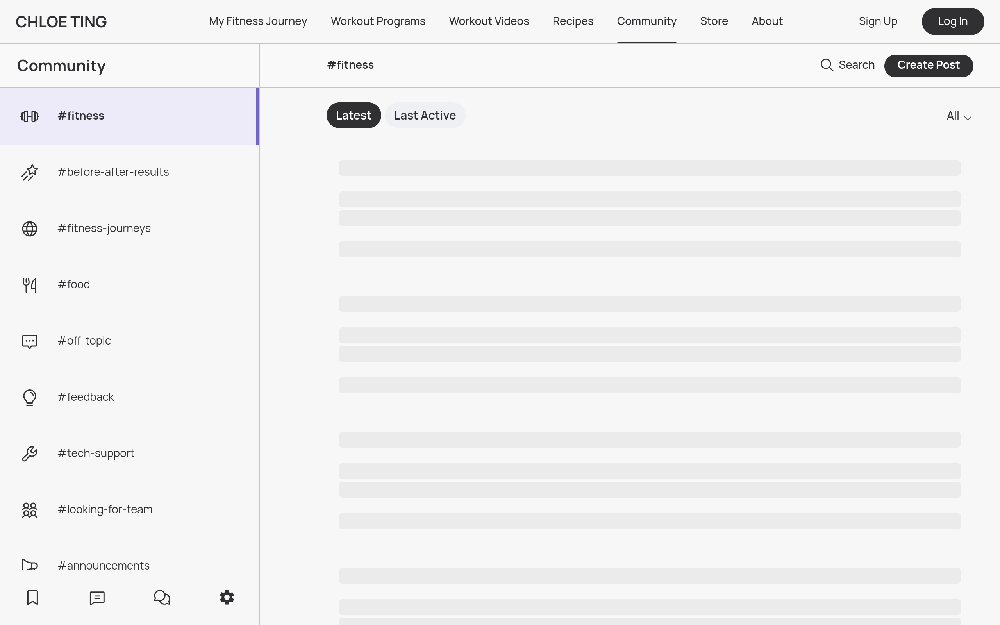

# chloeting-community DESIGN.md

> Auto-generated design system — reverse-engineered via static analysis by skillui.
> Frameworks: None detected
> Colors: 20 · Fonts: 3 · Components: 7
> Icon library: not detected · State: not detected
> Primary theme: light · Dark mode toggle: no · Motion: expressive

## Visual Reference

**Match this design exactly** — study colors, fonts, spacing, and component shapes before writing any UI code.



---

## 1. Visual Theme & Atmosphere

This is a **light-themed** interface with a cool, approachable feel. The light background emphasizes content clarity. Typography pairs **Manrope** for display/headings with **Poppins** for body text, creating clear visual hierarchy through type contrast. Spacing follows a **4px base grid** (compact density), with scale: 2, 4, 6, 8, 10, 12, 14, 16px. The accent color **#40a9ff** anchors interactive elements (buttons, links, focus rings). Motion is expressive — spring physics, layout animations, and staggered reveals are part of the visual language.

---

## 2. Color Palette & Roles

| Token | Hex | Role | Use |
|---|---|---|---|
| theme-color | `#ffffff` | background | Page background, darkest surface |
| highlight-color | `#fff2f0` | surface | Card and panel backgrounds |
| text-primary | `#000000` | text-primary | Headings and body text |
| color-primary-disabled | `#bfbfbf` | text-muted | Captions, placeholders, secondary info |
| color-secondary | `#868a93` | text-muted | Captions, placeholders, secondary info |
| color-primary | `#303033` | border | Dividers, card borders, outlines |
| accent | `#40a9ff` | accent | CTAs, links, focus rings, active states |
| danger | `#ff4d4f` | danger | Error states, destructive actions |
| success | `#52c41a` | success | Success states, positive indicators |
| warning | `#faad14` | warning | Warning states, caution indicators |
| anchor-hover-color | `#1890ff` | info | Informational highlights |
| unknown | `#d9d9d9` | unknown | Palette color |
| unknown | `#096dd9` | unknown | Palette color |
| base-color | `#f0f0f0` | unknown | Palette color |
| color-light-blue | `#e6f7ff` | unknown | Palette color |
| unknown | `#ff7875` | unknown | Palette color |
| unknown | `#d9363e` | unknown | Palette color |
| unknown | `#eb2f96` | unknown | Palette color |
| unknown | `#feffe6` | unknown | Palette color |
| unknown | `#fadb14` | unknown | Palette color |

### CSS Variable Tokens

```css
--antd-arrow-background-color: #fff;
--color-primary: #303033;
--color-primary-disabled: #c4c4c4;
--color-secondary: #868a93;
--color-background-primary: #f7f7f7;
--color-background-secondary: #f3f3f3;
--border-primary: 1px solid var(--color-primary-disabled);
--border-secondary: 1px solid #eff0f4;
--color-background: #fafafa;
--color-action-background: #eaedef;
--antd-arrow-background-color: #fff;
--color-primary: #303033;
--color-primary-disabled: #c4c4c4;
--color-secondary: #868a93;
--color-background-primary: #f7f7f7;
--color-background-secondary: #f3f3f3;
--border-primary: 1px solid var(--color-primary-disabled);
--border-secondary: 1px solid #eff0f4;
--color-background: #fafafa;
--color-action-background: #eaedef;
```


---

## 3. Typography Rules

**Font Stack:**
- **Poppins** — Heading 1, Heading 2, Heading 3
- **Manrope** — Body, Caption
- **SFMono-Regular** — Code

**Font Sources:**

```css
@font-face {
  font-family: "Manrope";
  src: url("fonts/Manrope-Bold.ttf") format("truetype");
  font-weight: 700;
}
@font-face {
  font-family: "Manrope";
  src: url("fonts/Manrope-Regular.ttf") format("truetype");
  font-weight: 400;
}
@font-face {
  font-family: "icomoon";
  src: url("fonts/icomoon-Regular.ttf") format("truetype");
  font-weight: 400;
}
@font-face {
  font-family: "Poppins";
  src: url("fonts/Poppins-Bold.ttf") format("truetype");
  font-weight: 700;
}
@font-face {
  font-family: "Poppins";
  src: url("fonts/Poppins-Regular.ttf") format("truetype");
  font-weight: 400;
}
@font-face {
  font-family: "Bricolage Grotesque";
  src: url("fonts/BricolageGrotesque-Bold.ttf") format("truetype");
  font-weight: 700;
}
@font-face {
  font-family: "Bricolage Grotesque";
  src: url("fonts/BricolageGrotesque-Regular.ttf") format("truetype");
  font-weight: 400;
}
```

| Role | Font | Size | Weight |
|---|---|---|---|
| Heading 1 | Poppins | 72px | 700 |
| Heading 2 | Poppins | 48px | 700 |
| Heading 3 | Poppins | 45px | 700 |
| Body | Manrope | 14px | 400 |
| Caption | Manrope | 16px | 400 |
| Code | SFMono-Regular | 14px | 400 |

**Typographic Rules:**
- Limit to 3 font families max per screen
- Use **Poppins** for body/UI text, **Manrope** for display/headings
- Maintain consistent hierarchy: no more than 3-4 font sizes per screen
- Headings use bold (600-700), body uses regular (400)
- Line height: 1.5 for body text, 1.2 for headings
- Use color and opacity for secondary hierarchy, not additional font sizes


---

## 4. Component Stylings

### Layout (1)

**Footer** — `html`

### Navigation (1)

**Navigation** — `html`

### Data Display (2)

**Badge** — `html`

**List** — `html`

### Data Input (2)

**Button** — `html`
- Variants: `round`, `default`
- Animation: 

**Input** — `html`
- State: :focus, :placeholder

### Media (1)

**Image** — `html`


---

## 5. Layout Principles

- **Base spacing unit:** 4px
- **Spacing scale:** 2, 4, 6, 8, 10, 12, 14, 16, 18, 20, 22, 24
- **Border radius:** inherit, .25rem, .3rem, 1px, 2px, 3px, 4px, 6px, 7px, 8px, 9px, 10px, 12px, 14px, 15px, 16px, 18px, 20px, 22px, 24px, 26px, 28px, 32px, 35px, 36px, 40px, 50px, 52px, 54px, 90px, 97px, 100%, 100px
- **Max content width:** 980px

**Spacing as Meaning:**
| Spacing | Use |
|---|---|
| 4-8px | Tight: related items within a group |
| 12-16px | Medium: between groups |
| 24-32px | Wide: between sections |
| 48px+ | Vast: major section breaks |


---

## 6. Depth & Elevation

### Flat — subtle depth hints

- `0 0 0 2px rgba(255,77,79,.2)`
- `0 0 0 2px rgba(250,173,20,.2)`
- `0 0 0 2px rgba(24,144,255,.2)`

### Raised — cards, buttons, interactive elements

- `0 0 0 0#1890ff`
- `0 0 0 0 var(--antd-wave-shadow-color)`
- `0 0 0#1890ff`

### Floating — dropdowns, popovers, modals

- `0 1px 2px -2px rgba(0,0,0,.16),0 3px 6px 0 rgba(0,0,0,.12),0 5px 12px 4px rgba(0,0,0,.09)`
- `inset 10px 0 8px -8px rgba(0,0,0,.08)`
- `inset -10px 0 8px -8px rgba(0,0,0,.08)`

### Overlay — full-screen overlays, top-level dialogs

- `0 3px 6px -4px rgba(0,0,0,.12),0 6px 16px 0 rgba(0,0,0,.08),0 9px 28px 8px rgba(0,0,0,.05)`
- `6px 0 16px -8px rgba(0,0,0,.08),9px 0 28px 0 rgba(0,0,0,.05),12px 0 48px 16px rgba(0,0,0,.03)`
- `-6px 0 16px -8px rgba(0,0,0,.08),-9px 0 28px 0 rgba(0,0,0,.05),-12px 0 48px 16px rgba(0,0,0,.03)`

### Z-Index Scale

`0, 1, 2, 3, 4, 9, 10, 15, 16, 99, 999, 1000, 1010, 1030, 1031, 1050, 1060, 1070, 1080, 9998, 2147483645, 2147483646, 2147483647`


---

## 7. Animation & Motion

This project uses **expressive motion**. Animations are an integral part of the experience.

### CSS Animations

- `@keyframes antFadeIn`
- `@keyframes antFadeOut`
- `@keyframes antMoveDownIn`
- `@keyframes antMoveDownOut`
- `@keyframes antMoveLeftIn`
- `@keyframes antMoveLeftOut`
- `@keyframes antMoveRightIn`
- `@keyframes antMoveRightOut`

### Animated Components

- **Button**: 

### Motion Guidelines

- Duration: 150-300ms for micro-interactions, 300-500ms for page transitions
- Easing: `ease-out` for enters, `ease-in` for exits
- Always respect `prefers-reduced-motion`


---

## 8. Do's and Don'ts

### Do's

- Use `#40a9ff` for interactive elements (buttons, links, focus rings)
- Use `#ffffff` as the primary page background
- Pair **Poppins** (body) with **Manrope** (display) — these are the only allowed fonts
- Follow the **4px** spacing grid for all margins, padding, and gaps
- Use the defined shadow tokens for elevation — see Section 6
- Use border-radius from the scale: inherit, .25rem, .3rem, 1px, 2px
- Reuse existing components from Section 4 before creating new ones

### Don'ts

- Don't introduce colors outside this palette — extend the design tokens first
- Don't introduce additional font families beyond Poppins and Manrope and SFMono-Regular
- Don't use arbitrary spacing values — stick to multiples of 4px
- Don't create custom box-shadow values outside the system tokens
- Don't use arbitrary border-radius values — pick from the defined scale
- Don't duplicate component patterns — check Section 4 first
- Don't use backdrop-blur or blur effects

### Anti-Patterns (detected from codebase)

- No blur or backdrop-blur effects
- No zebra striping on tables/lists


---

## 9. Responsive Behavior

| Name | Value | Source |
|---|---|---|
| xs | 0px | css |
| xs | 0em | css |
| sm | 39.9375em | css |
| sm | 40em | css |
| lg | 63.9375em | css |
| lg | 64em | css |
| xl | 74.9375em | css |
| xl | 75em | css |
| xs | 400px | css |
| xs | 480px | css |
| sm | 575px | css |
| sm | 576px | css |
| md | 767px | css |
| md | 767.98px | css |
| md | 768px | css |
| lg | 991px | css |
| lg | 992px | css |
| lg | 1023.98px | css |
| lg | 1024px | css |
| xl | 1199px | css |
| xl | 1200px | css |
| xl | 1239.98px | css |
| xl | 1240px | css |
| xl | 1280px | css |
| 2xl | 1440px | css |
| 2xl | 1599px | css |
| 2xl | 1600px | css |
| 2xl | 1615px | css |
| 2xl | 1680px | css |

**Approach:** Use `@media (min-width: ...)` queries matching the breakpoints above.


---

## 10. Agent Prompt Guide

Use these as starting points when building new UI:

### Build a Card

```
Background: #fff2f0
Border: 1px solid #303033
Radius: 18px
Padding: 16px
Font: Poppins
Use shadow tokens from Section 6.
```

### Build a Button

```
Primary: bg #40a9ff, text white
Ghost: bg transparent, border #303033
Padding: 8px 16px
Radius: 18px
Hover: opacity 0.9 or lighter shade
Focus: ring with #40a9ff
```

### Build a Page Layout

```
Background: #ffffff
Max-width: 980px, centered
Grid: 4px base
Responsive: mobile-first, breakpoints from Section 9
```

### Build a Stats Card

```
Surface: #fff2f0
Label: #bfbfbf (muted, 12px, uppercase)
Value: #000000 (primary, 24-32px, bold)
Status: use success/warning/danger from Section 2
```

### Build a Form

```
Input bg: #ffffff
Input border: 1px solid #303033
Focus: border-color #40a9ff
Label: #bfbfbf 12px
Spacing: 16px between fields
Radius: 18px
```

### General Component

```
1. Read DESIGN.md Sections 2-6 for tokens
2. Colors: only from palette
3. Font: Poppins, type scale from Section 3
4. Spacing: 4px grid
5. Components: match patterns from Section 4
6. Elevation: shadow tokens
```
