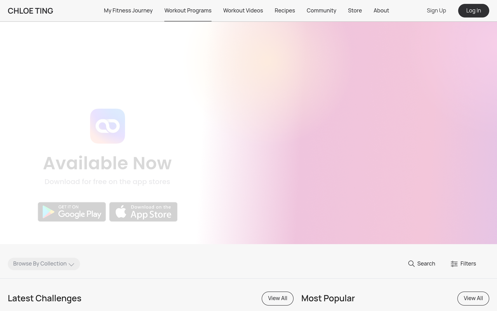

# chloeting-program Design System

You are matching **https://chloeting.com/program** (Workout Programs listing), not the homepage.

**Start here (2026-08-22):** `references/LIVE_CAPTURE_2026-08-22.md` + `screens/live-2026-08-22/`. Older embeds below (homepage.png, mixed home/login pages) are stale SkillUI crawl leftovers — do not implement from them.

UI type is **Manrope**. Poppins appears on the desktop hero H1 “Available Now” only. Hero uses a **background image**, not flat-only surfaces.

## Visual Reference

**IMPORTANT**: Study ALL screenshots below before writing any UI. Match colors, typography, spacing, layout, and motion exactly as shown.

### Live /program (2026-08-22)


### Stale SkillUI homepage embed (ignore)



### Scroll Journey (Cinematic Visual States)

> These screenshots capture the website at different scroll depths. The design changes dramatically as you scroll — each frame shows a different cinematic state. Replicate these exact visual transitions.

#### 0% — Hero / Above the fold


#### 17% — Mid-page at 17% scroll


#### 33% — Mid-page at 33% scroll


#### 50% — Mid-page at 50% scroll


#### 67% — Mid-page at 67% scroll


#### 83% — Mid-page at 83% scroll


#### 100% — Footer / End of page


> Read `references/DESIGN.md` for full token details. Read `references/ANIMATIONS.md` for motion specs. Read `references/LAYOUT.md` for layout structure. Read `references/COMPONENTS.md` for component patterns.

## Ultra Reference Files

This package includes extended documentation. **Read these files before implementing:**

| File | Contents |
|------|----------|
| `references/LIVE_CAPTURE_2026-08-22.md` | **START HERE** — measured live /program layout, type, colors |
| `references/DESIGN.md` | Full design system tokens, colors, typography, spacing |
| `references/VISUAL_GUIDE.md` | Older SkillUI visual guide (mixed URLs — verify against live capture) |
| `references/ANIMATIONS.md` | CSS keyframes, scroll triggers, motion library stack, video specs |
| `references/LAYOUT.md` | Flex/grid containers, page structure, spacing relationships |
| `references/COMPONENTS.md` | DOM component patterns, HTML structure, class fingerprints |
| `references/INTERACTIONS.md` | Hover/focus states with before/after style diffs |
| `screens/scroll/` | 7 scroll journey screenshots showing cinematic states |

## Design Philosophy

- **Manrope UI** — nav, cards, filters, H2/H3. Poppins only on desktop hero H1.
- **Hero is a photo wash** — `homepage-background-2025` PNG behind the app promo; not a flat white band.
- **Mint NEW** — `#c1ebe6` pill on new programs. Dark `#303033` pills for Log In / open Filters.
- **Two-column desktop listing** — Latest Challenges 736px + Most Popular 484px, then full-width collection rows.
- **5px density** — measured radii 15–20px cards, 35–52px pills.
- **Filter Ant blues** (`#1890ff`) — never as Erijane brand; curated tokens win for chrome.

## Color System

### Core Palette

| Role | Token | Hex | Use |
|------|-------|-----|-----|
| Background | `--background` | `#ffffff` | Page/app background |
| Surface | `--surface` | `#edfefc` | Cards, panels, modals |
| Text Primary | `--text-primary` | `#303033` | Headings, body text |
| Text Muted | `--text-muted` | `#868a93` | Captions, placeholders |
| Accent | `--accent` | `#c1ebe6` | CTAs, links, focus rings |

### Status Colors

| Status | Hex | Use |
|--------|-----|-----|
| Danger | `#e4485b` | Errors, destructive actions |

### Extended Palette

- `#000000` — Deep background layer or shadow color
- `#1890ff`
- `#c4c4c4`
- `#eff0f4` — Light surface or highlight color
- `#e3e4eb` — Light surface or highlight color

### CSS Variable Tokens

```css
--color-primary: #303033;
--color-primary-disabled: #c4c4c4;
--color-secondary: #868a93;
--color-background-primary: #f7f7f7;
--color-background-secondary: #f3f3f3;
--border-primary: 1px solid var(--color-primary-disabled);
--border-secondary: 1px solid #eff0f4;
--color-background: #fafafa;
--color-action-background: #eaedef;
```

## Typography

### Font Stack

- **Poppins** — Heading 1, Heading 2, Heading 3
- **Manrope** — Body

### Font Sources

```css
@font-face {
  font-family: "Poppins";
  src: url("fonts/Poppins-Bold.ttf") format("truetype");
  font-weight: 700;
}
@font-face {
  font-family: "Poppins";
  src: url("fonts/Poppins-Regular.ttf") format("truetype");
  font-weight: 400;
}
@font-face {
  font-family: "Manrope";
  src: url("fonts/Manrope-Bold.ttf") format("truetype");
  font-weight: 700;
}
@font-face {
  font-family: "Manrope";
  src: url("fonts/Manrope-Regular.ttf") format("truetype");
  font-weight: 400;
}
```

### Type Scale

| Role | Family | Size | Weight |
|------|--------|------|--------|
| Heading 1 | Poppins | 45px | 700 |
| Heading 2 | Poppins | 16px | 700 |
| Heading 3 | Poppins | 14px | 700 |
| Body | Manrope | 0px | 400 |

### Typography Rules

- Body/UI: **Poppins**, Headings: **Manrope** — these are the only display fonts
- Max 3-4 font sizes per screen
- Headings: weight 600-700, body: weight 400
- Use color and opacity for text hierarchy, not additional font sizes
- Line height: 1.5 for body, 1.2 for headings

## Spacing & Layout

### Base Grid: 5px

Every dimension (margin, padding, gap, width, height) must be a multiple of **5px**.

### Spacing Scale

`5, 10, 15, 20, 25, 30, 40, 50, 60, 80, 90, 100` px

### Spacing as Meaning

| Spacing | Use |
|---------|-----|
| 2.5-5px | Tight: related items within a group |
| 10px | Medium: between groups |
| 15-20px | Wide: between sections |
| 30px+ | Vast: major section breaks |

### Border Radius

Scale: `1px, 2px, 4px, 6px, 8px, 15px, 16px, 20px, 35px, 52px, 97px`
Default: `15px`

## Component Patterns

### Card

```css
.card {
  background: #edfefc;
  border-radius: 15px;
  padding: 20px;
  box-shadow: rgba(0, 0, 0, 0.016) 0px 2px 0px 0px;
}
```

```html
<div class="card">
  <h3>Card Title</h3>
  <p>Card content goes here.</p>
</div>
```

### Button

```css
/* Primary */
.btn-primary {
  background: #c1ebe6;
  color: #303033;
  border-radius: 15px;
  padding: 10px 20px;
  font-weight: 500;
  transition: opacity 150ms ease;
}
.btn-primary:hover { opacity: 0.9; }

/* Ghost */
.btn-ghost {
  background: transparent;
  border: 1px solid #cccccc;
  color: #303033;
  border-radius: 15px;
  padding: 10px 20px;
}
```

```html
<button class="btn-primary">Get Started</button>
<button class="btn-ghost">Learn More</button>
```

### Input

```css
.input {
  background: #ffffff;
  border: 1px solid #cccccc;
  border-radius: 15px;
  padding: 10px 15px;
  color: #303033;
  font-size: 14px;
}
.input:focus { border-color: #c1ebe6; outline: none; }
```

```html
<input class="input" type="text" placeholder="Search..." />
```

### Badge / Chip

```css
.badge {
  display: inline-flex;
  align-items: center;
  padding: 5px 10px;
  border-radius: 9999px;
  font-size: 12px;
  font-weight: 500;
  background: #edfefc;
  color: #868a93;
}
```

```html
<span class="badge">New</span>
<span class="badge">Beta</span>
```

### Modal / Dialog

```css
.modal-backdrop { background: rgba(0, 0, 0, 0.6); }
.modal {
  background: #edfefc;
  border-radius: 97px;
  padding: 30px;
  max-width: 480px;
  width: 90vw;
  box-shadow: rgba(0, 0, 0, 0.016) 0px 2px 0px 0px;
}
```

```html
<div class="modal-backdrop">
  <div class="modal">
    <h2>Dialog Title</h2>
    <p>Dialog content.</p>
    <button class="btn-primary">Confirm</button>
    <button class="btn-ghost">Cancel</button>
  </div>
</div>
```

### Table

```css
.table { width: 100%; border-collapse: collapse; }
.table th {
  text-align: left;
  padding: 10px 15px;
  font-weight: 500;
  font-size: 12px;
  color: #868a93;
  text-transform: uppercase;
  letter-spacing: 0.05em;
  border-bottom: 1px solid #cccccc;
}
.table td {
  padding: 15px;
  border-bottom: 1px solid #cccccc;
}
```

```html
<table class="table">
  <thead><tr><th>Name</th><th>Status</th><th>Date</th></tr></thead>
  <tbody>
    <tr><td>Item One</td><td>Active</td><td>Jan 1</td></tr>
    <tr><td>Item Two</td><td>Pending</td><td>Jan 2</td></tr>
  </tbody>
</table>
```

### Navigation

```css
.nav {
  display: flex;
  align-items: center;
  gap: 10px;
  padding: 15px 20px;
}
.nav-link {
  color: #868a93;
  padding: 10px 15px;
  border-radius: 15px;
  transition: color 150ms;
}
.nav-link:hover { color: #303033; }
.nav-link.active { color: #c1ebe6; }
```

```html
<nav class="nav">
  <a href="/" class="nav-link active">Home</a>
  <a href="/about" class="nav-link">About</a>
  <a href="/pricing" class="nav-link">Pricing</a>
  <button class="btn-primary" style="margin-left: auto">Get Started</button>
</nav>
```

## Animation & Motion

This project uses **subtle motion**. Transitions smooth state changes without calling attention.

### Motion Guidelines

- **Duration:** 150-300ms for micro-interactions, 300-500ms for page transitions
- **Easing:** `ease-out` for enters, `ease-in` for exits
- **Direction:** Elements enter from bottom/right, exit to top/left
- **Reduced motion:** Always respect `prefers-reduced-motion` — disable animations when set

## Depth & Elevation

### Shadow Tokens

- Subtle: `rgba(0, 0, 0, 0.016) 0px 2px 0px 0px`

## Anti-Patterns (Never Do)

- **No gradients** — solid colors only, everywhere
- **No blur effects** — no backdrop-blur, no filter: blur()
- **No zebra striping** — tables and lists use borders for separation
- **No invented colors** — every hex value must come from the palette above
- **No arbitrary spacing** — every dimension is a multiple of 5px
- **No extra fonts** — only Poppins and Manrope are allowed
- **No arbitrary border-radius** — use the scale: 1px, 2px, 4px, 6px, 8px, 15px, 16px, 20px, 35px, 52px
- **No opacity for disabled states** — use muted colors instead
- **No pill shapes** — this design doesn't use rounded-full / 9999px radius

## Workflow

1. **Read** `references/DESIGN.md` before writing any UI code
2. **Pick colors** from the Color System section — never invent new ones
3. **Set typography** — Poppins, Manrope only, using the type scale
4. **Build layout** on the 5px grid — check every margin, padding, gap
5. **Match components** to patterns above before creating new ones
6. **Apply elevation** — use shadow tokens
7. **Validate** — every value traces back to a design token. No magic numbers.

## Brand Spec

- **Site URL:** `https://chloeting.com/program`
- **Brand color:** `#c1ebe6`
- **Brand typeface:** Poppins

## Quick Reference

```
Background:     #ffffff
Surface:        #edfefc
Text:           #303033 / #868a93
Accent:         #c1ebe6
Border:         (not extracted)
Font:           Poppins
Spacing:        5px grid
Radius:         15px
Components:     0 detected
```

## When to Trigger

Activate this skill when:
- Creating new components, pages, or visual elements for chloeting-program
- Writing CSS, Tailwind classes, styled-components, or inline styles
- Building page layouts, templates, or responsive designs
- Reviewing UI code for design consistency
- The user mentions "chloeting-program" design, style, UI, or theme
- Generating mockups, wireframes, or visual prototypes

---

# Full Reference Files

> Every output file is embedded below. Claude has full design system context from /skills alone.

## Design System Tokens (DESIGN.md)

# chloeting-program DESIGN.md

> Auto-generated design system — reverse-engineered via static analysis by skillui.
> Frameworks: None detected
> Colors: 11 · Fonts: 2 · Components: 0
> Icon library: not detected · State: not detected
> Primary theme: light · Dark mode toggle: no · Motion: none

## Visual Reference

**Match this design exactly** — study colors, fonts, spacing, and component shapes before writing any UI code.


---

## 1. Visual Theme & Atmosphere

This is a **light-themed** interface with a cool, approachable feel. The light background emphasizes content clarity. Typography pairs **Manrope** for display/headings with **Poppins** for body text, creating clear visual hierarchy through type contrast. Spacing follows a **5px base grid** (standard density), with scale: 5, 10, 15, 20, 25, 30, 40, 50px. The palette is predominantly monochromatic with **#c1ebe6** as the single accent color — used sparingly for interactive elements and emphasis.

---

## 2. Color Palette & Roles

| Token | Hex | Role | Use |
|---|---|---|---|
| background | `#ffffff` | background | Page background, darkest surface |
| surface | `#edfefc` | surface | Card and panel backgrounds |
| text-primary | `#303033` | text-primary | Headings and body text |
| text-muted | `#868a93` | text-muted | Captions, placeholders, secondary info |
| accent | `#c1ebe6` | accent | CTAs, links, focus rings, active states |
| danger | `#e4485b` | danger | Error states, destructive actions |
| info | `#1890ff` | info | Informational highlights |
| unknown | `#000000` | unknown | Palette color |
| unknown | `#c4c4c4` | unknown | Palette color |
| unknown | `#eff0f4` | unknown | Palette color |
| unknown | `#e3e4eb` | unknown | Palette color |

### CSS Variable Tokens

```css
--color-primary: #303033;
--color-primary-disabled: #c4c4c4;
--color-secondary: #868a93;
--color-background-primary: #f7f7f7;
--color-background-secondary: #f3f3f3;
--border-primary: 1px solid var(--color-primary-disabled);
--border-secondary: 1px solid #eff0f4;
--color-background: #fafafa;
--color-action-background: #eaedef;
```


---

## 3. Typography Rules

**Font Stack:**
- **Poppins** — Heading 1, Heading 2, Heading 3
- **Manrope** — Body

| Role | Font | Size | Weight |
|---|---|---|---|
| Heading 1 | Poppins | 45px | 700 |
| Heading 2 | Poppins | 16px | 700 |
| Heading 3 | Poppins | 14px | 700 |
| Body | Manrope | 0px | 400 |

**Typographic Rules:**
- Limit to 2 font families max per screen
- Use **Poppins** for body/UI text, **Manrope** for display/headings
- Maintain consistent hierarchy: no more than 3-4 font sizes per screen
- Headings use bold (600-700), body uses regular (400)
- Line height: 1.5 for body text, 1.2 for headings
- Use color and opacity for secondary hierarchy, not additional font sizes


---

## 4. Component Stylings

No components detected. Scan `src/components/` or `components/` to populate this section.

---

## 5. Layout Principles

- **Base spacing unit:** 5px
- **Spacing scale:** 5, 10, 15, 20, 25, 30, 40, 50, 60, 80, 90, 100
- **Border radius:** 1px, 2px, 4px, 6px, 8px, 15px, 16px, 20px, 35px, 52px, 97px

**Spacing as Meaning:**
| Spacing | Use |
|---|---|
| 2.5-5px | Tight: related items within a group |
| 10px | Medium: between groups |
| 15-20px | Wide: between sections |
| 30px+ | Vast: major section breaks |


---

## 6. Depth & Elevation

### Flat — subtle depth hints

- `rgba(0, 0, 0, 0.016) 0px 2px 0px 0px`


---

## 8. Do's and Don'ts

### Do's

- Use `#c1ebe6` for interactive elements (buttons, links, focus rings)
- Use `#ffffff` as the primary page background
- Pair **Poppins** (body) with **Manrope** (display) — these are the only allowed fonts
- Follow the **5px** spacing grid for all margins, padding, and gaps
- Use the defined shadow tokens for elevation — see Section 6
- Use border-radius from the scale: 1px, 2px, 4px, 6px, 8px

### Don'ts

- Don't introduce colors outside this palette — extend the design tokens first
- Don't introduce additional font families beyond Poppins and Manrope
- Don't use arbitrary spacing values — stick to multiples of 5px
- Don't create custom box-shadow values outside the system tokens
- Don't use gradients — the design uses solid colors only
- Don't use arbitrary border-radius values — pick from the defined scale
- Don't use backdrop-blur or blur effects

### Anti-Patterns (detected from codebase)

- No gradient backgrounds
- No blur or backdrop-blur effects
- No zebra striping on tables/lists


---

## 9. Responsive Behavior

No breakpoints detected. Consider adding responsive breakpoints to the design system.

---

## 10. Agent Prompt Guide

Use these as starting points when building new UI:

### Build a Card

```
Background: #edfefc
Border: 1px solid var(--border)
Radius: 15px
Padding: 20px
Font: Poppins
Use shadow tokens from Section 6.
```

### Build a Button

```
Primary: bg #c1ebe6, text white
Ghost: bg transparent, border var(--border)
Padding: 10px 20px
Radius: 15px
Hover: opacity 0.9 or lighter shade
Focus: ring with #c1ebe6
```

### Build a Page Layout

```
Background: #ffffff
Max-width: 1280px, centered
Grid: 5px base
Responsive: mobile-first, breakpoints from Section 9
```

### Build a Stats Card

```
Surface: #edfefc
Label: #868a93 (muted, 12px, uppercase)
Value: #303033 (primary, 24-32px, bold)
Status: use success/warning/danger from Section 2
```

### Build a Form

```
Input bg: #ffffff
Input border: 1px solid var(--border)
Focus: border-color #c1ebe6
Label: #868a93 12px
Spacing: 20px between fields
Radius: 15px
```

### General Component

```
1. Read DESIGN.md Sections 2-6 for tokens
2. Colors: only from palette
3. Font: Poppins, type scale from Section 3
4. Spacing: 5px grid
5. Components: match patterns from Section 4
6. Elevation: shadow tokens
```

## Visual Guide — Screenshots (VISUAL_GUIDE.md)

# chloeting-program — Visual Guide

> Master visual reference. Study every screenshot carefully before implementing any UI.
> Match colors, layout, typography, spacing, and motion states exactly.

## Scroll Journey

The page has cinematic scroll animations. Each screenshot below shows the exact visual state at that scroll depth.
**Replicate these transitions precisely** — the design changes dramatically as you scroll.

### Hero — Above the fold

*Scroll position: 0px of 5414px total*


### 17% scroll depth

*Scroll position: 767px of 5414px total*


### 33% scroll depth

*Scroll position: 1490px of 5414px total*


### 50% scroll depth

*Scroll position: 2257px of 5414px total*


### 67% scroll depth

*Scroll position: 3024px of 5414px total*


### 83% scroll depth

*Scroll position: 3747px of 5414px total*


### Footer — End of page

*Scroll position: 4514px of 5414px total*


## Full Page Screenshots

### Chloe Ting Free Workout Programs

*URL: `https://chloeting.com/program`*


### Chloe Ting - Free Workout Programs

*URL: `https://chloeting.com/`*


### Chloe Ting - Free Workout Programs

*URL: `https://chloeting.com/login`*


## Section Screenshots

Clipped sections showing individual components in context.

### Section 1 — `section`

*1440×1200px*


### Section 1 — `section`

*1440×1200px*


## Animations & Motion (ANIMATIONS.md)

# Animation Reference

> Cinematic motion design extracted from live DOM. Follow these specs exactly to recreate the experience.

## Motion Technology Stack

Pure CSS animations — no external animation libraries detected.

## Scroll Journey

The page is **5,414px** tall. Each frame below shows what the user sees at that scroll depth.

> **Use these screenshots to understand WHAT animates, WHEN it animates, and HOW it moves.**

### 0% — Top / Hero
Scroll position: 0px


### 17% — Opening Section
Scroll position: 767px


### 33% — First Feature Section
Scroll position: 1,490px


### 50% — Mid-Page
Scroll position: 2,257px


### 67% — Lower Content
Scroll position: 3,024px


### 83% — Near Footer
Scroll position: 3,747px


### 100% — Bottom / Footer
Scroll position: 4,514px


## CSS Keyframes (64 extracted)

### `@keyframes antSlideUpIn`

Used by: `.ant-slide-up-appear.ant-slide-up-appear-active, .ant-slide-up-enter.ant-slide-u`, `.ant-select-dropdown.ant-slide-up-appear.ant-slide-up-appear-active.ant-select-d`, `.ant-dropdown.ant-slide-down-appear.ant-slide-down-appear-active.ant-dropdown-pl`, `.ant-picker-dropdown.ant-slide-up-appear.ant-slide-up-appear-active.ant-picker-d`

```css
@keyframes antSlideUpIn {
  0% {
    transform: scaleY(0.8);
    transform-origin: 0px 0px;
    opacity: 0;
  }
  100% {
    transform: scaleY(1);
    transform-origin: 0px 0px;
    opacity: 1;
  }
}
```

> Fade + motion enter animation

### `@keyframes antSlideUpOut`

Used by: `.ant-slide-up-leave.ant-slide-up-leave-active`, `.ant-select-dropdown.ant-slide-up-leave.ant-slide-up-leave-active.ant-select-dro`, `.ant-dropdown.ant-slide-down-leave.ant-slide-down-leave-active.ant-dropdown-plac`, `.ant-picker-dropdown.ant-slide-up-leave.ant-slide-up-leave-active.ant-picker-dro`

```css
@keyframes antSlideUpOut {
  0% {
    transform: scaleY(1);
    transform-origin: 0px 0px;
    opacity: 1;
  }
  100% {
    transform: scaleY(0.8);
    transform-origin: 0px 0px;
    opacity: 0;
  }
}
```

> Fade + motion enter animation

### `@keyframes antSlideDownIn`

Used by: `.ant-slide-down-appear.ant-slide-down-appear-active, .ant-slide-down-enter.ant-s`, `.ant-select-dropdown.ant-slide-up-appear.ant-slide-up-appear-active.ant-select-d`, `.ant-dropdown.ant-slide-up-appear.ant-slide-up-appear-active.ant-dropdown-placem`, `.ant-picker-dropdown.ant-slide-up-appear.ant-slide-up-appear-active.ant-picker-d`

```css
@keyframes antSlideDownIn {
  0% {
    transform: scaleY(0.8);
    transform-origin: 100% 100%;
    opacity: 0;
  }
  100% {
    transform: scaleY(1);
    transform-origin: 100% 100%;
    opacity: 1;
  }
}
```

> Fade + motion enter animation

### `@keyframes antSlideDownOut`

Used by: `.ant-slide-down-leave.ant-slide-down-leave-active`, `.ant-select-dropdown.ant-slide-up-leave.ant-slide-up-leave-active.ant-select-dro`, `.ant-dropdown.ant-slide-up-leave.ant-slide-up-leave-active.ant-dropdown-placemen`, `.ant-picker-dropdown.ant-slide-up-leave.ant-slide-up-leave-active.ant-picker-dro`

```css
@keyframes antSlideDownOut {
  0% {
    transform: scaleY(1);
    transform-origin: 100% 100%;
    opacity: 1;
  }
  100% {
    transform: scaleY(0.8);
    transform-origin: 100% 100%;
    opacity: 0;
  }
}
```

> Fade + motion enter animation

### `@keyframes antCheckboxEffect`

Duration: `0.36s` · Easing: `ease-in-out` · Delay: `0s` · Iteration: `1` · Fill: `backwards`

Used by: `.ant-cascader-checkbox-checked::after`, `.ant-checkbox-checked::after`, `.ant-tree-checkbox-checked::after`, `.ant-select-tree-checkbox-checked::after`

```css
@keyframes antCheckboxEffect {
  0% {
    transform: scale(1);
    opacity: 0.5;
  }
  100% {
    transform: scale(1.6);
    opacity: 0;
  }
}
```

> Fade + motion enter animation

### `@keyframes loadingCircle`

Duration: `1s` · Easing: `linear` · Delay: `0s` · Iteration: `infinite` · Fill: `none`

Used by: `.anticon-spin, .anticon-spin::before`, `.ant-btn > .ant-btn-loading-icon .anticon svg`

```css
@keyframes loadingCircle {
  100% {
    transform: rotate(1turn);
  }
}
```

> Transform/motion animation

### `@keyframes antZoomBigIn`

Used by: `.ant-zoom-big-appear.ant-zoom-big-appear-active, .ant-zoom-big-enter.ant-zoom-bi`, `.ant-zoom-big-fast-appear.ant-zoom-big-fast-appear-active, .ant-zoom-big-fast-en`

```css
@keyframes antZoomBigIn {
  0% {
    transform: scale(0.8);
    opacity: 0;
  }
  100% {
    transform: scale(1);
    opacity: 1;
  }
}
```

> Fade + motion enter animation

### `@keyframes antZoomBigOut`

Used by: `.ant-zoom-big-leave.ant-zoom-big-leave-active`, `.ant-zoom-big-fast-leave.ant-zoom-big-fast-leave-active`

```css
@keyframes antZoomBigOut {
  0% {
    transform: scale(1);
  }
  100% {
    transform: scale(0.8);
    opacity: 0;
  }
}
```

> Fade + motion enter animation

### `@keyframes ant-tree-node-fx-do-not-use`

Duration: `0.3s` · Easing: `ease` · Delay: `0s` · Iteration: `1` · Fill: `forwards`

Used by: `.ant-tree.ant-tree-block-node .ant-tree-list-holder-inner .ant-tree-treenode.dra`, `.ant-select-tree.ant-select-tree-block-node .ant-select-tree-list-holder-inner .`

```css
@keyframes ant-tree-node-fx-do-not-use {
  0% {
    opacity: 0;
  }
  100% {
    opacity: 1;
  }
}
```

> Opacity fade

### `@keyframes antFadeIn`

Used by: `.ant-fade-appear.ant-fade-appear-active, .ant-fade-enter.ant-fade-enter-active`

```css
@keyframes antFadeIn {
  0% {
    opacity: 0;
  }
  100% {
    opacity: 1;
  }
}
```

> Opacity fade

### `@keyframes antFadeOut`

Used by: `.ant-fade-leave.ant-fade-leave-active`

```css
@keyframes antFadeOut {
  0% {
    opacity: 1;
  }
  100% {
    opacity: 0;
  }
}
```

> Opacity fade

### `@keyframes antMoveDownIn`

Used by: `.ant-move-down-appear.ant-move-down-appear-active, .ant-move-down-enter.ant-move`

```css
@keyframes antMoveDownIn {
  0% {
    transform: translateY(100%);
    transform-origin: 0px 0px;
    opacity: 0;
  }
  100% {
    transform: translateY(0px);
    transform-origin: 0px 0px;
    opacity: 1;
  }
}
```

> Fade + motion enter animation

### `@keyframes antMoveDownOut`

Used by: `.ant-move-down-leave.ant-move-down-leave-active`

```css
@keyframes antMoveDownOut {
  0% {
    transform: translateY(0px);
    transform-origin: 0px 0px;
    opacity: 1;
  }
  100% {
    transform: translateY(100%);
    transform-origin: 0px 0px;
    opacity: 0;
  }
}
```

> Fade + motion enter animation

### `@keyframes antMoveLeftIn`

Used by: `.ant-move-left-appear.ant-move-left-appear-active, .ant-move-left-enter.ant-move`

```css
@keyframes antMoveLeftIn {
  0% {
    transform: translateX(-100%);
    transform-origin: 0px 0px;
    opacity: 0;
  }
  100% {
    transform: translateX(0px);
    transform-origin: 0px 0px;
    opacity: 1;
  }
}
```

> Fade + motion enter animation

### `@keyframes antMoveLeftOut`

Used by: `.ant-move-left-leave.ant-move-left-leave-active`

```css
@keyframes antMoveLeftOut {
  0% {
    transform: translateX(0px);
    transform-origin: 0px 0px;
    opacity: 1;
  }
  100% {
    transform: translateX(-100%);
    transform-origin: 0px 0px;
    opacity: 0;
  }
}
```

> Fade + motion enter animation

### `@keyframes antMoveRightIn`

Used by: `.ant-move-right-appear.ant-move-right-appear-active, .ant-move-right-enter.ant-m`

```css
@keyframes antMoveRightIn {
  0% {
    transform: translateX(100%);
    transform-origin: 0px 0px;
    opacity: 0;
  }
  100% {
    transform: translateX(0px);
    transform-origin: 0px 0px;
    opacity: 1;
  }
}
```

> Fade + motion enter animation

### `@keyframes antMoveRightOut`

Used by: `.ant-move-right-leave.ant-move-right-leave-active`

```css
@keyframes antMoveRightOut {
  0% {
    transform: translateX(0px);
    transform-origin: 0px 0px;
    opacity: 1;
  }
  100% {
    transform: translateX(100%);
    transform-origin: 0px 0px;
    opacity: 0;
  }
}
```

> Fade + motion enter animation

### `@keyframes antMoveUpIn`

Used by: `.ant-move-up-appear.ant-move-up-appear-active, .ant-move-up-enter.ant-move-up-en`

```css
@keyframes antMoveUpIn {
  0% {
    transform: translateY(-100%);
    transform-origin: 0px 0px;
    opacity: 0;
  }
  100% {
    transform: translateY(0px);
    transform-origin: 0px 0px;
    opacity: 1;
  }
}
```

> Fade + motion enter animation

### `@keyframes antMoveUpOut`

Used by: `.ant-move-up-leave.ant-move-up-leave-active`

```css
@keyframes antMoveUpOut {
  0% {
    transform: translateY(0px);
    transform-origin: 0px 0px;
    opacity: 1;
  }
  100% {
    transform: translateY(-100%);
    transform-origin: 0px 0px;
    opacity: 0;
  }
}
```

> Fade + motion enter animation

### `@keyframes waveEffect`

Duration: `2s, 0.4s` · Easing: `cubic-bezier(0.08, 0.82, 0.17, 1), cubic-bezier(0.08, 0.82, 0.17, 1)` · Delay: `0s, 0s` · Iteration: `1, 1` · Fill: `forwards`

Used by: `.ant-click-animating-node, [ant-click-animating-without-extra-node="true"]::afte`

```css
@keyframes waveEffect {
  100% {
    box-shadow: 0 0 0 6px var(--antd-wave-shadow-color);
  }
}
```

> Shadow pulse/glow effect

### `@keyframes fadeEffect`

Duration: `2s, 0.4s` · Easing: `cubic-bezier(0.08, 0.82, 0.17, 1), cubic-bezier(0.08, 0.82, 0.17, 1)` · Delay: `0s, 0s` · Iteration: `1, 1` · Fill: `forwards`

Used by: `.ant-click-animating-node, [ant-click-animating-without-extra-node="true"]::afte`

```css
@keyframes fadeEffect {
  100% {
    opacity: 0;
  }
}
```

> Opacity fade

### `@keyframes antSlideLeftIn`

Used by: `.ant-slide-left-appear.ant-slide-left-appear-active, .ant-slide-left-enter.ant-s`

```css
@keyframes antSlideLeftIn {
  0% {
    transform: scaleX(0.8);
    transform-origin: 0px 0px;
    opacity: 0;
  }
  100% {
    transform: scaleX(1);
    transform-origin: 0px 0px;
    opacity: 1;
  }
}
```

> Fade + motion enter animation

### `@keyframes antSlideLeftOut`

Used by: `.ant-slide-left-leave.ant-slide-left-leave-active`

```css
@keyframes antSlideLeftOut {
  0% {
    transform: scaleX(1);
    transform-origin: 0px 0px;
    opacity: 1;
  }
  100% {
    transform: scaleX(0.8);
    transform-origin: 0px 0px;
    opacity: 0;
  }
}
```

> Fade + motion enter animation

### `@keyframes antSlideRightIn`

Used by: `.ant-slide-right-appear.ant-slide-right-appear-active, .ant-slide-right-enter.an`

```css
@keyframes antSlideRightIn {
  0% {
    transform: scaleX(0.8);
    transform-origin: 100% 0px;
    opacity: 0;
  }
  100% {
    transform: scaleX(1);
    transform-origin: 100% 0px;
    opacity: 1;
  }
}
```

> Fade + motion enter animation

### `@keyframes antSlideRightOut`

Used by: `.ant-slide-right-leave.ant-slide-right-leave-active`

```css
@keyframes antSlideRightOut {
  0% {
    transform: scaleX(1);
    transform-origin: 100% 0px;
    opacity: 1;
  }
  100% {
    transform: scaleX(0.8);
    transform-origin: 100% 0px;
    opacity: 0;
  }
}
```

> Fade + motion enter animation

### `@keyframes antZoomIn`

Used by: `.ant-zoom-appear.ant-zoom-appear-active, .ant-zoom-enter.ant-zoom-enter-active`

```css
@keyframes antZoomIn {
  0% {
    transform: scale(0.2);
    opacity: 0;
  }
  100% {
    transform: scale(1);
    opacity: 1;
  }
}
```

> Fade + motion enter animation

### `@keyframes antZoomOut`

Used by: `.ant-zoom-leave.ant-zoom-leave-active`

```css
@keyframes antZoomOut {
  0% {
    transform: scale(1);
  }
  100% {
    transform: scale(0.2);
    opacity: 0;
  }
}
```

> Fade + motion enter animation

### `@keyframes antZoomUpIn`

Used by: `.ant-zoom-up-appear.ant-zoom-up-appear-active, .ant-zoom-up-enter.ant-zoom-up-en`

```css
@keyframes antZoomUpIn {
  0% {
    transform: scale(0.8);
    transform-origin: 50% 0px;
    opacity: 0;
  }
  100% {
    transform: scale(1);
    transform-origin: 50% 0px;
  }
}
```

> Fade + motion enter animation

### `@keyframes antZoomUpOut`

Used by: `.ant-zoom-up-leave.ant-zoom-up-leave-active`

```css
@keyframes antZoomUpOut {
  0% {
    transform: scale(1);
    transform-origin: 50% 0px;
  }
  100% {
    transform: scale(0.8);
    transform-origin: 50% 0px;
    opacity: 0;
  }
}
```

> Fade + motion enter animation

### `@keyframes antZoomLeftIn`

Used by: `.ant-zoom-left-appear.ant-zoom-left-appear-active, .ant-zoom-left-enter.ant-zoom`

```css
@keyframes antZoomLeftIn {
  0% {
    transform: scale(0.8);
    transform-origin: 0px 50%;
    opacity: 0;
  }
  100% {
    transform: scale(1);
    transform-origin: 0px 50%;
  }
}
```

> Fade + motion enter animation

### `@keyframes antZoomLeftOut`

Used by: `.ant-zoom-left-leave.ant-zoom-left-leave-active`

```css
@keyframes antZoomLeftOut {
  0% {
    transform: scale(1);
    transform-origin: 0px 50%;
  }
  100% {
    transform: scale(0.8);
    transform-origin: 0px 50%;
    opacity: 0;
  }
}
```

> Fade + motion enter animation

### `@keyframes antZoomRightIn`

Used by: `.ant-zoom-right-appear.ant-zoom-right-appear-active, .ant-zoom-right-enter.ant-z`

```css
@keyframes antZoomRightIn {
  0% {
    transform: scale(0.8);
    transform-origin: 100% 50%;
    opacity: 0;
  }
  100% {
    transform: scale(1);
    transform-origin: 100% 50%;
  }
}
```

> Fade + motion enter animation

### `@keyframes antZoomRightOut`

Used by: `.ant-zoom-right-leave.ant-zoom-right-leave-active`

```css
@keyframes antZoomRightOut {
  0% {
    transform: scale(1);
    transform-origin: 100% 50%;
  }
  100% {
    transform: scale(0.8);
    transform-origin: 100% 50%;
    opacity: 0;
  }
}
```

> Fade + motion enter animation

### `@keyframes antZoomDownIn`

Used by: `.ant-zoom-down-appear.ant-zoom-down-appear-active, .ant-zoom-down-enter.ant-zoom`

```css
@keyframes antZoomDownIn {
  0% {
    transform: scale(0.8);
    transform-origin: 50% 100%;
    opacity: 0;
  }
  100% {
    transform: scale(1);
    transform-origin: 50% 100%;
  }
}
```

> Fade + motion enter animation

### `@keyframes antZoomDownOut`

Used by: `.ant-zoom-down-leave.ant-zoom-down-leave-active`

```css
@keyframes antZoomDownOut {
  0% {
    transform: scale(1);
    transform-origin: 50% 100%;
  }
  100% {
    transform: scale(0.8);
    transform-origin: 50% 100%;
    opacity: 0;
  }
}
```

> Fade + motion enter animation

### `@keyframes antStatusProcessing`

Duration: `1.2s` · Easing: `ease-in-out` · Delay: `0s` · Iteration: `infinite` · Fill: `none`

Used by: `.ant-badge-status-processing::after`

```css
@keyframes antStatusProcessing {
  0% {
    transform: scale(0.8);
    opacity: 0.5;
  }
  100% {
    transform: scale(2.4);
    opacity: 0;
  }
}
```

> Fade + motion enter animation

### `@keyframes antZoomBadgeIn`

Duration: `0.3s` · Easing: `cubic-bezier(0.12, 0.4, 0.29, 1.46)` · Delay: `0s` · Iteration: `1` · Fill: `both`

Used by: `.ant-badge-zoom-appear, .ant-badge-zoom-enter`

```css
@keyframes antZoomBadgeIn {
  0% {
    transform: scale(0) translate(50%, -50%);
    opacity: 0;
  }
  100% {
    transform: scale(1) translate(50%, -50%);
  }
}
```

> Fade + motion enter animation

### `@keyframes antZoomBadgeOut`

Duration: `0.3s` · Easing: `cubic-bezier(0.71, -0.46, 0.88, 0.6)` · Delay: `0s` · Iteration: `1` · Fill: `both`

Used by: `.ant-badge-zoom-leave`

```css
@keyframes antZoomBadgeOut {
  0% {
    transform: scale(1) translate(50%, -50%);
  }
  100% {
    transform: scale(0) translate(50%, -50%);
    opacity: 0;
  }
}
```

> Fade + motion enter animation

### `@keyframes antNoWrapperZoomBadgeIn`

Duration: `0.3s` · Easing: `cubic-bezier(0.12, 0.4, 0.29, 1.46)` · Delay: `0s` · Iteration: `1` · Fill: `none`

Used by: `.ant-badge-not-a-wrapper .ant-badge-zoom-appear, .ant-badge-not-a-wrapper .ant-b`

```css
@keyframes antNoWrapperZoomBadgeIn {
  0% {
    transform: scale(0);
    opacity: 0;
  }
  100% {
    transform: scale(1);
  }
}
```

> Fade + motion enter animation

### `@keyframes antNoWrapperZoomBadgeOut`

Duration: `0.3s` · Easing: `cubic-bezier(0.71, -0.46, 0.88, 0.6)` · Delay: `0s` · Iteration: `1` · Fill: `none`

Used by: `.ant-badge-not-a-wrapper .ant-badge-zoom-leave`

```css
@keyframes antNoWrapperZoomBadgeOut {
  0% {
    transform: scale(1);
  }
  100% {
    transform: scale(0);
    opacity: 0;
  }
}
```

> Fade + motion enter animation

### `@keyframes antBadgeLoadingCircle`

Duration: `1s` · Easing: `linear` · Delay: `0s` · Iteration: `infinite` · Fill: `none`

Used by: `.ant-badge .ant-scroll-number-custom-component.anticon-spin, .ant-badge-count.an`

```css
@keyframes antBadgeLoadingCircle {
  0% {
    transform-origin: 50% center;
  }
  100% {
    transform: translate(50%, -50%) rotate(1turn);
    transform-origin: 50% center;
  }
}
```

> Transform/motion animation

### `@keyframes antZoomBadgeInRtl`

Used by: `.ant-badge:not(.ant-badge-not-a-wrapper).ant-badge-rtl .ant-badge-zoom-appear, .`

```css
@keyframes antZoomBadgeInRtl {
  0% {
    transform: scale(0) translate(-50%, -50%);
    opacity: 0;
  }
  100% {
    transform: scale(1) translate(-50%, -50%);
  }
}
```

> Fade + motion enter animation

### `@keyframes antZoomBadgeOutRtl`

Used by: `.ant-badge:not(.ant-badge-not-a-wrapper).ant-badge-rtl .ant-badge-zoom-leave`

```css
@keyframes antZoomBadgeOutRtl {
  0% {
    transform: scale(1) translate(-50%, -50%);
  }
  100% {
    transform: scale(0) translate(-50%, -50%);
    opacity: 0;
  }
}
```

> Fade + motion enter animation

### `@keyframes antRadioEffect`

Duration: `0.36s` · Easing: `ease-in-out` · Delay: `0s` · Iteration: `1` · Fill: `both`

Used by: `.ant-radio-checked::after`

```css
@keyframes antRadioEffect {
  0% {
    transform: scale(1);
    opacity: 0.5;
  }
  100% {
    transform: scale(1.6);
    opacity: 0;
  }
}
```

> Fade + motion enter animation

### `@keyframes ant-skeleton-loading`

Duration: `1.4s` · Easing: `ease` · Delay: `0s` · Iteration: `infinite` · Fill: `none`

Used by: `.ant-skeleton-active .ant-skeleton-avatar::after, .ant-skeleton-active .ant-skel`

```css
@keyframes ant-skeleton-loading {
  0% {
    transform: translateX(-37.5%);
  }
  100% {
    transform: translateX(37.5%);
  }
}
```

> Transform/motion animation

### `@keyframes ant-skeleton-loading-rtl`

Used by: `.ant-skeleton-rtl.ant-skeleton.ant-skeleton-active .ant-skeleton-avatar, .ant-sk`

```css
@keyframes ant-skeleton-loading-rtl {
  0% {
    background-position-x: 0px;
    background-position-y: 50%;
  }
  100% {
    background-position-x: 100%;
    background-position-y: 50%;
  }
}
```

> Background color/gradient shift · Background position (shimmer/scroll)

### `@keyframes antdDrawerFadeIn`

Duration: `0.3s` · Easing: `cubic-bezier(0.23, 1, 0.32, 1)` · Delay: `0s` · Iteration: `1` · Fill: `none`

Used by: `.ant-drawer.ant-drawer-open .ant-drawer-mask`

```css
@keyframes antdDrawerFadeIn {
  0% {
    opacity: 0;
  }
  100% {
    opacity: 1;
  }
}
```

> Opacity fade

### `@keyframes antSpinMove`

Duration: `1s` · Easing: `linear` · Delay: `0s` · Iteration: `infinite` · Fill: `none`

Used by: `.ant-spin-dot-item`

```css
@keyframes antSpinMove {
  100% {
    opacity: 1;
  }
}
```

> Opacity fade

### `@keyframes antRotate`

Duration: `1.2s` · Easing: `linear` · Delay: `0s` · Iteration: `infinite` · Fill: `none`

Used by: `.ant-spin-dot-spin`

```css
@keyframes antRotate {
  100% {
    transform: rotate(1turn);
  }
}
```

> Transform/motion animation

### `@keyframes antRotateRtl`

Used by: `.ant-spin-rtl .ant-spin-dot-spin`

```css
@keyframes antRotateRtl {
  100% {
    transform: rotate(-405deg);
  }
}
```

> Transform/motion animation

### `@keyframes MessageMoveOut`

Duration: `0.3s`

Used by: `.ant-message-notice.ant-move-up-leave.ant-move-up-leave-active`

```css
@keyframes MessageMoveOut {
  0% {
    max-height: 150px;
    padding-top: 8px;
    padding-right: 8px;
    padding-bottom: 8px;
    padding-left: 8px;
    opacity: 1;
  }
  100% {
    max-height: 0px;
    padding-top: 0px;
    padding-right: 0px;
    padding-bottom: 0px;
    padding-left: 0px;
    opacity: 0;
  }
}
```

> Opacity fade · Dimension expand/collapse

### `@keyframes NotificationFadeIn`

Used by: `.ant-notification-fade-appear.ant-notification-fade-appear-active, .ant-notifica`

```css
@keyframes NotificationFadeIn {
  0% {
    left: 384px;
    opacity: 0;
  }
  100% {
    left: 0px;
    opacity: 1;
  }
}
```

> Opacity fade

### `@keyframes NotificationFadeOut`

Used by: `.ant-notification-fade-leave.ant-notification-fade-leave-active`

```css
@keyframes NotificationFadeOut {
  0% {
    max-height: 150px;
    margin-bottom: 16px;
    opacity: 1;
  }
  100% {
    max-height: 0px;
    margin-bottom: 0px;
    padding-top: 0px;
    padding-bottom: 0px;
    opacity: 0;
  }
}
```

> Opacity fade · Dimension expand/collapse

### `@keyframes NotificationTopFadeIn`

Used by: `.ant-notification-top .ant-notification-fade-appear.ant-notification-fade-appear`

```css
@keyframes NotificationTopFadeIn {
  0% {
    margin-top: -100%;
    opacity: 0;
  }
  100% {
    margin-top: 0px;
    opacity: 1;
  }
}
```

> Opacity fade

### `@keyframes NotificationBottomFadeIn`

Used by: `.ant-notification-bottom .ant-notification-fade-appear.ant-notification-fade-app`

```css
@keyframes NotificationBottomFadeIn {
  0% {
    margin-bottom: -100%;
    opacity: 0;
  }
  100% {
    margin-bottom: 0px;
    opacity: 1;
  }
}
```

> Opacity fade

### `@keyframes NotificationLeftFadeIn`

Used by: `.ant-notification-bottomLeft .ant-notification-fade-appear.ant-notification-fade`

```css
@keyframes NotificationLeftFadeIn {
  0% {
    right: 384px;
    opacity: 0;
  }
  100% {
    right: 0px;
    opacity: 1;
  }
}
```

> Opacity fade

### `@keyframes ant-progress-active`

Duration: `2.4s` · Easing: `cubic-bezier(0.23, 1, 0.32, 1)` · Delay: `0s` · Iteration: `infinite` · Fill: `none`

Used by: `.ant-progress-status-active .ant-progress-bg::before`

```css
@keyframes ant-progress-active {
  0% {
    transform: translateX(-100%) scaleX(0);
    opacity: 0.1;
  }
  20% {
    transform: translateX(-100%) scaleX(0);
    opacity: 0.5;
  }
  100% {
    transform: translateX(0px) scaleX(1);
    opacity: 0;
  }
}
```

> Fade + motion enter animation

### `@keyframes uploadAnimateInlineIn`

Used by: `.ant-upload-list .ant-upload-animate-inline-appear, .ant-upload-list .ant-upload`

```css
@keyframes uploadAnimateInlineIn {
  0% {
    width: 0px;
    height: 0px;
    margin-top: 0px;
    margin-right: 0px;
    margin-bottom: 0px;
    margin-left: 0px;
    padding-top: 0px;
    padding-right: 0px;
    padding-bottom: 0px;
    padding-left: 0px;
    opacity: 0;
  }
}
```

> Opacity fade · Dimension expand/collapse

### `@keyframes uploadAnimateInlineOut`

Used by: `.ant-upload-list .ant-upload-animate-inline-leave`

```css
@keyframes uploadAnimateInlineOut {
  100% {
    width: 0px;
    height: 0px;
    margin-top: 0px;
    margin-right: 0px;
    margin-bottom: 0px;
    margin-left: 0px;
    padding-top: 0px;
    padding-right: 0px;
    padding-bottom: 0px;
    padding-left: 0px;
    opacity: 0;
  }
}
```

> Opacity fade · Dimension expand/collapse

### `@keyframes nprogress-spinner`

Duration: `0.4s` · Easing: `linear` · Delay: `0s` · Iteration: `infinite` · Fill: `none`

Used by: `#nprogress .spinner-icon`

```css
@keyframes nprogress-spinner {
  0% {
    transform: rotate(0deg);
  }
  100% {
    transform: rotate(1turn);
  }
}
```

> Transform/motion animation

### `@keyframes react-loading-skeleton`

Duration: `var(--animation-duration)` · Easing: `ease-in-out` · Iteration: `infinite`

Used by: `.react-loading-skeleton::after`

```css
@keyframes react-loading-skeleton {
  100% {
    transform: translateX(100%);
  }
}
```

> Transform/motion animation

### `@keyframes diffZoomIn1`

```css
@keyframes diffZoomIn1 {
  0% {
    transform: scale(0);
    opacity: 0;
  }
  100% {
    transform: scale(1);
    opacity: 1;
  }
}
```

> Fade + motion enter animation

### `@keyframes diffZoomIn2`

```css
@keyframes diffZoomIn2 {
  0% {
    transform: scale(0);
    opacity: 0;
  }
  100% {
    transform: scale(1);
    opacity: 1;
  }
}
```

> Fade + motion enter animation

### `@keyframes diffZoomIn3`

```css
@keyframes diffZoomIn3 {
  0% {
    transform: scale(0);
    opacity: 0;
  }
  100% {
    transform: scale(1);
    opacity: 1;
  }
}
```

> Fade + motion enter animation

## Global Transition Declarations

These `transition` values were extracted from CSS rules across the site:

```css
transition: color 0.3s;
transition: height 0.2s cubic-bezier(0.645, 0.045, 0.355, 1), opacity 0.2s cubic-bezier(0.645, 0.045, 0.355, 1);
transition: max-height 0.3s cubic-bezier(0.78, 0.14, 0.15, 0.86), opacity 0.3s cubic-bezier(0.78, 0.14, 0.15, 0.86), padding-top 0.3s cubic-bezier(0.78, 0.14, 0.15, 0.86), padding-bottom 0.3s cubic-bezier(0.78, 0.14, 0.15, 0.86), margin-bottom 0.3s cubic-bezier(0.78, 0.14, 0.15, 0.86);
transition: top 0.3s ease-in-out;
transition: 0.3s;
transition: font-size 0.3s, line-height 0.3s, height 0.3s;
transition: 0.3s cubic-bezier(0.645, 0.045, 0.355, 1);
transition: transform 0.3s;
transition: color 0.3s, opacity 0.15s;
transition: background 0.3s;
transition: background 1.5s;
transition: transform 0.2s;
```

## How to Recreate This Motion Design

### Step 2 — Scroll-Reveal Pattern

Elements that animate into view follow this pattern:

```css
/* Initial hidden state */
.reveal {
  opacity: 0;
  transform: translateY(40px);
  transition: opacity 0.3s cubic-bezier(0.4, 0, 0.2, 1),
              transform 0.3s cubic-bezier(0.4, 0, 0.2, 1);
}
.reveal.visible {
  opacity: 1;
  transform: translateY(0);
}
```

### Step 3 — Key Motion Principles

- **Duration scale:** `0.3s` · `0.2s` — use these values, never invent new durations
- **Always add** `@media (prefers-reduced-motion: reduce) { * { animation-duration: 0.01ms !important; transition-duration: 0.01ms !important; } }`

### Step 4 — Scroll Journey Reference

Match what happens at each scroll position:

- **0%** (`0px`) → `screens/scroll/scroll-000.png`
- **17%** (`767px`) → `screens/scroll/scroll-017.png`
- **33%** (`1490px`) → `screens/scroll/scroll-033.png`
- **50%** (`2257px`) → `screens/scroll/scroll-050.png`
- **67%** (`3024px`) → `screens/scroll/scroll-067.png`
- **83%** (`3747px`) → `screens/scroll/scroll-083.png`
- **100%** (`4514px`) → `screens/scroll/scroll-100.png`

## Layout & Grid (LAYOUT.md)

# Layout Reference

> Auto-extracted from live DOM. Use this to understand how the site is structured spatially.

## Spacing System

**Base grid:** 5px

**Scale:** `5, 10, 15, 20, 25, 30, 40, 50, 60, 80, 90, 100, 150, 170` px

| Spacing | Semantic Use |
|---------|-------------|
| 5px | Tight — within a component |
| 10px | Medium — between sibling items |
| 20px | Wide — between sections |
| 40px | Vast — major section breaks |

## Flex Layouts

| Element | Direction | Justify | Align | Gap | Children |
|---------|-----------|---------|-------|-----|----------|
| `section.sc-b8265d47-2.gsUVEg` | column | — | — | — | 1 |

## Structural Containers

### `<header>` (`header.sc-fa17463b-0.cqsIsV`)

```
display:          block
padding:          0px 20px
children:         1
```

### `<footer>` (`footer.sc-920433a0-0.fqQTjb`)

```
display:          block
padding:          0px 20px 90px
children:         1
```

### `<section>` (`section.sc-7f97eba3-1.bmYFFU`)

```
display:          block
children:         1
```

### `<section>` (`section.sc-b8265d47-2.gsUVEg`)

```
display:          flex
flex-direction:   column
justify-content:  —
align-items:      —
children:         1
```

### `<nav>` (`nav.sc-e0a9e758-0.fzNVgI`)

```
display:          block
children:         2
```

## Layout Rules

- Primary layout system: **Flexbox**
- Every spacing value must be a multiple of **5px**
- Never use arbitrary margin/padding values outside the spacing scale

## Component Patterns (COMPONENTS.md)

# Component Reference

> Repeated DOM patterns detected by structural analysis. Each component appeared 3+ times.

## Detected Components

| Component | Category | Instances | Key Classes |
|-----------|----------|-----------|-------------|
| **KfGsbT** | unknown | 78× | `.kfGsbT`, `.sc-8f9b99bf-1` |
| **GMbYIx** | unknown | 39× | `.gMbYIx`, `.sc-f4281c56-0` |
| **EMbezf** | unknown | 38× | `.eMbezf`, `.sc-8f9b99bf-11` |
| **CprNVH** | unknown | 38× | `.cprNVH`, `.sc-8f9b99bf-0` |
| **KcojqV** | unknown | 38× | `.kcojqV`, `.sc-8f9b99bf-16` |
| **IHBEvN** | unknown | 38× | `.iHBEvN`, `.sc-8f9b99bf-6` |
| **ItyMyW** | unknown | 38× | `.ityMyW`, `.sc-8f9b99bf-5` |
| **IjAvMR** | unknown | 38× | `.ijAvMR`, `.sc-8f9b99bf-12` |
| **LlcQNV** | unknown | 38× | `.llcQNV`, `.sc-8f9b99bf-2` |
| **EgnzOr** | unknown | 38× | `.egnzOr`, `.sc-f9f41025-0` |
| **CUqPFy** | unknown | 38× | `.cUqPFy`, `.p__h--10`, `.sc-8f9b99bf-3` |
| **BGHoSs** | unknown | 36× | `.bGHoSs`, `.sc-8f9b99bf-7` |
| **BQgXAq** | unknown | 9× | `.bQgXAq`, `.sc-f4281c56-0` |
| **FAKkZj** | unknown | 9× | `.fAKkZj`, `.sc-f3ff884a-1` |
| **EncWBa** | unknown | 9× | `.encWBa`, `.sc-e84bcdfa-16` |
| **CEUyUd** | unknown | 7× | `.cEUyUd`, `.sc-bfbc441a-30` |
| **EiIga** | unknown | 7× | `.eiIga`, `.sc-f3ff884a-2` |
| **FgxxhK** | unknown | 6× | `.fgxxhK`, `.sc-e0a9e758-4` |
| **Jcpoxp** | unknown | 5× | `.jcpoxp`, `.sc-e0a9e758-8` |
| **JoHhoF** | list-item | 4× | `.joHhoF`, `.sc-e0a9e758-3` |

## List Items

### JoHhoF

**Instances found:** 4

**CSS classes:** `.joHhoF` `.sc-e0a9e758-3`

**HTML structure:**

```html
<li class="sc-e0a9e758-3 joHhoF"><div class="sc-e0a9e758-8 jcpoxp"><a href="/login" class="sc-e0a9e758-4 fgxxhK">My Fitness Journey</a></div></li>
```

**Base styles (from design tokens):**

```css
.joHhoF {
  padding: 5px 0;
}```

## Other Components

### KfGsbT

**Instances found:** 78

**CSS classes:** `.kfGsbT` `.sc-8f9b99bf-1`

**HTML structure:**

```html
<div class="sc-8f9b99bf-1 kfGsbT"><i class="sc-b3289a12-0 gCICwI icon-calendar-outline "></i>&nbsp;<span>14 days</span></div>
```

**Base styles (from design tokens):**

```css
.kfGsbT {
  background: #edfefc;
  padding: 5px;
}```

### GMbYIx

**Instances found:** 39

**CSS classes:** `.gMbYIx` `.sc-f4281c56-0`

**HTML structure:**

```html
<div class="sc-8f9b99bf-7 bGHoSs"><div class="sc-8f9b99bf-0 cprNVH"></div><div class="sc-8f9b99bf-16 kcojqV"><span style="box-sizing: border-box; display: block; overflow: hidden; width: initial; height: initial; background: none; opacity: 1; border: 0px; margin: 0px; padding: 0px; position: absolute; inset: 0px;"></div>
```

**Base styles (from design tokens):**

```css
.cprNVH {
  background: #edfefc;
  padding: 5px;
}```

### KcojqV

**Instances found:** 38

**CSS classes:** `.kcojqV` `.sc-8f9b99bf-16`

**HTML structure:**

```html
<div class="sc-8f9b99bf-16 kcojqV"><span style="box-sizing: border-box; display: block; overflow: hidden; width: initial; height: initial; background: none; opacity: 1; border: 0px; margin: 0px; padding: 0px; position: absolute; inset: 0px;"><div class="sc-8f9b99bf-5 ityMyW"><label class="sc-8f9b99bf-14 jaRZCm">Type</label><p>Full Body, Abs &amp; Core</p><label class="sc-8f9b99bf-14 jaRZCm">Equipment</label><p>Fitness Mat</p><label class="sc-8f9b99bf-14 jaRZCm">Release Date</label><div class="sc-8f9b99bf-10 ezDHnE">June 2026</div></div></div>
```

**Base styles (from design tokens):**

```css
.iHBEvN {
  background: #edfefc;
  padding: 5px;
}```

### ItyMyW

**Instances found:** 38

**CSS classes:** `.ityMyW` `.sc-8f9b99bf-5`

**HTML structure:**

```html
<div class="sc-8f9b99bf-5 ityMyW"><label class="sc-8f9b99bf-14 jaRZCm">Type</label><p>Full Body, Abs &amp; Core</p><label class="sc-8f9b99bf-14 jaRZCm">Equipment</label><p>Fitness Mat</p><label class="sc-8f9b99bf-14 jaRZCm">Release Date</label><div class="sc-8f9b99bf-10 ezDHnE">June 2026</div></div>
```

**Base styles (from design tokens):**

```css
.ityMyW {
  background: #edfefc;
  padding: 5px;
}```

### IjAvMR

**Instances found:** 38

**CSS classes:** `.ijAvMR` `.sc-8f9b99bf-12`

**HTML structure:**

```html
<div class="sc-8f9b99bf-12 ijAvMR"><div class="sc-8f9b99bf-2 llcQNV"><div class="sc-8f9b99bf-1 kfGsbT"><i class="sc-b3289a12-0 gCICwI icon-calendar-outline "></i>&nbsp;<span>20<!-- --> days</span></div><div class="sc-8f9b99bf-1 kfGsbT"><i class="sc-b3289a12-0 gzUmza icon-clock-outline "></i>&nbsp;<span>20-40<!-- --> min/day</span></div></div><div class="sc-f9f41025-0 egnzOr"><h3 class="sc-8f9b99bf-3 cUqPFy p__h--10">2026 Pilates Challenge</h3></div></div>
```

**Base styles (from design tokens):**

```css
.ijAvMR {
  background: #edfefc;
  padding: 5px;
}```

### LlcQNV

**Instances found:** 38

**CSS classes:** `.llcQNV` `.sc-8f9b99bf-2`

**HTML structure:**

```html
<div class="sc-8f9b99bf-2 llcQNV"><div class="sc-8f9b99bf-1 kfGsbT"><i class="sc-b3289a12-0 gCICwI icon-calendar-outline "></i>&nbsp;<span>20<!-- --> days</span></div><div class="sc-8f9b99bf-1 kfGsbT"><i class="sc-b3289a12-0 gzUmza icon-clock-outline "></i>&nbsp;<span>20-40<!-- --> min/day</span></div></div>
```

**Base styles (from design tokens):**

```css
.llcQNV {
  background: #edfefc;
  padding: 5px;
}```

### EgnzOr

**Instances found:** 38

**CSS classes:** `.egnzOr` `.sc-f9f41025-0`

**HTML structure:**

```html
<div class="sc-f9f41025-0 egnzOr"><h3 class="sc-8f9b99bf-3 cUqPFy p__h--10">2026 Pilates Challenge</h3></div>
```

**Base styles (from design tokens):**

```css
.egnzOr {
  background: #edfefc;
  padding: 5px;
}```

### CUqPFy

**Instances found:** 38

**CSS classes:** `.cUqPFy` `.p__h--10` `.sc-8f9b99bf-3`

**HTML structure:**

```html
<h3 class="sc-8f9b99bf-3 cUqPFy p__h--10">2026 Pilates Challenge</h3>
```

**Base styles (from design tokens):**

```css
.cUqPFy {
  background: #edfefc;
  padding: 5px;
}```

### BGHoSs

**Instances found:** 36

**CSS classes:** `.bGHoSs` `.sc-8f9b99bf-7`

**HTML structure:**

```html
<div class="sc-8f9b99bf-7 bGHoSs"><div class="sc-8f9b99bf-0 cprNVH"></div><div class="sc-8f9b99bf-16 kcojqV"><span style="box-sizing: border-box; display: block; overflow: hidden; width: initial; height: initial; background: none; opacity: 1; border: 0px; margin: 0px; padding: 0px; position: absolute; inset: 0px;">Latest Challenges</h2>
```

**Base styles (from design tokens):**

```css
.fAKkZj {
  background: #edfefc;
  padding: 5px;
}```

### EncWBa

**Instances found:** 9

**CSS classes:** `.encWBa` `.sc-e84bcdfa-16`

**HTML structure:**

```html
<a href="/program/c/latest-challenge" class="sc-e84bcdfa-16 encWBa">View All</a>
```

**Base styles (from design tokens):**

```css
.encWBa {
  background: #edfefc;
  padding: 5px;
}```

### CEUyUd

**Instances found:** 7

**CSS classes:** `.cEUyUd` `.sc-bfbc441a-30`

**HTML structure:**

```html
<div class="sc-bfbc441a-30 cEUyUd"><div class="sc-f3ff884a-2 eiIga"><h2 class="sc-f3ff884a-1 fAKkZj">Beginner Friendly</h2><div class="sc-e84bcdfa-6 sc-f3ff884a-3 ghdtdj dixUYn"><a href="/program/c/beginner-friendly" class="sc-e84bcdfa-16 encWBa">View All</a></div><p class="sc-f3ff884a-0 ifXsDU">Looking to get started on your fitness j…</p></div><div class="sc-bfbc441a-34 fwA-DHs hidden-scrollbar"><a href="/program/2024/summer-shred-challenge" class="sc-8f9b99bf-11 eMbezf"><div class="sc-8f9b99bf-7 bGHoSs"><div class="sc-8f9b99bf-0 cprNVH"></div><div class="sc-8f9b99bf-16 kcojqV"><span style="
```

**Base styles (from design tokens):**

```css
.cEUyUd {
  background: #edfefc;
  padding: 5px;
}```

### EiIga

**Instances found:** 7

**CSS classes:** `.eiIga` `.sc-f3ff884a-2`

**HTML structure:**

```html
<div class="sc-f3ff884a-2 eiIga"><h2 class="sc-f3ff884a-1 fAKkZj">Beginner Friendly</h2><div class="sc-e84bcdfa-6 sc-f3ff884a-3 ghdtdj dixUYn"><a href="/program/c/beginner-friendly" class="sc-e84bcdfa-16 encWBa">View All</a></div><p class="sc-f3ff884a-0 ifXsDU">Looking to get started on your fitness j…</p></div>
```

**Base styles (from design tokens):**

```css
.eiIga {
  background: #edfefc;
  padding: 5px;
}```

### FgxxhK

**Instances found:** 6

**CSS classes:** `.fgxxhK` `.sc-e0a9e758-4`

**HTML structure:**

```html
<a href="/login" class="sc-e0a9e758-4 fgxxhK">My Fitness Journey</a>
```

**Base styles (from design tokens):**

```css
.fgxxhK {
  background: #edfefc;
  padding: 5px;
}```

### Jcpoxp

**Instances found:** 5

**CSS classes:** `.jcpoxp` `.sc-e0a9e758-8`

**HTML structure:**

```html
<div class="sc-e0a9e758-8 jcpoxp"><a href="/login" class="sc-e0a9e758-4 fgxxhK">My Fitness Journey</a></div>
```

**Base styles (from design tokens):**

```css
.jcpoxp {
  background: #edfefc;
  padding: 5px;
}```

## Component Rules

- Match class names exactly from the patterns above
- Each component instance must be visually identical to others of its type
- Do not add extra wrappers or change the DOM structure
- Use `#c1ebe6` for all interactive/active states

## Interactions & States (INTERACTIONS.md)

# Interaction Reference

> Micro-interactions extracted from live DOM. Recreate these exactly for authentic feel.

## Coverage

| Component Type | Count | States Captured |
|----------------|-------|----------------|
| Button | 2 | default, hover, focus |
| Link | 3 | default, hover, focus |
| Input | 1 | default, hover, focus |

## Transition System

These transition declarations were extracted from interactive elements:

```css
transition: 0.3s;
transition: color 0.3s;
transition: all;
```

Apply these to all interactive elements. Never invent new durations or easings.

## Button Interactions

### Button 1 — `Remove All Filters`

**States:**

- Default: `../screens/states/button-1-default.png`
- Hover: `../screens/states/button-1-hover.png`
- Focus: `../screens/states/button-1-focus.png`

**Transition:** `0.3s`

_No visible style changes detected for this element._

### Button 2 — `View Challenge`

**States:**

- Default: `../screens/states/button-2-default.png`
- Hover: `../screens/states/button-2-hover.png`
- Focus: `../screens/states/button-2-focus.png`

**Transition:** `0.3s`

_No visible style changes detected for this element._

## Link Interactions

### Link 1 — `CHLOE TING`

**States:**

- Default: `../screens/states/link-1-default.png`
- Hover: `../screens/states/link-1-hover.png`
- Focus: `../screens/states/link-1-focus.png`

**On hover:**

```css
/* outline: rgb(48, 48, 51) none 3px → */ outline: rgb(48, 48, 51) none 0px;
```

**On focus:**

```css
/* outline: rgb(48, 48, 51) none 3px → */ outline: rgb(48, 48, 51) none 0px;
```

**Transition:** `color 0.3s`

### Link 2 — `My Fitness Journey`

**States:**

- Default: `../screens/states/link-2-default.png`
- Hover: `../screens/states/link-2-hover.png`
- Focus: `../screens/states/link-2-focus.png`

**On hover:**

```css
/* outline: rgb(48, 48, 51) none 3px → */ outline: rgb(48, 48, 51) none 0px;
```

**On focus:**

```css
/* outline: rgb(48, 48, 51) none 3px → */ outline: rgb(48, 48, 51) none 0px;
```

**Transition:** `color 0.3s`

### Link 3 — `Workout Programs`

**States:**

- Default: `../screens/states/link-3-default.png`
- Hover: `../screens/states/link-3-hover.png`
- Focus: `../screens/states/link-3-focus.png`

**On hover:**

```css
/* outline: rgb(48, 48, 51) none 3px → */ outline: rgb(48, 48, 51) none 0px;
```

**On focus:**

```css
/* outline: rgb(48, 48, 51) none 3px → */ outline: rgb(48, 48, 51) none 0px;
```

**Transition:** `color 0.3s`

## Input Interactions

### Input 1 — `Search`

**States:**

- Default: `../screens/states/input-1-default.png`
- Hover: `../screens/states/input-1-hover.png`
- Focus: `../screens/states/input-1-focus.png`

**Transition:** `all`

_No visible style changes detected for this element._

## Interaction Rules

- Accent color `#c1ebe6` is used for focus rings, active states, and hover highlights
- Focus states use **outline** (not box-shadow) — always match the extracted focus ring
- Transition durations in use: `0.3s`
- Always respect `prefers-reduced-motion` — set all transitions to `0s` when enabled

## Design Tokens — JSON Files

### tokens/colors.json
```json
{
  "$schema": "https://design-tokens.github.io/community-group/format/",
  "core": {
    "text-primary": {
      "value": "#303033",
      "role": "text-primary"
    },
    "background": {
      "value": "#ffffff",
      "role": "background"
    },
    "text-muted": {
      "value": "#868a93",
      "role": "text-muted"
    },
    "accent": {
      "value": "#c1ebe6",
      "role": "accent"
    },
    "surface": {
      "value": "#edfefc",
      "role": "surface"
    }
  },
  "status": {
    "danger": {
      "value": "#e4485b",
      "role": "danger"
    }
  },
  "extended": {
    "color-000000": {
      "value": "#000000",
      "role": "unknown"
    },
    "color-1890ff": {
      "value": "#1890ff",
      "role": "info"
    },
    "color-c4c4c4": {
      "value": "#c4c4c4",
      "role": "unknown"
    },
    "color-eff0f4": {
      "value": "#eff0f4",
      "role": "unknown"
    },
    "color-e3e4eb": {
      "value": "#e3e4eb",
      "role": "unknown"
    }
  },
  "meta": {
    "theme": "light",
    "extracted": "2026-08-11"
  }
}
```

### tokens/spacing.json
```json
{
  "base": {
    "value": "5px",
    "description": "Grid unit — all spacing must be multiples of this"
  },
  "unit": "px",
  "scale": {
    "xs": {
      "value": "5px",
      "px": 5
    },
    "sm": {
      "value": "10px",
      "px": 10
    },
    "md": {
      "value": "15px",
      "px": 15
    },
    "lg": {
      "value": "20px",
      "px": 20
    },
    "xl": {
      "value": "25px",
      "px": 25
    },
    "2xl": {
      "value": "30px",
      "px": 30
    },
    "3xl": {
      "value": "40px",
      "px": 40
    },
    "4xl": {
      "value": "50px",
      "px": 50
    },
    "5xl": {
      "value": "60px",
      "px": 60
    },
    "6xl": {
      "value": "80px",
      "px": 80
    }
  },
  "multipliers": {
    "1x": {
      "value": "5px",
      "raw": 5
    },
    "2x": {
      "value": "10px",
      "raw": 10
    },
    "3x": {
      "value": "15px",
      "raw": 15
    },
    "4x": {
      "value": "20px",
      "raw": 20
    },
    "5x": {
      "value": "25px",
      "raw": 25
    },
    "6x": {
      "value": "30px",
      "raw": 30
    },
    "7x": {
      "value": "35px",
      "raw": 35
    },
    "8x": {
      "value": "40px",
      "raw": 40
    },
    "9x": {
      "value": "45px",
      "raw": 45
    },
    "10x": {
      "value": "50px",
      "raw": 50
    },
    "11x": {
      "value": "55px",
      "raw": 55
    },
    "12x": {
      "value": "60px",
      "raw": 60
    },
    "13x": {
      "value": "65px",
      "raw": 65
    },
    "14x": {
      "value": "70px",
      "raw": 70
    },
    "15x": {
      "value": "75px",
      "raw": 75
    },
    "16x": {
      "value": "80px",
      "raw": 80
    }
  },
  "meta": {
    "totalValues": 14,
    "min": 5,
    "max": 170
  }
}
```

### tokens/typography.json
```json
{
  "families": [
    "Poppins",
    "Manrope"
  ],
  "scale": {
    "heading-1": {
      "fontFamily": "Poppins",
      "fontSize": "45px",
      "fontWeight": "700",
      "lineHeight": null,
      "source": "computed"
    },
    "heading-2": {
      "fontFamily": "Poppins",
      "fontSize": "16px",
      "fontWeight": "700",
      "lineHeight": null,
      "source": "computed"
    },
    "heading-3": {
      "fontFamily": "Poppins",
      "fontSize": "14px",
      "fontWeight": "700",
      "lineHeight": null,
      "source": "computed"
    },
    "body": {
      "fontFamily": "Manrope",
      "fontSize": "0px",
      "fontWeight": "400",
      "lineHeight": null,
      "source": "computed"
    }
  },
  "fontFaces": [],
  "rules": {
    "maxSizesPerScreen": 4,
    "headingWeightRange": "600-700",
    "bodyWeight": 400,
    "lineHeightBody": 1.5,
    "lineHeightHeading": 1.2
  }
}
```

## Bundled Fonts (fonts/)

The following font files are bundled in the `fonts/` directory:

- `fonts/Manrope-ExtraLight.ttf`
- `fonts/Manrope-Light.ttf`
- `fonts/Manrope-Medium.ttf`
- `fonts/Manrope-SemiBold.ttf`
- `fonts/Manrope-Bold.ttf`
- `fonts/Manrope-ExtraBold.ttf`
- `fonts/Manrope-Regular.ttf`
- `fonts/icomoon-Regular.ttf`
- `fonts/icomoon-Regular.woff`
- `fonts/Poppins-Thin.ttf`
- `fonts/Poppins-ExtraLight.ttf`
- `fonts/Poppins-Light.ttf`
- `fonts/Poppins-Medium.ttf`
- `fonts/Poppins-SemiBold.ttf`
- `fonts/Poppins-Bold.ttf`
- `fonts/Poppins-ExtraBold.ttf`
- `fonts/Poppins-Black.ttf`
- `fonts/Poppins-Regular.ttf`
- `fonts/BricolageGrotesque-ExtraLight.ttf`
- `fonts/BricolageGrotesque-Light.ttf`
- `fonts/BricolageGrotesque-Medium.ttf`
- `fonts/BricolageGrotesque-SemiBold.ttf`
- `fonts/BricolageGrotesque-Bold.ttf`
- `fonts/BricolageGrotesque-ExtraBold.ttf`
- `fonts/BricolageGrotesque-Regular.ttf`

Use these local font files in `@font-face` declarations instead of fetching from Google Fonts.

## Screenshots Inventory (screens/)

> Study all screenshots carefully before implementing any UI. Match every visual detail exactly.

### Scroll Journey (screens/scroll/)

*Cinematic scroll states — page visual at each scroll depth*


### Full Page Screenshots (screens/pages/)

*Full-page screenshots of each crawled URL*


### Section Clips (screens/sections/)

*Clipped individual sections and components*


### Interaction States (screens/states/)

*Hover, focus, and active state captures*


### Screenshot Index (screens/INDEX.md)

# Screenshot Index

## Scroll Journey

> Shows the cinematic state at each point of the page

| Scroll | Y Position | File |
|--------|-----------|------|
| 0% | 0px | `screens/scroll/scroll-000.png` |
| 17% | 767px | `screens/scroll/scroll-017.png` |
| 33% | 1490px | `screens/scroll/scroll-033.png` |
| 50% | 2257px | `screens/scroll/scroll-050.png` |
| 67% | 3024px | `screens/scroll/scroll-067.png` |
| 83% | 3747px | `screens/scroll/scroll-083.png` |
| 100% | 4514px | `screens/scroll/scroll-100.png` |

## Pages

| Page | URL | File |
|------|-----|------|
| Chloe Ting Free Workout Programs | `https://chloeting.com/program` | `screens/pages/program.png` |
| Chloe Ting - Free Workout Programs | `https://chloeting.com/` | `screens/pages/home.png` |
| Chloe Ting - Free Workout Programs | `https://chloeting.com/login` | `screens/pages/login.png` |

## Sections

| Page | Section | File |
|------|---------|------|
| program | #1 (section) | `screens/sections/program-section-1.png` |
| home | #1 (section) | `screens/sections/home-section-1.png` |

## Homepage Screenshots (screenshots/)


