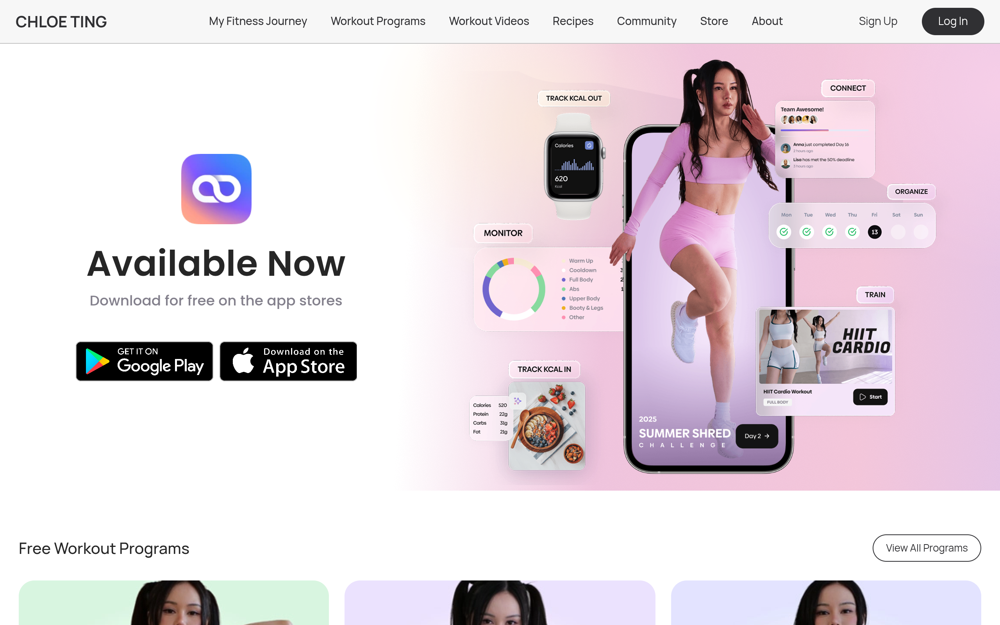

# chloe-ting Design System

You are building UI for **chloe-ting**. Light-themed, warm palette, sans-serif typography (Poppins), compact density on a 4px grid, expressive motion.

## Visual Reference

**IMPORTANT**: Study ALL screenshots below before writing any UI. Match colors, typography, spacing, layout, and motion exactly as shown.

### Homepage



> Read `references/DESIGN.md` for full token details.

## Design Philosophy

- **Layered depth** — use shadow tokens to create a sense of physical layering. Each elevation level has a specific shadow.
- **Gradient accents** — gradients are used thoughtfully for emphasis, not decoration.
- **Type pairing** — Poppins for body/UI text, Manrope for headings/display. Never introduce a third typeface.
- **compact density** — 4px base grid. Every dimension is a multiple of 4.
- **warm palette** — the color temperature runs warm, matching the sans-serif typography.
- **Restrained accent** — `#ff7875` is the only pop of color. Used exclusively for CTAs, links, focus rings, and active states.
- **Expressive motion** — animations are an integral part of the experience. Use spring physics and layout animations.

## Color System

### Core Palette

| Role | Token | Hex | Use |
|------|-------|-----|-----|
| Background | `--background` | `#ffffff` | Page/app background |
| Surface | `--surface` | `#d9d9d9` | Cards, panels, modals |
| Text Primary | `--text-primary` | `#000000` | Headings, body text |
| Text Muted | `--text-muted` | `#bfbfbf` | Captions, placeholders |
| Accent | `--accent` | `#ff7875` | CTAs, links, focus rings |
| Border | `--border` | `#595959` | Dividers, card borders |

### Status Colors

| Status | Hex | Use |
|--------|-----|-----|
| Success | `#52c41a` | Confirmations, positive trends |
| Warning | `#faad14` | Caution states, pending items |
| Danger | `#da532c` | Errors, destructive actions |

### Extended Palette

- **anchor-hover-color:** `#1890ff`
- `#096dd9`
- `#eb2f96`
- `#13c2c2`
- `#fadb14`
- `#001529` — Deep background layer or shadow color
- `#a0d911`
- `#722ed1`

### CSS Variable Tokens

```css
--antd-arrow-background-color: #fff;
--color-primary: #303033;
--color-primary-disabled: #c4c4c4;
--color-secondary: #868a93;
--color-background-primary: #f7f7f7;
--color-background-secondary: #f3f3f3;
--border-primary: 1px solid var(--color-primary-disabled);
--border-secondary: 1px solid #eff0f4;
--color-background: #fafafa;
--color-action-background: #eaedef;
--antd-arrow-background-color: #fff;
--color-primary: #303033;
--color-primary-disabled: #c4c4c4;
--color-secondary: #868a93;
--color-background-primary: #f7f7f7;
--color-background-secondary: #f3f3f3;
--border-primary: 1px solid var(--color-primary-disabled);
--border-secondary: 1px solid #eff0f4;
--color-background: #fafafa;
--color-action-background: #eaedef;
```

## Typography

### Font Stack

- **Poppins** — Heading 1, Heading 2, Heading 3
- **Manrope** — Body, Caption
- **SFMono-Regular** — Code

### Font Sources

```css
@font-face {
  font-family: "Manrope";
  src: url("fonts/Manrope-Bold.ttf") format("truetype");
  font-weight: 700;
}
@font-face {
  font-family: "Manrope";
  src: url("fonts/Manrope-Regular.ttf") format("truetype");
  font-weight: 400;
}
@font-face {
  font-family: "icomoon";
  src: url("fonts/icomoon-Regular.ttf") format("truetype");
  font-weight: 400;
}
@font-face {
  font-family: "Poppins";
  src: url("fonts/Poppins-Bold.ttf") format("truetype");
  font-weight: 700;
}
@font-face {
  font-family: "Poppins";
  src: url("fonts/Poppins-Regular.ttf") format("truetype");
  font-weight: 400;
}
@font-face {
  font-family: "Bricolage Grotesque";
  src: url("fonts/BricolageGrotesque-Bold.ttf") format("truetype");
  font-weight: 700;
}
@font-face {
  font-family: "Bricolage Grotesque";
  src: url("fonts/BricolageGrotesque-Regular.ttf") format("truetype");
  font-weight: 400;
}
```

### Type Scale

| Role | Family | Size | Weight |
|------|--------|------|--------|
| Heading 1 | Poppins | 72px | 700 |
| Heading 2 | Poppins | 48px | 700 |
| Heading 3 | Poppins | 45px | 700 |
| Body | Manrope | 14px | 400 |
| Caption | Manrope | 16px | 400 |
| Code | SFMono-Regular | 14px | 400 |

### Typography Rules

- Body/UI: **Poppins**, Headings: **Manrope** — these are the only display fonts
- Max 3-4 font sizes per screen
- Headings: weight 600-700, body: weight 400
- Use color and opacity for text hierarchy, not additional font sizes
- Line height: 1.5 for body, 1.2 for headings

## Spacing & Layout

### Base Grid: 4px

Every dimension (margin, padding, gap, width, height) must be a multiple of **4px**.

### Spacing Scale

`2, 4, 6, 8, 10, 12, 14, 16, 18, 20, 22, 24` px

### Spacing as Meaning

| Spacing | Use |
|---------|-----|
| 4-8px | Tight: related items (icon + label, avatar + name) |
| 12-16px | Medium: between groups within a section |
| 24-32px | Wide: between distinct sections |
| 48px+ | Vast: major page section breaks |

### Border Radius

Scale: `inherit, .25rem, .3rem, 1px, 2px, 3px, 4px, 6px, 7px, 8px, 9px, 10px, 12px, 14px, 15px, 16px, 18px, 20px, 22px, 24px, 26px, 28px, 32px, 35px, 36px, 40px, 50px, 52px, 54px, 97px, 100%, 100px`
Default: `18px`

### Container

Max-width: `980px`, centered with auto margins.

### Breakpoints

| Name | Value |
|------|-------|
| xs | 0px |
| xs | 0em |
| sm | 39.9375em |
| sm | 40em |
| lg | 63.9375em |
| lg | 64em |
| xl | 74.9375em |
| xl | 75em |
| xs | 400px |
| xs | 480px |
| sm | 575px |
| sm | 576px |
| md | 767px |
| md | 767.98px |
| md | 768px |
| lg | 991px |
| lg | 992px |
| lg | 1023.98px |
| lg | 1024px |
| xl | 1199px |
| xl | 1200px |
| xl | 1239.98px |
| xl | 1240px |
| xl | 1280px |
| 2xl | 1440px |
| 2xl | 1599px |
| 2xl | 1600px |

Mobile-first: design for small screens, layer on responsive overrides.

## Component Patterns

### Card

```css
.card {
  background: #d9d9d9;
  border: 1px solid #595959;
  border-radius: 18px;
  padding: 16px;
  box-shadow: 0 0 0 0#1890ff;
}
```

```html
<div class="card">
  <h3>Card Title</h3>
  <p>Card content goes here.</p>
</div>
```

### Button

```css
/* Primary */
.btn-primary {
  background: #ff7875;
  color: #000000;
  border-radius: 18px;
  padding: 8px 16px;
  font-weight: 500;
  transition: opacity 150ms ease;
}
.btn-primary:hover { opacity: 0.9; }

/* Ghost */
.btn-ghost {
  background: transparent;
  border: 1px solid #595959;
  color: #000000;
  border-radius: 18px;
  padding: 8px 16px;
}
```

```html
<button class="btn-primary">Get Started</button>
<button class="btn-ghost">Learn More</button>
```

### Input

```css
.input {
  background: #ffffff;
  border: 1px solid #595959;
  border-radius: 18px;
  padding: 8px 12px;
  color: #000000;
  font-size: 14px;
}
.input:focus { border-color: #ff7875; outline: none; }
```

```html
<input class="input" type="text" placeholder="Search..." />
```

### Badge / Chip

```css
.badge {
  display: inline-flex;
  align-items: center;
  padding: 4px 8px;
  border-radius: 9999px;
  font-size: 12px;
  font-weight: 500;
  background: #d9d9d9;
  color: #bfbfbf;
}
```

```html
<span class="badge">New</span>
<span class="badge">Beta</span>
```

### Modal / Dialog

```css
.modal-backdrop { background: rgba(0, 0, 0, 0.6); }
.modal {
  background: #d9d9d9;
  border: 1px solid #595959;
  border-radius: 100px;
  padding: 24px;
  max-width: 480px;
  width: 90vw;
  box-shadow: 0 1px 2px -2px rgba(0,0,0,.16),0 3px 6px 0 rgba(0,0,0,.12),0 5px 12px 4px rgba(0,0,0,.09);
}
```

```html
<div class="modal-backdrop">
  <div class="modal">
    <h2>Dialog Title</h2>
    <p>Dialog content.</p>
    <button class="btn-primary">Confirm</button>
    <button class="btn-ghost">Cancel</button>
  </div>
</div>
```

### Table

```css
.table { width: 100%; border-collapse: collapse; }
.table th {
  text-align: left;
  padding: 8px 12px;
  font-weight: 500;
  font-size: 12px;
  color: #bfbfbf;
  text-transform: uppercase;
  letter-spacing: 0.05em;
  border-bottom: 1px solid #595959;
}
.table td {
  padding: 12px;
  border-bottom: 1px solid #595959;
}
```

```html
<table class="table">
  <thead><tr><th>Name</th><th>Status</th><th>Date</th></tr></thead>
  <tbody>
    <tr><td>Item One</td><td>Active</td><td>Jan 1</td></tr>
    <tr><td>Item Two</td><td>Pending</td><td>Jan 2</td></tr>
  </tbody>
</table>
```

### Navigation

```css
.nav {
  display: flex;
  align-items: center;
  gap: 8px;
  padding: 12px 16px;
  border-bottom: 1px solid #595959;
}
.nav-link {
  color: #bfbfbf;
  padding: 8px 12px;
  border-radius: 18px;
  transition: color 150ms;
}
.nav-link:hover { color: #000000; }
.nav-link.active { color: #ff7875; }
```

```html
<nav class="nav">
  <a href="/" class="nav-link active">Home</a>
  <a href="/about" class="nav-link">About</a>
  <a href="/pricing" class="nav-link">Pricing</a>
  <button class="btn-primary" style="margin-left: auto">Get Started</button>
</nav>
```

### Extracted Components

These components were found in the codebase:

**Button** (`html`)
- Variants: `round`, `default`

## Page Structure

The following page sections were detected:

- **Navigation** — Top navigation bar (10 items)
- **Hero** — Hero section (detected from heading structure)
- **Faq** — FAQ/accordion section
- **Footer** — Page footer with links and info (9 items)

When building pages, follow this section order and structure.

## Animation & Motion

This project uses **expressive motion**. Animations are part of the design language.

### CSS Animations

- `antFadeIn`
- `antFadeOut`
- `antMoveDownIn`
- `antMoveDownOut`
- `antMoveLeftIn`

### Motion Tokens

- **Duration scale:** `0ms`, `0s`, `.1s`, `.2s`, `.24s`, `.3s`, `17ms`, `100ms`, `150ms`, `200ms`, `240ms`, `300ms`, `400ms`, `500ms`, `600ms`, `1500ms`
- **Easing functions:** `linear`, `cubic-bezier(.08,.82,.17,1)`, `cubic-bezier(.6,.04,.98,.34)`, `cubic-bezier(.23,1,.32,1)`, `cubic-bezier(.755,.05,.855,.06)`, `cubic-bezier(.78,.14,.15,.86)`, `cubic-bezier(.645,.045,.355,1)`, `ease-in-out`, `ease`, `cubic-bezier(.2,0,0,1)`, `cubic-bezier(.215,.61,.355,1)`, `ease-out`, `cubic-bezier(.71,-.46,.88,.6)`, `cubic-bezier(.12,.4,.29,1.46)`, `cubic-bezier(.18,.89,.32,1.28)`
- **Animated properties:** `color`

### Motion Guidelines

- **Duration:** Use values from the duration scale above. Short (0ms) for micro-interactions, long (1500ms) for page transitions
- **Easing:** Use `linear` as the default easing curve
- **Direction:** Elements enter from bottom/right, exit to top/left
- **Reduced motion:** Always respect `prefers-reduced-motion` — disable animations when set

## Depth & Elevation

### Shadow Tokens

- Subtle: `0 0 0 2px rgba(255,77,79,.2)`
- Subtle: `0 0 0 2px rgba(250,173,20,.2)`
- Subtle: `0 0 0 2px rgba(24,144,255,.2)`
- Subtle: `0 0 0 1px #fff`
- Subtle: `0 2px 0 rgba(0,0,0,.015)`
- Subtle: `0 2px 0 rgba(0,0,0,.045)`

### Z-Index Scale

`0, 1, 2, 3, 4, 9, 10, 15, 99, 999, 1000, 1010, 1030, 1031, 1050, 1060, 1070, 1080, 9998, 2147483645, 2147483646, 2147483647`

Use these exact values — never invent z-index values.

## Anti-Patterns (Never Do)

- **No blur effects** — no backdrop-blur, no filter: blur()
- **No zebra striping** — tables and lists use borders for separation
- **No invented colors** — every hex value must come from the palette above
- **No arbitrary spacing** — every dimension is a multiple of 4px
- **No extra fonts** — only Poppins and Manrope and SFMono-Regular are allowed
- **No arbitrary border-radius** — use the scale: .25rem, .3rem, 1px, 2px, 3px, 4px, 6px, 7px, 8px, 9px
- **No opacity for disabled states** — use muted colors instead

## Workflow

1. **Read** `references/DESIGN.md` before writing any UI code
2. **Pick colors** from the Color System section — never invent new ones
3. **Set typography** — Poppins, Manrope, SFMono-Regular only, using the type scale
4. **Build layout** on the 4px grid — check every margin, padding, gap
5. **Match components** to patterns above before creating new ones
6. **Apply elevation** — use shadow tokens
7. **Validate** — every value traces back to a design token. No magic numbers.

## Brand Spec

- **Favicon:** `/favicon.ico`
- **Site URL:** `https://chloeting.com`
- **Brand color:** `#ff7875`
- **Brand typeface:** Poppins

## Quick Reference

```
Background:     #ffffff
Surface:        #d9d9d9
Text:           #000000 / #bfbfbf
Accent:         #ff7875
Border:         #595959
Font:           Poppins
Spacing:        4px grid
Radius:         18px
Components:     6 detected
```

## When to Trigger

Activate this skill when:
- Creating new components, pages, or visual elements for chloe-ting
- Writing CSS, Tailwind classes, styled-components, or inline styles
- Building page layouts, templates, or responsive designs
- Reviewing UI code for design consistency
- The user mentions "chloe-ting" design, style, UI, or theme
- Generating mockups, wireframes, or visual prototypes

---

# Full Reference Files

> Every output file is embedded below. Claude has full design system context from /skills alone.

## Design System Tokens (DESIGN.md)

# chloe-ting DESIGN.md

> Auto-generated design system — reverse-engineered via static analysis by skillui.
> Frameworks: None detected
> Colors: 20 · Fonts: 3 · Components: 6
> Icon library: not detected · State: not detected
> Primary theme: light · Dark mode toggle: no · Motion: expressive

## Visual Reference

**Match this design exactly** — study colors, fonts, spacing, and component shapes before writing any UI code.


---

## 1. Visual Theme & Atmosphere

This is a **light-themed** interface with a warm, approachable feel. The light background emphasizes content clarity. Typography pairs **Manrope** for display/headings with **Poppins** for body text, creating clear visual hierarchy through type contrast. Spacing follows a **4px base grid** (compact density), with scale: 2, 4, 6, 8, 10, 12, 14, 16px. The accent color **#ff7875** anchors interactive elements (buttons, links, focus rings). Motion is expressive — spring physics, layout animations, and staggered reveals are part of the visual language.

---

## 2. Color Palette & Roles

| Token | Hex | Role | Use |
|---|---|---|---|
| theme-color | `#ffffff` | background | Page background, darkest surface |
| color-ultra-light-purple | `#d9d9d9` | surface | Card and panel backgrounds |
| text-primary | `#000000` | text-primary | Headings and body text |
| color-primary-disabled | `#bfbfbf` | text-muted | Captions, placeholders, secondary info |
| color-secondary | `#868a93` | text-muted | Captions, placeholders, secondary info |
| border | `#595959` | border | Dividers, card borders, outlines |
| accent | `#ff7875` | accent | CTAs, links, focus rings, active states |
| tile-color | `#da532c` | danger | Error states, destructive actions |
| success | `#52c41a` | success | Success states, positive indicators |
| warning | `#faad14` | warning | Warning states, caution indicators |
| anchor-hover-color | `#1890ff` | info | Informational highlights |
| unknown | `#096dd9` | unknown | Palette color |
| unknown | `#eb2f96` | unknown | Palette color |
| unknown | `#13c2c2` | unknown | Palette color |
| unknown | `#fadb14` | unknown | Palette color |
| unknown | `#001529` | unknown | Palette color |
| unknown | `#a0d911` | unknown | Palette color |
| unknown | `#722ed1` | unknown | Palette color |
| unknown | `#91d5ff` | unknown | Palette color |
| color-primary | `#262626` | unknown | Palette color |

### CSS Variable Tokens

```css
--antd-arrow-background-color: #fff;
--color-primary: #303033;
--color-primary-disabled: #c4c4c4;
--color-secondary: #868a93;
--color-background-primary: #f7f7f7;
--color-background-secondary: #f3f3f3;
--border-primary: 1px solid var(--color-primary-disabled);
--border-secondary: 1px solid #eff0f4;
--color-background: #fafafa;
--color-action-background: #eaedef;
--antd-arrow-background-color: #fff;
--color-primary: #303033;
--color-primary-disabled: #c4c4c4;
--color-secondary: #868a93;
--color-background-primary: #f7f7f7;
--color-background-secondary: #f3f3f3;
--border-primary: 1px solid var(--color-primary-disabled);
--border-secondary: 1px solid #eff0f4;
--color-background: #fafafa;
--color-action-background: #eaedef;
```


---

## 3. Typography Rules

**Font Stack:**
- **Poppins** — Heading 1, Heading 2, Heading 3
- **Manrope** — Body, Caption
- **SFMono-Regular** — Code

**Font Sources:**

```css
@font-face {
  font-family: "Manrope";
  src: url("fonts/Manrope-Bold.ttf") format("truetype");
  font-weight: 700;
}
@font-face {
  font-family: "Manrope";
  src: url("fonts/Manrope-Regular.ttf") format("truetype");
  font-weight: 400;
}
@font-face {
  font-family: "icomoon";
  src: url("fonts/icomoon-Regular.ttf") format("truetype");
  font-weight: 400;
}
@font-face {
  font-family: "Poppins";
  src: url("fonts/Poppins-Bold.ttf") format("truetype");
  font-weight: 700;
}
@font-face {
  font-family: "Poppins";
  src: url("fonts/Poppins-Regular.ttf") format("truetype");
  font-weight: 400;
}
@font-face {
  font-family: "Bricolage Grotesque";
  src: url("fonts/BricolageGrotesque-Bold.ttf") format("truetype");
  font-weight: 700;
}
@font-face {
  font-family: "Bricolage Grotesque";
  src: url("fonts/BricolageGrotesque-Regular.ttf") format("truetype");
  font-weight: 400;
}
```

| Role | Font | Size | Weight |
|---|---|---|---|
| Heading 1 | Poppins | 72px | 700 |
| Heading 2 | Poppins | 48px | 700 |
| Heading 3 | Poppins | 45px | 700 |
| Body | Manrope | 14px | 400 |
| Caption | Manrope | 16px | 400 |
| Code | SFMono-Regular | 14px | 400 |

**Typographic Rules:**
- Limit to 3 font families max per screen
- Use **Poppins** for body/UI text, **Manrope** for display/headings
- Maintain consistent hierarchy: no more than 3-4 font sizes per screen
- Headings use bold (600-700), body uses regular (400)
- Line height: 1.5 for body text, 1.2 for headings
- Use color and opacity for secondary hierarchy, not additional font sizes


---

## 4. Component Stylings

### Layout (1)

**Footer** — `html`

### Navigation (1)

**Navigation** — `html`

### Data Display (2)

**Badge** — `html`

**List** — `html`

### Data Input (1)

**Button** — `html`
- Variants: `round`, `default`
- Animation: 

### Media (1)

**Image** — `html`


---

## 5. Layout Principles

- **Base spacing unit:** 4px
- **Spacing scale:** 2, 4, 6, 8, 10, 12, 14, 16, 18, 20, 22, 24
- **Border radius:** inherit, .25rem, .3rem, 1px, 2px, 3px, 4px, 6px, 7px, 8px, 9px, 10px, 12px, 14px, 15px, 16px, 18px, 20px, 22px, 24px, 26px, 28px, 32px, 35px, 36px, 40px, 50px, 52px, 54px, 97px, 100%, 100px
- **Max content width:** 980px

**Spacing as Meaning:**
| Spacing | Use |
|---|---|
| 4-8px | Tight: related items within a group |
| 12-16px | Medium: between groups |
| 24-32px | Wide: between sections |
| 48px+ | Vast: major section breaks |


---

## 6. Depth & Elevation

### Flat — subtle depth hints

- `0 0 0 2px rgba(255,77,79,.2)`
- `0 0 0 2px rgba(250,173,20,.2)`
- `0 0 0 2px rgba(24,144,255,.2)`

### Raised — cards, buttons, interactive elements

- `0 0 0 0#1890ff`
- `0 0 0 0 var(--antd-wave-shadow-color)`
- `0 0 0#1890ff`

### Floating — dropdowns, popovers, modals

- `0 1px 2px -2px rgba(0,0,0,.16),0 3px 6px 0 rgba(0,0,0,.12),0 5px 12px 4px rgba(0,0,0,.09)`
- `inset 10px 0 8px -8px rgba(0,0,0,.08)`
- `inset -10px 0 8px -8px rgba(0,0,0,.08)`

### Overlay — full-screen overlays, top-level dialogs

- `0 3px 6px -4px rgba(0,0,0,.12),0 6px 16px 0 rgba(0,0,0,.08),0 9px 28px 8px rgba(0,0,0,.05)`
- `6px 0 16px -8px rgba(0,0,0,.08),9px 0 28px 0 rgba(0,0,0,.05),12px 0 48px 16px rgba(0,0,0,.03)`
- `-6px 0 16px -8px rgba(0,0,0,.08),-9px 0 28px 0 rgba(0,0,0,.05),-12px 0 48px 16px rgba(0,0,0,.03)`

### Z-Index Scale

`0, 1, 2, 3, 4, 9, 10, 15, 99, 999, 1000, 1010, 1030, 1031, 1050, 1060, 1070, 1080, 9998, 2147483645, 2147483646, 2147483647`


---

## 7. Animation & Motion

This project uses **expressive motion**. Animations are an integral part of the experience.

### CSS Animations

- `@keyframes antFadeIn`
- `@keyframes antFadeOut`
- `@keyframes antMoveDownIn`
- `@keyframes antMoveDownOut`
- `@keyframes antMoveLeftIn`
- `@keyframes antMoveLeftOut`
- `@keyframes antMoveRightIn`
- `@keyframes antMoveRightOut`

### Animated Components

- **Button**: 

### Motion Guidelines

- Duration: 150-300ms for micro-interactions, 300-500ms for page transitions
- Easing: `ease-out` for enters, `ease-in` for exits
- Always respect `prefers-reduced-motion`


---

## 8. Do's and Don'ts

### Do's

- Use `#ff7875` for interactive elements (buttons, links, focus rings)
- Use `#ffffff` as the primary page background
- Pair **Poppins** (body) with **Manrope** (display) — these are the only allowed fonts
- Follow the **4px** spacing grid for all margins, padding, and gaps
- Use the defined shadow tokens for elevation — see Section 6
- Use border-radius from the scale: inherit, .25rem, .3rem, 1px, 2px
- Reuse existing components from Section 4 before creating new ones

### Don'ts

- Don't introduce colors outside this palette — extend the design tokens first
- Don't introduce additional font families beyond Poppins and Manrope and SFMono-Regular
- Don't use arbitrary spacing values — stick to multiples of 4px
- Don't create custom box-shadow values outside the system tokens
- Don't use arbitrary border-radius values — pick from the defined scale
- Don't duplicate component patterns — check Section 4 first
- Don't use backdrop-blur or blur effects

### Anti-Patterns (detected from codebase)

- No blur or backdrop-blur effects
- No zebra striping on tables/lists


---

## 9. Responsive Behavior

| Name | Value | Source |
|---|---|---|
| xs | 0px | css |
| xs | 0em | css |
| sm | 39.9375em | css |
| sm | 40em | css |
| lg | 63.9375em | css |
| lg | 64em | css |
| xl | 74.9375em | css |
| xl | 75em | css |
| xs | 400px | css |
| xs | 480px | css |
| sm | 575px | css |
| sm | 576px | css |
| md | 767px | css |
| md | 767.98px | css |
| md | 768px | css |
| lg | 991px | css |
| lg | 992px | css |
| lg | 1023.98px | css |
| lg | 1024px | css |
| xl | 1199px | css |
| xl | 1200px | css |
| xl | 1239.98px | css |
| xl | 1240px | css |
| xl | 1280px | css |
| 2xl | 1440px | css |
| 2xl | 1599px | css |
| 2xl | 1600px | css |

**Approach:** Use `@media (min-width: ...)` queries matching the breakpoints above.


---

## 10. Agent Prompt Guide

Use these as starting points when building new UI:

### Build a Card

```
Background: #d9d9d9
Border: 1px solid #595959
Radius: 18px
Padding: 16px
Font: Poppins
Use shadow tokens from Section 6.
```

### Build a Button

```
Primary: bg #ff7875, text white
Ghost: bg transparent, border #595959
Padding: 8px 16px
Radius: 18px
Hover: opacity 0.9 or lighter shade
Focus: ring with #ff7875
```

### Build a Page Layout

```
Background: #ffffff
Max-width: 980px, centered
Grid: 4px base
Responsive: mobile-first, breakpoints from Section 9
```

### Build a Stats Card

```
Surface: #d9d9d9
Label: #bfbfbf (muted, 12px, uppercase)
Value: #000000 (primary, 24-32px, bold)
Status: use success/warning/danger from Section 2
```

### Build a Form

```
Input bg: #ffffff
Input border: 1px solid #595959
Focus: border-color #ff7875
Label: #bfbfbf 12px
Spacing: 16px between fields
Radius: 18px
```

### General Component

```
1. Read DESIGN.md Sections 2-6 for tokens
2. Colors: only from palette
3. Font: Poppins, type scale from Section 3
4. Spacing: 4px grid
5. Components: match patterns from Section 4
6. Elevation: shadow tokens
```

## Bundled Fonts (fonts/)

The following font files are bundled in the `fonts/` directory:

- `fonts/Manrope-Bold.ttf`
- `fonts/Manrope-Regular.ttf`
- `fonts/icomoon-Regular.ttf`
- `fonts/icomoon-Regular.woff`
- `fonts/Poppins-Bold.ttf`
- `fonts/Poppins-Regular.ttf`
- `fonts/BricolageGrotesque-Bold.ttf`
- `fonts/BricolageGrotesque-Regular.ttf`

Use these local font files in `@font-face` declarations instead of fetching from Google Fonts.

## Homepage Screenshots (screenshots/)


